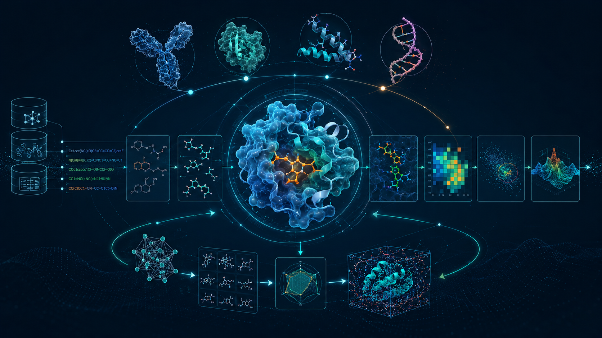

# Awesome Biomolecular Binder Discovery [](https://awesome.re)

<p align="center">
  
</p>

A comprehensive, curated collection of **computational tools, models, databases, and APIs** for the in silico discovery and optimization of biomolecular binders — spanning small molecules, peptides, protein binders, nanobodies, antibodies, and RNA aptamers.

## Why This Repository?

The landscape of AI-driven biomolecular design is evolving at breakneck speed. New approaches appear all the time in top-tier venues like Nature, Science, ICML, NeurIPS, and ICLR. For researchers and practitioners, it is increasingly difficult to keep track of **which tools exist, what they do, how to install them, and where they fit in a design pipeline**.

This repository aims to be a **one-stop reference** that:

- **Covers all major binder modalities** — small molecules, peptides & protein binders, nanobodies (VHH), full antibodies (VH/VL), and RNA/DNA aptamers.
- **Spans the full design pipeline** — from target characterization (binding site prediction, structure prediction) through de novo generation, sequence optimization, property prediction (ADMET, stability, affinity), docking, MD simulation, and virtual screening.
- **Provides actionable information** — each tool entry includes a one-line description, publication reference, GitHub link with star badge, install instructions (pip/conda/Docker), and a minimal usage example.
- **Is continuously updated** — we actively track new releases and welcome community contributions.

> **200+ tools** across **6 sections** · **200+ GitHub star badges** · Install & usage for every entry · Last updated: **May 2026**

---

## Roadmap

- [ ] **Agentic AI for Biomolecular Discovery** — Add LLM-agent and multi-agent frameworks (e.g., ProtAgents, MD-Agent, ChemGraph) that autonomously orchestrate multi-step design and simulation workflows, combining structure prediction, docking, MD, and optimization into end-to-end agentic pipelines.
- [ ] **Docker / Container Recipes** — Provide ready-to-use Dockerfiles and Singularity/Apptainer recipes for the most widely-used tools (RFdiffusion, ProteinMPNN, AlphaFold2/3, ColabFold, DiffDock, OpenMM, etc.) so users can spin up reproducible environments in minutes without wrestling with dependency conflicts.

---

## Table of Contents

| Section | Subsection | e.g. |
|---------|-----------|------|
| **[0. Databases & APIs](#0-databases--apis)** | | |
| | [0.1 Sequence & Structure Databases](#01-sequence--structure-databases) | UniProt |
| | [0.2 Small Molecule Databases](#02-small-molecule-databases) | ChEMBL |
| | [0.3 Similarity Search Services](#03-similarity-search-services) | FoldSeek |
| | [0.4 Antibody & Nanobody Databases](#04-antibody--nanobody-databases) | SAbDab |
| | [0.5 RNA Databases](#05-rna-databases) | RNAcentral |
| | [0.6 Target & Binding Site Databases](#06-target--binding-site-databases) | PDBbind |
| **[1. Small Molecules](#1-small-molecules)** | | |
| | [1.1 Molecular Representation / Foundation Models](#11-molecular-representation--foundation-models) | Uni-Mol |
| | [1.2 Conformer Generation / 3D Structure](#12-conformer-generation--3d-structure) | Torsional Diffusion |
| | [1.3 Binding Site Prediction](#13-binding-site-prediction) | P2Rank |
| | [1.4 De Novo Small Molecule Generation](#14-de-novo-small-molecule-generation) | DiffSBDD |
| | [1.5 Molecular Optimization](#15-molecular-optimization) | REINVENT4 |
| | [1.6 Property Prediction (ADMET)](#16-property-prediction-admet) | Chemprop |
| | [1.7 Similarity Search](#17-similarity-search) | FPSim2 |
| | [1.8 Molecular Docking](#18-molecular-docking) | DiffDock |
| | [1.8b Protein-Ligand Interaction & Affinity](#18b-protein-ligand-interaction--affinity-prediction) | PSICHIC |
| | [1.9 MD Simulation & Free Energy](#19-md-simulation--free-energy) | GROMACS |
| | [1.10 Virtual Screening](#110-virtual-screening) | DeepChem |
| **[2. Peptides & Protein Binders](#2-peptides--protein-binders)** | | |
| | [2.1 Protein Language Models / Sequence Models](#21-protein-language-models--sequence-models) | ESM-2 |
| | [2.2 Structure Prediction](#22-structure-prediction) | AlphaFold3 |
| | [2.2b Conformational Ensembles](#22b-protein-conformational-ensembles) | AlphaFlow |
| | [2.3 Binding Site / Interface Prediction](#23-binding-site--interface-prediction) | MaSIF |
| | [2.4 De Novo Binder Design / Generation](#24-de-novo-binder-design--generation) | RFdiffusion |
| | [2.5 Sequence Design / Inverse Folding](#25-sequence-design--inverse-folding) | ProteinMPNN |
| | [2.6 Optimization / Directed Evolution](#26-optimization--directed-evolution) | EvoProtGrad |
| | [2.7 Protein-Protein Interaction & Docking](#27-protein-protein-interaction--docking) | HADDOCK3 |
| | [2.8 PPI Binding Affinity & ΔΔG](#28-protein-protein-binding-affinity--mutation-effects-δδg) | PPIformer |
| **[3. Nanobodies](#3-nanobodies)** | | |
| | [3.1 Sequence Models](#31-sequence-models-for-nanobodies) | AbLang |
| | [3.2 Structure Prediction](#32-nanobody-structure-prediction) | IgFold |
| | [3.3 CDR Numbering & Analysis](#33-cdr-numbering--analysis) | ANARCI |
| | [3.4 De Novo Generation](#34-de-novo-nanobody-generation) | RFantibody |
| | [3.5 Nanobody-Antigen Docking](#35-nanobody-antigen-docking) | HADDOCK3 |
| | [3.6 Humanization & Developability](#36-humanization--developability) | BioPhi |
| | [3.7 Affinity Optimization](#37-affinity-optimization) | TEMPRO |
| **[4. Antibodies](#4-antibodies)** | | |
| | [4.1 Antibody Language Models](#41-antibody-language-models) | IgLM |
| | [4.2 Structure Prediction](#42-antibody-structure-prediction) | ImmuneBuilder |
| | [4.3 CDR Loop Modeling & Numbering](#43-cdr-loop-modeling--numbering) | ABlooper |
| | [4.4 Epitope / Paratope Prediction](#44-epitope--paratope-prediction) | DiscoTope-3.0 |
| | [4.5 De Novo Antibody Generation](#45-de-novo-antibody-generation) | DiffAb |
| | [4.6 Affinity Maturation & Optimization](#46-affinity-maturation--optimization) | Graphinity |
| | [4.7 Humanization & Developability](#47-humanization--developability) | HuDiff |
| | [4.8 Antibody-Antigen Docking](#48-antibody-antigen-docking) | SnugDock |
| **[5. RNA Aptamers](#5-rna-aptamers)** | | |
| | [5.1 RNA Language Models](#51-rna-language-models) | RNA-FM |
| | [5.2 RNA Secondary Structure Prediction](#52-rna-secondary-structure-prediction) | ViennaRNA |
| | [5.3 RNA 3D Structure Prediction](#53-rna-3d-structure-prediction) | RhoFold+ |
| | [5.4 Aptamer-Target Docking](#54-aptamer-target-docking) | HADDOCK3 |
| | [5.5 In Silico SELEX / Aptamer Selection](#55-in-silico-selex--aptamer-selection) | RaptGen |
| | [5.6 De Novo Aptamer Design & Optimization](#56-de-novo-aptamer-design--optimization) | AptaDiff |
| | [5.7 Binding Affinity Prediction (RNA-Target)](#57-binding-affinity-prediction-rna-target) | CoPRA |
| | [5.8 RNA Structure Analysis](#58-rna-structure-analysis-tools) | RNAglib |
| **[Quick Reference Matrix](#quick-reference-tool--pipeline-step-matrix)** | | |

---

## 0. Databases & APIs

### 0.1 Sequence & Structure Databases

---

#### UniProt REST API
**Description:** Comprehensive protein sequence and functional annotation database (Swiss-Prot + TrEMBL), >250M sequences.  
**URL:** https://www.uniprot.org  
**Publication:** Nucleic Acids Research (annual update)  

<details><summary>Install & Usage</summary>

**Install:**
```bash
pip install requests bioservices
```

**Usage:**
```python
import requests

# Fetch protein by accession
r = requests.get("https://rest.uniprot.org/uniprotkb/P00533.json")
data = r.json()
print(data["sequence"]["value"])

# Search by name/function
r = requests.get(
    "https://rest.uniprot.org/uniprotkb/search",
    params={"query": "EGFR AND reviewed:true", "format": "json", "size": 10}
)
```


</details>

---

#### RCSB PDB API
**Description:** Protein Data Bank REST + GraphQL API for querying/downloading experimental 3D structures (~220,000 entries).  
**URL:** https://www.rcsb.org  
**API Docs:** https://search.rcsb.org  

**Install:**
```bash
pip install rcsbsearchapi requests
```

**Usage:**
```python
from rcsbsearchapi.search import TextQuery, AttributeQuery
from rcsbsearchapi import rcsb_attributes as attrs

# Search for human kinase structures
query = AttributeQuery("rcsb_entity_source_organism.ncbi_scientific_name", "exact_match", "Homo sapiens") \
      & AttributeQuery("entity_poly.rcsb_entity_polymer_type", "exact_match", "Protein")

for entry_id in query():
    print(entry_id)

# Download PDB file
import requests
r = requests.get("https://files.rcsb.org/download/1TUP.pdb")
with open("1TUP.pdb","w") as f:
    f.write(r.text)
```

---

#### AlphaFold DB API
**Description:** EBI-hosted database of >200M predicted protein structures from AlphaFold2.  
**URL:** https://alphafold.ebi.ac.uk  

<details><summary>Install & Usage</summary>

**Install:**
```bash
pip install requests
```

**Usage:**
```python
import requests

uniprot_id = "P00533"
r = requests.get(f"https://alphafold.ebi.ac.uk/api/prediction/{uniprot_id}")
entries = r.json()
# Download predicted structure
pdb_url = entries[0]["pdbUrl"]
pdb_data = requests.get(pdb_url).text
with open(f"{uniprot_id}_AF2.pdb","w") as f:
    f.write(pdb_data)
```


</details>

---

#### ESM Metagenomic Atlas (Meta AI)
**Description:** ESMFold structure predictions for ~700M metagenomic proteins; searchable by sequence similarity.  
**URL:** https://esmatlas.com  
**GitHub:** https://github.com/facebookresearch/esm  

**Install:**
```bash
pip install fair-esm
pip install "fair-esm[esmfold]"  # for structure prediction
```

**Usage:**
```python
import esm, torch

# Load ESMFold
model = esm.pretrained.esmfold_v1()
model.eval().cuda()
sequence = "MKTVRQERLKSIVRILERSKEPVSGAQLAEELSVSRQVIVQDIAYLRSLGY"
with torch.no_grad():
    output = model.infer_pdb(sequence)
with open("predicted.pdb","w") as f:
    f.write(output)
```

---

### 0.2 Small Molecule Databases

---

#### ChEMBL API
**Description:** Manually curated bioactivity database with >2M compounds, >19M activities against >15,000 targets.  
**URL:** https://www.ebi.ac.uk/chembl  
**GitHub:** https://github.com/chembl/chembl_webresource_client  

**Install:**
```bash
pip install chembl_webresource_client
```

**Usage:**
```python
from chembl_webresource_client.new_client import new_client

molecule = new_client.molecule
activity  = new_client.activity

# Search molecule by name
mols = molecule.filter(pref_name__iexact="sildenafil").only(["molecule_chembl_id","molecule_structures"])
print(mols[0]["molecule_structures"]["canonical_smiles"])

# Get bioactivities for a target
acts = activity.filter(target_chembl_id="CHEMBL203", standard_type="IC50").only(
    ["molecule_chembl_id","standard_value","standard_units"])
for a in acts[:5]:
    print(a)
```

---

#### PubChem REST API (pubchempy)
**Description:** NIH database of >115M chemical substances with biological activities, properties, and assay data.  
**URL:** https://pubchem.ncbi.nlm.nih.gov  

<details><summary>Install & Usage</summary>

**Install:**
```bash
pip install pubchempy
```

**Usage:**
```python
import pubchempy as pcp

# Search by name
compounds = pcp.get_compounds("aspirin", "name")
c = compounds[0]
print(c.canonical_smiles, c.molecular_weight, c.xlogp)

# Search by SMILES
compounds = pcp.get_compounds("CC(=O)Oc1ccccc1C(=O)O", "smiles")

# Get assay data
pcp.download("JSON", "aspirin_data.json", "aspirin", "name", record_type="3d")
```


</details>

---

#### ZINC20
**Description:** Free database of commercially available compounds for virtual screening; >1.4B purchasable molecules.  
**URL:** https://zinc20.docking.org  
**Download:** https://zinc.docking.org/tranches/home  

**Install:**
```bash
pip install requests
```

**Usage:**
```python
# Download tranches via ZINC20 API
import requests

# Get subset by properties (drug-like, in-stock)
url = "https://zinc20.docking.org/substances/subsets/for-sale.json"
r = requests.get(url, params={"count": 10})
# Bulk download: use ZINC20 2D/3D tranche download pages
# wget https://zinc20.docking.org/tranches/download - select by MW/logP
```

---

#### BindingDB API
**Description:** Database of measured binding affinities for drug-like molecules with protein targets; ~2.9M data points.  
**URL:** https://www.bindingdb.org  

<details><summary>Install & Usage</summary>

**Install:**
```bash
pip install requests pandas
```

**Usage:**
```python
import requests

# REST API - search by target
url = "https://bindingdb.org/axis2/services/BDBService/getLigandsByUniprots"
r = requests.get(url, params={"uniprot": "P00533", "response": "application/json"})
data = r.json()
# Bulk: download full tab-sep file from https://www.bindingdb.org/bind/chemsearch/marvin/Download.jsp
```


</details>

---

### 0.3 Similarity Search Services

---

#### FoldSeek
**Description:** Ultra-fast protein **structure** similarity search; compares millions of structures in seconds using 3Di alphabet.  
[](https://github.com/steineggerlab/foldseek) [paper: Nature Biotechnology 2024] [[code](https://github.com/steineggerlab/foldseek)]


<details><summary>Install & Usage</summary>

**Install:**
```bash
# Conda (recommended)
conda install -c conda-forge -c bioconda foldseek

# Or binary
wget https://mmseqs.com/foldseek/foldseek-linux-avx2.tar.gz
tar xvzf foldseek-linux-avx2.tar.gz
export PATH=$(pwd)/foldseek/bin/:$PATH
```

**Usage:**
```bash
# Build database from PDB files
foldseek createdb query_pdbs/ queryDB
foldseek createdb target_pdbs/ targetDB

# Search
foldseek easy-search query.pdb targetDB results.m8 tmpFolder

# Use web API
curl -X POST https://search.foldseek.com/api/ticket \
  -F "q=@query.pdb" \
  -F "database[]=pdb100" -F "mode=3diaa"
```


</details>

---

#### MMseqs2
**Description:** Ultra-fast protein **sequence** search and clustering; 10,000× faster than BLAST at comparable sensitivity.  
[](https://github.com/soedinglab/MMseqs2) [paper: Nature Biotechnology 2017; Nature Methods 2018] [[code](https://github.com/soedinglab/MMseqs2)]


<details><summary>Install & Usage</summary>

**Install:**
```bash
conda install -c conda-forge -c bioconda mmseqs2
# or Docker:
docker pull ghcr.io/soedinglab/mmseqs2
```

**Usage:**
```bash
# Easy search (FASTA vs FASTA)
mmseqs easy-search query.fasta target.fasta result.m8 tmp --format-mode 4

# Easy cluster
mmseqs easy-cluster sequences.fasta clusterRes tmp --min-seq-id 0.9

# REST API (used by ColabFold for MSA generation)
curl -X POST https://api.mmseqs.com/ticket/msa \
  -d "q=>seq\nMKTVRQERLKSIVRI" -d "database[]=UniRef30_2302"
```


</details>

---

#### BLAST (via Biopython)
**Description:** Classic sequence similarity search against NCBI databases (nr, pdb, uniprot etc.).  
**URL:** https://blast.ncbi.nlm.nih.gov  

<details><summary>Install & Usage</summary>

**Install:**
```bash
pip install biopython
```

**Usage:**
```python
from Bio.Blast import NCBIWWW, NCBIXML

sequence = "MKTVRQERLKSIVRILERSKEPVSGAQLAEELS"
result_handle = NCBIWWW.qblast("blastp", "pdb", sequence)
blast_records = NCBIXML.parse(result_handle)
for record in blast_records:
    for alignment in record.alignments[:3]:
        print(alignment.title, alignment.hsps[0].score)
```


</details>

---

### 0.4 Antibody & Nanobody Databases

---

#### SAbDab (Structural Antibody Database)
**Description:** Curated database of all antibody and nanobody 3D structures in the PDB with standardized annotations.  
**URL:** https://opig.stats.ox.ac.uk/webapps/sabdab-sabpred/sabdab  

<details><summary>Install & Usage</summary>

**Install:**
```bash
pip install requests pandas
```

**Usage:**
```python
import requests, pandas as pd

# Get all nanobody structures
r = requests.get(
    "https://opig.stats.ox.ac.uk/webapps/sabdab-sabpred/sabdab/search/",
    params={"ABtype": "Nanobody", "resulttype": "json"}
)
df = pd.DataFrame(r.json()["result"])
# Download specific structure
pdb_id = df.iloc[0]["pdb"]
struct = requests.get(f"https://files.rcsb.org/download/{pdb_id}.pdb").text
```


</details>

---

#### OAS (Observed Antibody Space)
**Description:** Repository of >2.4B natural antibody sequences from >100 immune repertoire studies.  
**URL:** https://opig.stats.ox.ac.uk/webapps/oas  

<details><summary>Install & Usage</summary>

**Usage:**
```python
import requests
# Bulk unit downloads via OAS web interface; programmatic bulk via:
# https://opig.stats.ox.ac.uk/webapps/oas/api/bulk
r = requests.get(
    "https://opig.stats.ox.ac.uk/webapps/oas/api/",
    params={"species": "human", "chain": "Heavy", "isotype": "IgG"}
)
units = r.json()["units"]  # list of downloadable dataset units
```


</details>

---

#### ANARCI (Antibody Numbering and CDR Annotation)
**Description:** Assigns IMGT/Chothia/Kabat numbering to antibody and TCR sequences; identifies chain type.  
[](https://github.com/oxpig/ANARCI) [[code](https://github.com/oxpig/ANARCI)]


<details><summary>Install & Usage</summary>

**Install:**
```bash
conda install -c conda-forge biopython
conda install -c bioconda hmmer=3.3.2
pip install anarci
```

**Usage:**
```bash
# CLI
ANARCI -i EVQLVESGGGVVQPGGSLRLSCAASGFTFNSYGMHWVRQAPGKGLE --scheme imgt

# Python
```
```python
from anarci import anarci
sequences = [("VHH1", "EVQLVESGGGVVQPGGSLRLSCAASGFTFNSYGMHWVRQAPGKGLE")]
results = anarci(sequences, scheme="imgt", output=True)
```


</details>

---

#### PyIR
**Description:** Fast IgBLAST wrapper for antibody V(D)J gene annotation; outputs JSON.  
[](https://github.com/crowelab/PyIR) [[code](https://github.com/crowelab/PyIR)]


<details><summary>Install & Usage</summary>

**Install:**
```bash
pip install pyir
pyir setup  # downloads IgBLAST databases
```

**Usage:**
```python
from pyir.pyir import PyIR

p = PyIR(query="sequences.fasta", args=["--outfmt", "json"])
result = p.run()
```


</details>

---

#### CoV-AbDab (Coronavirus Antibody Database)
**Description:** Curated database of >10,000 antibodies and nanobodies targeting coronaviruses (SARS-CoV-2, MERS, etc.) with structural annotations, binding data, and neutralization potency.  
**URL:** https://opig.stats.ox.ac.uk/webapps/covabdab  
**Publication:** Bioinformatics 2021  

<details><summary>Install & Usage</summary>

**Install:**
```bash
pip install requests pandas
```

**Usage:**
```python
import requests, pandas as pd

# Download full database as CSV
r = requests.get("https://opig.stats.ox.ac.uk/webapps/covabdab/covabdab/download/")
with open("covabdab.csv", "wb") as f:
    f.write(r.content)
df = pd.read_csv("covabdab.csv")

# Filter nanobodies binding Spike RBD
nb_rbd = df[(df["Ab or Nb"] == "Nb") & (df["Protein + Epitope"].str.contains("RBD", na=False))]
print(nb_rbd[["Name", "Heavy VDJ", "Neutralising Vs"]].head())
```


</details>

---

#### NbThermo
**Description:** Curated dataset + predictor for nanobody thermostability (Tm); provides thermal stability measurements for >400 nanobodies to support developability assessments.  
**URL:** https://research.naturalantibody.com/nbthermo  
**Publication:** Proteins 2023  

<details><summary>Install & Usage</summary>

**Usage:**
```python
# Download dataset from https://research.naturalantibody.com/nbthermo
# Used as training set for ML thermostability predictors:
import pandas as pd
df = pd.read_csv("nbthermo.csv")
# Columns: sequence, Tm, CDR_lengths, source
```


</details>

---

#### PLAbDab-Nano
**Description:** Patent and Literature Antibody Database for Nanobodies; curated database of patented and literature-described nanobodies with sequence, target, and patent information.  
**URL:** https://opig.stats.ox.ac.uk/webapps/plabdab-nano/  
**Note:** Web server interface; no API/GitHub.

---

### 0.5 RNA Databases

---

#### RNAcentral API
**Description:** Unified RNA sequence database integrating >50 expert databases; >45M sequences.  
**URL:** https://rnacentral.org  

<details><summary>Install & Usage</summary>

**Install:**
```bash
pip install requests
```

**Usage:**
```python
import requests

# Text search
r = requests.get("https://rnacentral.org/api/v1/rna/", 
                 params={"search": "aptamer thrombin", "format": "json"})
data = r.json()
for entry in data["results"][:3]:
    print(entry["rnacentral_id"], entry["sequence"])
```


</details>

---

#### Rfam
**Description:** Database of 4,227+ RNA families (v15.1) with covariance models, consensus secondary structures, and sequence alignments; covers ribozymes, aptamers, regulatory elements, snoRNAs, miRNAs.  
**URL:** https://rfam.org  
**Publication:** Nucleic Acids Research 2024 (Ontiveros-Palacios et al.)  

<details><summary>Install & Usage</summary>

**Install:**
```bash
pip install requests
# Bulk downloads via FTP:
# ftp://ftp.ebi.ac.uk/pub/databases/Rfam
```

**Usage:**
```python
import requests

# REST API — get family by accession
r = requests.get("https://rfam.org/family/RF00001", headers={"Accept": "application/json"})
print(r.json()["rfam"]["acc"], r.json()["rfam"]["id"])

# Search a sequence against all Rfam families
r = requests.post("https://rfam.org/search/sequence",
    data={"seq": "GCGGAUUUAGCUCAGUUGGGAGAGCGCCAGACUGAAGAUCUGGAGGUCCUGUGUUCGAUCCACAGAAUUCGCA"})
print(r.json())

# Infernal (Rfam's annotation tool) for local annotation:
# conda install -c bioconda infernal
# cmscan --rfam --cut_ga --nohmmonly Rfam.cm aptamer.fasta
```


</details>

---

#### AptaDB
**Description:** Curated database of ~1,350 aptamer-target interactions with binding affinities, sequences, and target categories; covers both RNA and DNA aptamers.  
**URL:** http://lmmd.ecust.edu.cn/aptadb  
**Publication:** RNA Journal 2024 (PMID:38164624)  

<details><summary>Install & Usage</summary>

**Usage:**
```python
import requests

# Browse online or download dataset:
# http://lmmd.ecust.edu.cn/aptadb/download.php
# Columns: Aptamer_ID, Sequence, Target, Kd, Method, Source

import pandas as pd
df = pd.read_csv("AptaDB_sequences.csv")
rna_aptamers = df[df["Type"] == "RNA"]
print(rna_aptamers.head())
```


</details>

---

#### Aptamer Database (UT Austin)
**Description:** 1,443 curated RNA/DNA aptamer records with sequences, targets, Kd values, and selection conditions; maintained by the Ellington lab.  
**URL:** https://sites.utexas.edu/aptamerdatabase  
**Publication:** Nucleic Acids Research 2024  

<details><summary>Install & Usage</summary>

**Usage:**
```python
# Web interface with filter and export options
# Download full dataset from: https://sites.utexas.edu/aptamerdatabase/download/
import pandas as pd
df = pd.read_csv("aptamer_database.csv")
thrombin = df[df["Target"].str.contains("thrombin", case=False, na=False)]
print(thrombin[["Name", "Sequence", "Kd"]])
```


</details>

---

#### Apta-Index (Aptagen)
**Description:** Searchable web index of RNA and DNA aptamers with binding affinities and target information; covers >500 entries across therapeutic, diagnostic, and research targets.  
**URL:** https://www.aptagen.com/aptamer-index  
**Note:** Web-only interface; no programmatic API.

---

#### AptaBench
**Description:** Machine learning benchmark suite for aptamer–molecule interaction prediction; provides standardized dataset splits, featurization, and evaluation for aptamer binding affinity models; enables reproducible comparison of ML methods for aptamer design across multiple target classes.  
**GitHub:** *(repository not publicly available as of May 2026)*  

<details><summary>Install & Usage</summary>

**Install:**
```bash
git clone <repo_url>  # Repository not publicly available as of May 2026
pip install -r requirements.txt
```

**Usage:**
```python
from aptabench import AptaBench

# Load standardized benchmark dataset
benchmark = AptaBench.load(task="binding_affinity", split="random")
train_seqs, train_labels = benchmark.get_train()
test_seqs, test_labels = benchmark.get_test()

# Evaluate a custom model
from aptabench.evaluator import BenchmarkEvaluator

evaluator = BenchmarkEvaluator(benchmark)
results = evaluator.evaluate(my_model_predictions)
print(results)  # RMSE, Pearson r, Spearman r vs. experimental affinities
```


</details>

---

### 0.6 Target & Binding Site Databases

---

#### PDBbind
**Description:** Curated subset of PDB with experimentally measured binding affinities (Kd/Ki/IC50) for 23,000+ complexes.  
**URL:** http://www.pdbbind.org.cn  
**Note:** Requires free registration for download.  

---

#### sc-PDB
**Description:** Annotated database of druggable binding sites from the PDB; ~16,000 protein–ligand entries.  
**URL:** http://bioinfo-pharma.u-strasbg.fr/scPDB  
**Download:** Direct bulk download after registration.

---

## 1. Small Molecules

### 1.1 Molecular Representation / Foundation Models

---

#### Uni-Mol
**Description:** Universal 3D molecular pretraining framework trained on 209M conformations; state-of-the-art on property prediction and docking pose benchmarks.  
[](https://github.com/dptech-corp/Uni-Mol) [paper: ICLR 2023; NeurIPS 2024 (Uni-Mol2)] [[code](https://github.com/dptech-corp/Uni-Mol)]


<details><summary>Install & Usage</summary>

**Install:**
```bash
pip install unimol-tools  # easy-use wrapper
# Full repo:
git clone https://github.com/dptech-corp/Uni-Mol.git
conda env create -f Uni-Mol/unimol/environment.yml
```

**Usage:**
```python
from unimol_tools import MolTrain, MolPredict

# Property prediction
clf = MolTrain(task='classification', data_type='molecule',
               epochs=10, batch_size=16, metrics='auc')
clf.fit(data={'smiles': smiles_list, 'target': labels})

pred = MolPredict(load_model='./exp')
results = pred.predict(data={'smiles': test_smiles})
```


</details>

---

#### Chemprop (v2)
**Description:** Message-passing neural network (D-MPNN) for molecular property prediction; trained Halicin antibiotic discovery (Science 2020).  
[](https://github.com/chemprop/chemprop) [paper: Journal of Chemical Information and Modeling 2019; Science 2020] [[code](https://github.com/chemprop/chemprop)]


<details><summary>Install & Usage</summary>

**Install:**
```bash
conda create -n chemprop python=3.11 && conda activate chemprop
pip install chemprop
```

**Usage:**
```bash
# CLI training
chemprop train --data-path data.csv --task-type regression --smiles-column smiles \
  --target-columns activity --save-dir checkpoints/

# CLI predict
chemprop predict --test-path test.csv --model-path checkpoints/ --preds-path preds.csv
```
```python
# Python API
from chemprop import data, featurizers, models, nn
import lightning.pytorch as pl

mpnn = models.MPNN(nn.BondMessagePassing(), nn.MeanAggregation(), nn.RegressionFFN())
trainer = pl.Trainer(max_epochs=20)
# ... load DataModule and train
```


</details>

---

#### RDKit
**Description:** The gold-standard cheminformatics library; fingerprints, descriptors, conformer generation, substructure search.  
[](https://github.com/rdkit/rdkit) [[code](https://github.com/rdkit/rdkit)]

**URL:** https://www.rdkit.org  

**Install:**
```bash
conda install -c conda-forge rdkit
```

**Usage:**
```python
from rdkit import Chem
from rdkit.Chem import AllChem, Descriptors, DataStructs

mol = Chem.MolFromSmiles("CC(=O)Oc1ccccc1C(=O)O")

# Morgan fingerprint
fp = AllChem.GetMorganFingerprintAsBitVect(mol, radius=2, nBits=2048)

# Properties
print(Descriptors.MolWt(mol), Descriptors.MolLogP(mol))

# Tanimoto similarity
fp2 = AllChem.GetMorganFingerprintAsBitVect(Chem.MolFromSmiles("Cc1ccc(S(N)(=O)=O)cc1"), 2)
print(DataStructs.TanimotoSimilarity(fp, fp2))

# Conformer generation (ETKDG)
mol_h = Chem.AddHs(mol)
AllChem.EmbedMolecule(mol_h, AllChem.ETKDGv3())
AllChem.MMFFOptimizeMolecule(mol_h)
```

---

#### ChemBERTa / ChemBERTa-2
**Description:** RoBERTa-based chemical language model pretrained on SMILES strings (PubChem 77M); fine-tunable for property prediction and zero-shot property ordering.  
[](https://github.com/seyonechithrananda/bert-loves-chemistry) [paper: NeurIPS 2020 Workshop; arXiv 2022 (ChemBERTa-2)] [[code](https://github.com/seyonechithrananda/bert-loves-chemistry)]


<details><summary>Install & Usage</summary>

**Install:**
```bash
pip install transformers datasets torch
```

**Usage:**
```python
from transformers import AutoTokenizer, AutoModel
import torch

tokenizer = AutoTokenizer.from_pretrained("seyonec/ChemBERTa-zinc-base-v1")
model = AutoModel.from_pretrained("seyonec/ChemBERTa-zinc-base-v1")

smiles = "CC(=O)Oc1ccccc1C(=O)O"
inputs = tokenizer(smiles, return_tensors="pt")
with torch.no_grad():
    outputs = model(**inputs)
embedding = outputs.last_hidden_state[:, 0, :]  # [CLS] token: (1, 768)
```


</details>

---

#### molfeat
**Description:** Unified featurization toolkit wrapping 20+ molecular featurizers (Morgan FP, MACCS, descriptors, pretrained GNN/LM embeddings) with a consistent API.  
[](https://github.com/datamol-io/molfeat) [paper: JOSS 2023] [[code](https://github.com/datamol-io/molfeat)]


<details><summary>Install & Usage</summary>

**Install:**
```bash
pip install molfeat
pip install "molfeat[all]"   # full extras including DGL, HuggingFace models
```

**Usage:**
```python
from molfeat.calc import FPCalculator
from molfeat.trans import MoleculeTransformer

# Morgan fingerprints
calc = FPCalculator("ecfp")
transformer = MoleculeTransformer(calc)
fps = transformer.transform(["CC(=O)Oc1ccccc1C(=O)O", "c1ccccc1"])

# Use pretrained ChemBERTa embeddings
from molfeat.trans.pretrained import PretrainedHFTransformer
embedder = PretrainedHFTransformer(kind="ChemBERTa-77M-MLM", notation="smiles")
embs = embedder.transform(["CC(=O)Oc1ccccc1C(=O)O"])
```


</details>

---

#### GROVER (Graph-level Representations Over Words via self-supervised ERNIE)
**Description:** Self-supervised GNN pretraining on 10M unlabelled molecules using graph-level masking and contextual motif prediction; strong SOTA on MoleculeNet benchmarks.  
[](https://github.com/tencent-ailab/grover) [paper: NeurIPS 2020] [[code](https://github.com/tencent-ailab/grover)]


<details><summary>Install & Usage</summary>

**Install:**
```bash
git clone https://github.com/tencent-ailab/grover.git && cd grover
conda create -n grover python=3.7 && conda activate grover
pip install -r requirements.txt
# Download pretrained weights from the repo's README (grover_base.pt / grover_large.pt)
```

**Usage:**
```bash
# Fine-tune on a classification task (e.g., HIV actives)
python main.py finetune \
  --data_path data/hiv.csv \
  --dataset_type classification \
  --model_dir checkpoints/grover_base.pt \
  --save_dir finetune_output/

# Predict
python main.py predict \
  --data_path data/test.csv \
  --model_dir finetune_output/ \
  --preds_path preds.csv
```


</details>

---

#### MolBERT
**Description:** BERT-based molecular representation model pretrained on SMILES with three tasks: physicochemical property prediction, valid SMILES masking, and SMILES equivalence; enables few-shot property fine-tuning.  
[](https://github.com/BenevolentAI/MolBERT) [paper: arXiv:2011.13230 (2020)] [[code](https://github.com/BenevolentAI/MolBERT)]


<details><summary>Install & Usage</summary>

**Install:**
```bash
pip install molbert
# or from source:
git clone https://github.com/BenevolentAI/MolBERT.git && cd MolBERT
pip install -e .
```

**Usage:**
```python
from molbert.utils.featurizer.molbert_featurizer import MolBertFeaturizer

# Load pretrained model (downloads automatically)
featurizer = MolBertFeaturizer("bertseq_both", max_seq_len=512, embedding_type="average-1-cat-2")

smiles = ["CC(=O)Oc1ccccc1C(=O)O", "c1ccccc1"]
embeddings, masks = featurizer.transform(smiles)
print(embeddings.shape)  # (2, 768)
```


</details>

---

### 1.2 Conformer Generation / 3D Structure

---

#### Torsional Diffusion
**Description:** Diffusion model over torsion angles for small molecule conformer generation; outperforms ETKDG on GEOM benchmark.  
[](https://github.com/gcorso/torsional-diffusion) [paper: NeurIPS 2022] [[code](https://github.com/gcorso/torsional-diffusion)]


<details><summary>Install & Usage</summary>

**Install:**
```bash
git clone https://github.com/gcorso/torsional-diffusion.git
conda env create -f environment.yml && conda activate torsional_diffusion
```

**Usage:**
```bash
python generate_confs.py --torsional_diffusion \
  --smiles "CC(=O)Oc1ccccc1C(=O)O" \
  --num_confs 10 \
  --out_file confs.sdf
```


</details>

---

#### GeoMol
**Description:** Graph neural network for torsional conformer generation using local 3D geometry; models torsion angle distributions directly from molecular graphs; competitive with Torsional Diffusion on GEOM-DRUGS.  
[](https://github.com/PattanaikL/GeoMol) [paper: NeurIPS 2021] [[code](https://github.com/PattanaikL/GeoMol)]


<details><summary>Install & Usage</summary>

**Install:**
```bash
git clone https://github.com/PattanaikL/GeoMol.git && cd GeoMol
conda env create -f environment.yml -n geomol && conda activate geomol
```

**Usage:**
```python
from model.model import GeoMol
import torch

# Load pretrained checkpoint
model = GeoMol.load_from_checkpoint("trained_models/drugs/best_model.ckpt")
model.eval()

# Generate conformers for aspirin
from data.featurization import featurize_mol_from_smiles
data = featurize_mol_from_smiles("CC(=O)Oc1ccccc1C(=O)O", dataset="drugs")
with torch.no_grad():
    out = model(data, inference=True, n_model_confs=10)
# Returns torsion angles → use to reconstruct 3D coordinates via RDKit
```


</details>

---

### 1.3 Binding Site Prediction

---

#### P2Rank
**Description:** ML-based binding site prediction from protein structure; no external dependencies; fast (~1s per structure).  
[](https://github.com/rdk/p2rank) [paper: Journal of Cheminformatics 2018] [[code](https://github.com/rdk/p2rank)]


<details><summary>Install & Usage</summary>

**Install:**
```bash
# Download precompiled binary (Java 17+ required)
wget https://github.com/rdk/p2rank/releases/download/2.5/p2rank_2.5.tar.gz
tar -xzf p2rank_2.5.tar.gz
```

**Usage:**
```bash
# Predict binding sites on a PDB file
./prank predict -f protein.pdb

# Batch prediction
./prank predict -l proteins_list.txt -o output_dir/

# Output: protein.pdb_predictions.csv (pockets ranked by score)
```


</details>

---

#### fpocket
**Description:** Fast open-source Voronoi-based binding pocket detection; widely used baseline.  
[](https://github.com/Discngine/fpocket) [[code](https://github.com/Discngine/fpocket)]


<details><summary>Install & Usage</summary>

**Install:**
```bash
conda install -c bioconda fpocket
```

**Usage:**
```bash
fpocket -f protein.pdb
# Outputs: protein_out/ directory with pocket PDBs and info file
```
```python
# Parse results
import pandas as pd
df = pd.read_csv("protein_out/protein_info.txt", sep="\t")
```


</details>

---

#### PeSTo (Protein Structure Transformer)
**Description:** Parameter-free geometric deep learning for accurate prediction of protein binding interfaces; predicts interaction sites for protein-protein, protein-nucleic acid, protein-lipid, protein-ligand, and protein-ion interactions from structure alone.  
[](https://github.com/LBM-EPFL/PeSTo) [paper: Nature Communications 2023] [[code](https://github.com/LBM-EPFL/PeSTo)]


<details><summary>Install & Usage</summary>

**Install:**
```bash
git clone https://github.com/LBM-EPFL/PeSTo.git && cd PeSTo
conda env create -f pesto.yml && conda activate pesto
```

**Usage:**
```bash
python predict.py --pdb protein.pdb --output predictions.pdb
# Binding probabilities stored in B-factor column
# Visualize in PyMOL: spectrum b, blue_white_red, all, 0, 1
```


</details>

---

#### PeSTo-Carbs
**Description:** Extension of PeSTo trained for protein-carbohydrate and protein-cyclodextrin binding interface prediction.  
[](https://github.com/LBM-EPFL/PeSTo-Carbs) [paper: 2024] [[code](https://github.com/LBM-EPFL/PeSTo-Carbs)]


<details><summary>Install & Usage</summary>

**Install:**
```bash
git clone https://github.com/LBM-EPFL/PeSTo-Carbs.git && cd PeSTo-Carbs
pip install -r requirements.txt
```

**Usage:**
```bash
python apply_model.py  # set model_path and data_path in script
# Outputs: <pdbid>_i0.pdb (carbohydrate) and <pdbid>_i1.pdb (cyclodextrin)
```


</details>

---

#### IF-SitePred
**Description:** Ligand-binding site prediction using ESM-IF1 inverse folding embeddings + point cloud clustering; identifies binding site centers from protein structure.  
[](https://github.com/oxpig/binding-sites) [paper: Oxford Protein Informatics Group] [[code](https://github.com/oxpig/binding-sites)]


<details><summary>Install & Usage</summary>

**Install:**
```bash
git clone https://github.com/oxpig/binding-sites.git
conda env create -f esm_env.yml && conda activate esm_env
```

**Usage:**
```bash
python predict_binding_sites.py --pdb protein.pdb --output sites.csv
```


</details>

---

#### PocketMiner
**Description:** GNN-based prediction of cryptic (hidden) binding pockets from single protein structures; identifies pockets that only open upon ligand binding.  
[](https://github.com/Mickdub/gvp) [paper: Nature Communications 2023] [[code](https://github.com/Mickdub/gvp)]


<details><summary>Install & Usage</summary>

**Install:**
```bash
git clone -b pocket_pred https://github.com/Mickdub/gvp.git && cd gvp
pip install -r requirements.txt
```

**Usage:**
```bash
python predict_pockets.py --pdb protein.pdb --output pockets.csv
```


</details>

---

#### DeepGlycanSite
**Description:** State-of-the-art carbohydrate-binding site prediction; predicts common and glycan-specific binding sites; guides mutation design for glycan targets.  
[](https://github.com/xichengeva/DeepGlycanSite) [[code](https://github.com/xichengeva/DeepGlycanSite)]


<details><summary>Install & Usage</summary>

**Install:**
```bash
git clone https://github.com/xichengeva/DeepGlycanSite.git && cd DeepGlycanSite
pip install -r requirements.txt
```

**Usage:**
```bash
python predict.py --pdb protein.pdb --glycan GLC --output predictions.csv
```


</details>

---

### 1.4 De Novo Small Molecule Generation

---

#### DiffSBDD
**Description:** Equivariant 3D diffusion model for structure-based drug design; generates molecules in protein pockets.  
[](https://github.com/arneschneuing/DiffSBDD) [paper: Nature Computational Science 2023] [[code](https://github.com/arneschneuing/DiffSBDD)]


<details><summary>Install & Usage</summary>

**Install:**
```bash
git clone https://github.com/arneschneuing/DiffSBDD.git
conda env create -f environment.yaml -n diffsbdd && conda activate diffsbdd
# Download pretrained models from Zenodo (links in README)
```

**Usage:**
```bash
python generate_ligands.py checkpoints/crossdocked_fullatom_cond.ckpt \
  --pdbfile protein.pdb \
  --outfile generated_mols.sdf \
  --ref_ligand ref_ligand.sdf \
  --n_samples 100
```


</details>

---

#### Pocket2Mol
**Description:** Equivariant GNN for efficient sampling of drug-like molecules from 3D binding pockets.  
[](https://github.com/pengxingang/Pocket2Mol) [paper: ICML 2022] [[code](https://github.com/pengxingang/Pocket2Mol)]


<details><summary>Install & Usage</summary>

**Install:**
```bash
git clone https://github.com/pengxingang/Pocket2Mol.git
conda env create -f env.yml && conda activate Pocket2Mol
```

**Usage:**
```bash
# Sample for a custom PDB pocket
python sample_for_pdb.py \
  --pdb_path protein.pdb \
  --center "10.0,20.0,15.0" \
  --outdir outputs/
```


</details>

---

#### TargetDiff
**Description:** SE(3)-equivariant diffusion model for 3D structure-based drug design; jointly denoises atom types and positions conditioned on protein pocket geometry; ICLR 2023 outstanding paper nominee.  
[](https://github.com/guanjq/targetdiff) [paper: ICLR 2023] [[code](https://github.com/guanjq/targetdiff)]


<details><summary>Install & Usage</summary>

**Install:**
```bash
git clone https://github.com/guanjq/targetdiff.git && cd targetdiff
conda create -n targetdiff python=3.8 && conda activate targetdiff
pip install torch torch-scatter torch-sparse torch-geometric
pip install -r requirements.txt
# Download pretrained checkpoint from README
```

**Usage:**
```bash
python scripts/sample_diffusion.py \
  --config configs/sampling.yml \
  --ckpt checkpoints/pretrained.pt \
  --pdb_file protein.pdb \
  --ref_ligand ref.sdf \
  --n_samples 100 \
  --result_path outputs/
```


</details>

---

#### DecompDiff
**Description:** Diffusion model with decomposed priors over arms and scaffold; injects prior chemical knowledge by decomposing molecules into fragments, improving drug-likeness and binding affinity; ICML 2023.  
[](https://github.com/bytedance/DecompDiff) [paper: ICML 2023] [[code](https://github.com/bytedance/DecompDiff)]


<details><summary>Install & Usage</summary>

**Install:**
```bash
git clone https://github.com/bytedance/DecompDiff.git && cd DecompDiff
conda env create -f env.yml && conda activate decompdiff
```

**Usage:**
```bash
# Generate molecules for a target pocket
python scripts/sample.py \
  --config configs/sample_for_pocket.yml \
  --ckpt checkpoints/decompdiff.pt \
  --pdb_path protein.pdb \
  --ref_ligand ref.sdf \
  --n_samples 100 \
  --outdir outputs/
```


</details>

---

#### REINVENT4
**Description:** Industry-standard RL-based molecular generation platform (de novo, scaffold hopping, linker design, R-group replacement).  
[](https://github.com/MolecularAI/REINVENT4) [paper: Journal of Cheminformatics 2024] [[code](https://github.com/MolecularAI/REINVENT4)]


<details><summary>Install & Usage</summary>

**Install:**
```bash
git clone https://github.com/MolecularAI/REINVENT4.git && cd REINVENT4
conda create -n reinvent4 python=3.10 && conda activate reinvent4
pip install -e ".[dev]"   # specify --cuda/--rocm/--cpu flag as needed
```

**Usage:**
```bash
# Run with TOML config
reinvent config/de_novo.toml

# Example TOML snippet:
# [parameters]
# smiles_file = "input.smi"
# [scoring.component.custom_alerts]
# ...
```


</details>

---

#### MolGPT
**Description:** GPT-based autoregressive SMILES generator conditioned on molecular properties.  
[](https://github.com/devalab/molgpt) [paper: Journal of Chemical Information and Modeling 2022] [[code](https://github.com/devalab/molgpt)]


<details><summary>Install & Usage</summary>

**Install:**
```bash
git clone https://github.com/devalab/molgpt.git
pip install torch numpy rdkit pandas
```

**Usage:**
```python
# See generate.py in repo; property-conditioned generation:
# python generate.py --model_weight weights/molgpt.pt \
#   --n_samples 1000 --logp 3.0 --tpsa 80.0 --qed 0.8
```


</details>

---

#### DeLinker
**Description:** Deep generative model for 3D linker design between molecular fragments; key tool for fragment-based drug design and PROTAC linker optimization; uses graph-based VAE conditioned on fragment geometry.  
[](https://github.com/oxpig/DeLinker) [paper: Journal of Chemical Information and Modeling 2020] [[code](https://github.com/oxpig/DeLinker)]


<details><summary>Install & Usage</summary>

**Install:**
```bash
git clone https://github.com/oxpig/DeLinker.git && cd DeLinker
conda env create -f environment.yml && conda activate delinker
```

**Usage:**
```python
from delinker.delinker import DeLinker

model = DeLinker(model_path="models/pretrained.pt")
# Input: two fragments as SMILES + 3D coordinates defining distance constraint
linkers = model.generate(
    frag1="c1ccc(N)cc1",
    frag2="C1CCCCC1",
    distance=6.0,
    n_samples=100
)
```


</details>

---

#### AiZynthFinder
**Description:** Monte Carlo Tree Search retrosynthesis planning tool; predicts synthetic routes using neural network expansion policies and rollout; from AstraZeneca's Molecular AI group.  
[](https://github.com/MolecularAI/aizynthfinder) [paper: Journal of Cheminformatics 2020] [[code](https://github.com/MolecularAI/aizynthfinder)]


<details><summary>Install & Usage</summary>

**Install:**
```bash
pip install aizynthfinder
# Download stock + policy models
aizynthcli --download public
```

**Usage:**
```python
from aizynthfinder.aizynthfinder import AiZynthFinder

finder = AiZynthFinder(configfile="config.yml")
finder.target_smiles = "CC(=O)Oc1ccccc1C(=O)O"
finder.tree_search()
finder.build_routes()

# Display top route
print(finder.routes[0])
```
```bash
# CLI
aizynthcli --smiles "CC(=O)Oc1ccccc1C(=O)O" --config config.yml --output routes.json
```


</details>

---

#### ADiT (All-atom Diffusion Transformer)
**Description:** Unified latent diffusion model for de novo generation of both small molecules and periodic materials; autoencoder maps all-atom representations to a shared latent space, diffusion generates new molecules that the decoder reconstructs; from Meta FAIR.  
[](https://github.com/facebookresearch/all-atom-diffusion-transformer) [paper: ICML 2025] [[code](https://github.com/facebookresearch/all-atom-diffusion-transformer)]

<details><summary>Install & Usage</summary>

**Install:**
```bash
git clone https://github.com/facebookresearch/all-atom-diffusion-transformer.git
pip install -e .
```

**Usage:**
```python
# See Colab notebook for generation examples
# Generates diverse small molecules and materials via latent diffusion
```

</details>

---

### 1.5 Molecular Optimization

---

#### STONED (SELFIES-based)
**Description:** Purely string-based exploration of chemical space via SELFIES mutations; no ML required.  
[](https://github.com/aspuru-guzik-group/stoned-selfies) [paper: Chemical Science 2021] [[code](https://github.com/aspuru-guzik-group/stoned-selfies)]


<details><summary>Install & Usage</summary>

**Install:**
```bash
pip install selfies rdkit
git clone https://github.com/aspuru-guzik-group/stoned-selfies.git
```

**Usage:**
```python
from selfies import encoder, decoder
import stoned

# Generate neighbors of a molecule
smiles = "CC(=O)Oc1ccccc1C(=O)O"
neighbors = stoned.get_random_selfies_neighbors(smiles, n_neighbors=100)
```


</details>

---

#### MOLLEO (Evolutionary Optimization)
**Description:** LLM-guided evolutionary algorithm for molecular optimization; embeds large language model as mutation operator.  
[](https://github.com/zoom-wang112358/MOLLEO) [paper: ICML 2024] [[code](https://github.com/zoom-wang112358/MOLLEO)]


<details><summary>Install & Usage</summary>

**Install:**
```bash
git clone https://github.com/zoom-wang112358/MOLLEO.git
pip install -r requirements.txt
```

**Usage:**
```bash
python run.py --task JNK3 --oracle 500 --llm gpt-4o-mini
```


</details>

---

#### Graph GA (Genetic Algorithm)
**Description:** Graph-based genetic algorithm for molecular optimization over SMILES; strong baseline on GuacaMol benchmarks.  
[](https://github.com/jensengroup/GB-GA) [paper: Chemical Science 2019] [[code](https://github.com/jensengroup/GB-GA)]


<details><summary>Install & Usage</summary>

**Install:**
```bash
pip install rdkit joblib
git clone https://github.com/jensengroup/GB-GA.git
```


</details>

---

### 1.6 Property Prediction (ADMET)

---

#### ADMET-AI
**Description:** Fast ML-based ADMET prediction; trained on 41 TDC datasets; web server + Python package.  
[](https://github.com/swansonk14/admet_ai) [paper: Bioinformatics 2024] [[code](https://github.com/swansonk14/admet_ai)]


<details><summary>Install & Usage</summary>

**Install:**
```bash
pip install admet-ai
```

**Usage:**
```python
from admet_ai import ADMETModel

model = ADMETModel()
preds = model.predict(smiles=["CC(=O)Oc1ccccc1C(=O)O", "c1ccccc1"])
print(preds)  # DataFrame with 41 ADMET properties
```


</details>

---

#### ADMETlab 3.0
**Description:** Web-based ADMET prediction covering 50+ endpoints; physicochemical, pharmacokinetic, toxicity.  
**URL:** https://admetlab3.scbdd.com  
**Publication:** Nucleic Acids Research 2024  

<details><summary>Install & Usage</summary>

**Usage:**
```python
import requests
r = requests.post("https://admetlab3.scbdd.com/api/admet",
    json={"smiles": ["CC(=O)Oc1ccccc1C(=O)O"]})
print(r.json())
```


</details>

---

#### DeepPurpose
**Description:** Deep learning toolkit for drug-target interaction (DTI) prediction; 15+ drug encodings, multiple model architectures.  
[](https://github.com/kexinhuang12345/DeepPurpose) [paper: Bioinformatics 2020] [[code](https://github.com/kexinhuang12345/DeepPurpose)]


<details><summary>Install & Usage</summary>

**Install:**
```bash
conda create -n DeepPurpose python=3.6 && conda activate DeepPurpose
pip install DeepPurpose
```

**Usage:**
```python
from DeepPurpose import DTI as models
from DeepPurpose.utils import *
from DeepPurpose.dataset import *

X_drug, X_target, y = process_BindingDB('./data/', y='Kd', binary=False)
drug_encoding, target_encoding = 'MPNN', 'Transformer'
train, val, test = data_process(X_drug, X_target, y, drug_encoding, target_encoding)
config = generate_config(drug_encoding, target_encoding, train_epoch=3)
net = models.model_initialize(**config)
net.train(train, val, test)
```


</details>

---

#### Therapeutics Data Commons (TDC / PyTDC)
**Description:** Unified benchmark platform with 66+ drug discovery datasets, standardized splits, and evaluation metrics.  
[](https://github.com/mims-harvard/TDC) [paper: Nature Chemical Biology 2022] [[code](https://github.com/mims-harvard/TDC)]


<details><summary>Install & Usage</summary>

**Install:**
```bash
pip install PyTDC
```

**Usage:**
```python
from tdc.single_pred import ADME, Tox
from tdc.utils import retrieve_label_name_list

# Load Caco-2 permeability dataset
data = ADME(name='Caco2_Wang')
split = data.get_split()
print(split['train'].head())

# List all ADMET tasks
print(retrieve_label_name_list('ADME'))
```


</details>

---

#### SwissADME
**Description:** Free web tool from the Swiss Institute of Bioinformatics for rapid ADME and drug-likeness assessment; computes physicochemical descriptors, BOILED-Egg bioavailability model, iLOGP, and 6 drug-likeness rules.  
**URL:** https://www.swissadme.ch  
**Publication:** Scientific Reports 2017 (DOI: 10.1038/srep42717)  

<details><summary>Install & Usage</summary>

**Usage (web API via POST):**
```python
import requests

smiles_list = ["CC(=O)Oc1ccccc1C(=O)O", "Cc1ccc(S(N)(=O)=O)cc1"]
r = requests.post(
    "https://www.swissadme.ch/include/dispatcher.php",
    data={"smiles": "\n".join(smiles_list)}
)
# Parse returned HTML or use the CSV download option
# For batch programmatic use, consider ADMET-AI or ADMETlab 3.0 instead
```

**Notes:** No official REST API; best for interactive use of ≤100 molecules. For programmatic access, pair with `admet_ai` or `ADMETlab3`.


</details>

---

### 1.7 Similarity Search

---

#### FPSim2
**Description:** Fast fingerprint-based chemical similarity search in large databases (billions of molecules).  
[](https://github.com/chembl/FPSim2) [[code](https://github.com/chembl/FPSim2)]


<details><summary>Install & Usage</summary>

**Install:**
```bash
pip install FPSim2
```

**Usage:**
```python
from FPSim2 import FPSim2Engine
from FPSim2.io import create_db_file

# Build database
create_db_file(['CC(=O)Oc1ccccc1C(=O)O', 'c1ccccc1'], 'mols.h5', 'Morgan', {'radius': 2, 'nBits': 2048})

# Search
fpe = FPSim2Engine('mols.h5')
results = fpe.similarity('CC(=O)Oc1ccccc1C(=O)O', 0.7, n_workers=4)
print(results)  # idx, similarity
```


</details>

---

#### ScaffoldGraph
**Description:** Graph-based scaffold network and hierarchy generation for chemical series analysis.  
[](https://github.com/UCLCheminformatics/ScaffoldGraph) [paper: Bioinformatics 2020] [[code](https://github.com/UCLCheminformatics/ScaffoldGraph)]


<details><summary>Install & Usage</summary>

**Install:**
```bash
pip install scaffoldgraph
```

**Usage:**
```python
import scaffoldgraph as sg

network = sg.ScaffoldNetwork.from_smiles(['CC(=O)Oc1ccccc1C(=O)O', 'CCOc1ccccc1C(=O)O'])
print(network.num_scaffold_nodes, network.num_molecule_nodes)
```


</details>

---

### 1.8 Molecular Docking

---

#### DiffDock
**Description:** Diffusion model for blind protein-ligand docking; no need for a predefined binding site; ICLR 2023 best paper area.  
[](https://github.com/gcorso/DiffDock) [paper: ICLR 2023] [[code](https://github.com/gcorso/DiffDock)]


<details><summary>Install & Usage</summary>

**Install:**
```bash
git clone https://github.com/gcorso/DiffDock.git
conda env create --file environment.yml && conda activate diffdock
# Or Docker:
docker pull rbgcsail/diffdock
```

**Usage:**
```bash
python -m inference \
  --config default_inference_args.yaml \
  --protein_ligand_csv data/protein_ligand_example.csv \
  --out_dir results/
# CSV format: complex_name, protein_path, ligand_description
```


</details>

---

#### AutoDock-Vina
**Description:** Classic, widely-used open-source docking engine; fast and accurate for known binding sites.  
[](https://github.com/ccsb-scripps/AutoDock-Vina) [paper: Journal of Chemical Information and Modeling 2021] [[code](https://github.com/ccsb-scripps/AutoDock-Vina)]


<details><summary>Install & Usage</summary>

**Install:**
```bash
pip install vina
conda install -c conda-forge autodock-vina
```

**Usage:**
```python
from vina import Vina

v = Vina(sf_name='vina')
v.set_receptor('protein.pdbqt')
v.set_ligand_from_file('ligand.pdbqt')
v.compute_vina_maps(center=[10.0, 20.0, 15.0], box_size=[20, 20, 20])
v.dock(exhaustiveness=8, n_poses=5)
v.write_poses('docked.pdbqt', overwrite=True)
```


</details>

---

#### GNINA
**Description:** AutoDock-Vina fork with CNN-based scoring; substantially improves pose ranking.  
[](https://github.com/gnina/gnina) [paper: Journal of Cheminformatics 2021] [[code](https://github.com/gnina/gnina)]


<details><summary>Install & Usage</summary>

**Install:**
```bash
# Download binary
wget https://github.com/gnina/gnina/releases/download/v1.1/gnina
chmod +x gnina
```

**Usage:**
```bash
./gnina -r protein.pdbqt -l ligand.pdbqt \
  --autobox_ligand ref_ligand.pdbqt \
  -o docked_gnina.sdf --num_modes 9
```


</details>

---

#### Uni-Mol Docking V2
**Description:** Transformer-based docking achieving 77%+ accuracy on PoseBusters (RMSD <2Å); end-to-end SE(3)-equivariant.  
[](https://github.com/dptech-corp/Uni-Mol) [paper: NeurIPS 2024] [[code](https://github.com/dptech-corp/Uni-Mol)]


<details><summary>Install & Usage</summary>

**Install:**
```bash
pip install unimol-tools
```

**Usage:**
```python
from unimol_tools import UniMolDocking

docking = UniMolDocking()
result = docking.predict(
    protein_path="protein.pdb",
    ligand_smiles="CC(=O)Oc1ccccc1C(=O)O",
    ref_ligand_path="ref.sdf"   # optional for pocket definition
)
```


</details>

---

#### NeuralPLexer
**Description:** Full-atom protein-ligand complex structure prediction via diffusion; co-folds protein and ligand simultaneously from sequence and SMILES; competitive with AlphaFold3 on PoseBusters.  
[](https://github.com/zrqiao/NeuralPLexer) [paper: Nature Machine Intelligence 2024] [[code](https://github.com/zrqiao/NeuralPLexer)]


<details><summary>Install & Usage</summary>

**Install:**
```bash
git clone https://github.com/zrqiao/NeuralPLexer.git && cd NeuralPLexer
conda env create -f environment.yml && conda activate neuralplexer
# Download model weights from HuggingFace (see README)
```

**Usage:**
```bash
# Predict complex structure from protein sequence and ligand SMILES
python scripts/run_inference.py \
  --task=batched_structure_sampling \
  --input_receptor protein.fasta \
  --input_ligand ligand.smi \
  --out_path outputs/ \
  --n_samples 40 \
  --chunk_size 2
```


</details>

---

#### FABind
**Description:** End-to-end blind protein-ligand docking model; integrates pocket prediction and docking in a single network; NeurIPS 2023; ~10× faster than AutoDock-Vina at comparable accuracy.  
[](https://github.com/QizhiPei/FABind) [paper: NeurIPS 2023] [[code](https://github.com/QizhiPei/FABind)]


<details><summary>Install & Usage</summary>

**Install:**
```bash
git clone https://github.com/QizhiPei/FABind.git && cd FABind
conda create -n fabind python=3.9 && conda activate fabind
pip install torch torch-geometric rdkit biopython
pip install -r requirements.txt
```

**Usage:**
```bash
# Blind docking (no pocket specification needed)
python fabind/main_fabind.py \
  --mode inference \
  --protein protein.pdb \
  --ligand ligand.sdf \
  --output outputs/
```


</details>

---

#### TANKBind
**Description:** Trigonometry-aware neural network for protein-ligand binding; models inter-molecular geometry via distance constraints; fast screening-scale inference; NeurIPS 2022.  
[](https://github.com/luwei0917/TankBind) [paper: NeurIPS 2022] [[code](https://github.com/luwei0917/TankBind)]


<details><summary>Install & Usage</summary>

**Install:**
```bash
git clone https://github.com/luwei0917/TankBind.git && cd TankBind
conda env create -f environment.yml && conda activate tankbind
```

**Usage:**
```python
from tankbind import TANKBind, get_protein_feature, get_ligand_feature

model = TANKBind.load_from_checkpoint("checkpoints/tankbind.ckpt")
protein_feat = get_protein_feature("protein.pdb")
ligand_feat = get_ligand_feature("CC(=O)Oc1ccccc1C(=O)O")  # SMILES

# Predict binding affinity and pose
pred_affinity, pred_coords = model.predict(protein_feat, ligand_feat)
print(f"Predicted pKd: {pred_affinity:.2f}")
```


</details>

---

#### EquiBind
**Description:** SE(3)-equivariant geometric deep learning for direct-shot protein-ligand binding structure prediction without iterative search; ~100× faster than Vina; ICML 2022.  
[](https://github.com/HannesStark/EquiBind) [paper: ICML 2022] [[code](https://github.com/HannesStark/EquiBind)]


<details><summary>Install & Usage</summary>

**Install:**
```bash
git clone https://github.com/HannesStark/EquiBind.git && cd EquiBind
pip install -r requirements.txt
```

**Usage:**
```bash
python inference.py \
  --config configs/inference.yml \
  --protein_path protein.pdb \
  --ligand_path ligand.sdf \
  --out_dir results/
```


</details>

---

#### PoseBusters
**Description:** Physics-aware validation tool for checking geometric and chemical plausibility of docked/generated ligand poses; checks bond lengths, angles, clashes, flatness, chirality; benchmark for ML-based docking.  
[](https://github.com/maabuu/posebusters) [paper: Chemical Science 2024] [[code](https://github.com/maabuu/posebusters)]


<details><summary>Install & Usage</summary>

**Install:**
```bash
pip install posebusters
```

**Usage:**
```python
from posebusters import PoseBusters

pb = PoseBusters(config="dock")
results = pb.bust(mol_pred="docked.sdf", mol_true="crystal.sdf", protein="protein.pdb")
print(results)  # DataFrame: pass/fail for each geometric check
```
```bash
# CLI
bust docked.sdf -p protein.pdb --config dock
```


</details>

---

#### PLIP (Protein-Ligand Interaction Profiler)
**Description:** Automated detection and visualization of non-covalent interactions (H-bonds, hydrophobic, π-stacking, salt bridges, water bridges) in protein-ligand complexes; de facto standard for post-docking interaction analysis.  
[](https://github.com/pharmai/plip) [paper: Nucleic Acids Research 2015] [[code](https://github.com/pharmai/plip)]


<details><summary>Install & Usage</summary>

**Install:**
```bash
pip install plip
conda install -c conda-forge plip
```

**Usage:**
```bash
# CLI analysis
plip -f complex.pdb -o interaction_report/ -x  # XML output

# Python API
from plip.structure.preparation import PDBComplex
my_mol = PDBComplex()
my_mol.load_pdb("complex.pdb")
my_mol.analyze()
for bsid, interactions in my_mol.interaction_sets.items():
    print(f"Pocket: {bsid}")
    print(f"  H-bonds: {len(interactions.hbonds_pdon + interactions.hbonds_ldon)}")
    print(f"  Hydrophobic: {len(interactions.hydrophobic_contacts)}")
```


</details>

---

### 1.8b Protein-Ligand Interaction & Affinity Prediction

---

#### ConPLex
**Description:** Contrastive learning framework combining protein language model (ESM) embeddings with molecular fingerprints for rapid, structure-free drug–target interaction prediction; achieves high AUROC with zero-shot transfer to unseen targets.  
[](https://github.com/samsledje/ConPLex) [paper: PNAS 2023 (Sledzieski et al.)] [[code](https://github.com/samsledje/ConPLex)]


<details><summary>Install & Usage</summary>

**Install:**
```bash
git clone https://github.com/samsledje/ConPLex.git && cd ConPLex
pip install -e .
```

**Usage:**
```python
from conplex import ConPLex

model = ConPLex.from_pretrained("conplex_v1")
scores = model.predict(
    proteins=["MKTVRQERLKSIVRI..."],
    molecules=["CC(=O)Oc1ccccc1C(=O)O"]
)
print(f"Binding score: {scores[0]:.3f}")
```


</details>

---

#### DrugBAN
**Description:** Interpretable bilinear attention network for drug–target interaction prediction; uses dual-branch encoding (molecular graph + protein sequence) with domain adaptation for cross-dataset generalization.  
[](https://github.com/peizhenbai/DrugBAN) [paper: Nature Machine Intelligence 2023 (Bai et al.)] [[code](https://github.com/peizhenbai/DrugBAN)]


<details><summary>Install & Usage</summary>

**Install:**
```bash
git clone https://github.com/peizhenbai/DrugBAN.git && cd DrugBAN
pip install -r requirements.txt
```

**Usage:**
```bash
python main.py --cfg configs/DrugBAN.yaml --data bindingdb
python predict.py --model checkpoints/drugban_bindingdb.pt \
  --drug_smiles "CC(=O)Oc1ccccc1C(=O)O" \
  --protein_seq "MKTVRQERLKSIVRI..."
```


</details>

---

#### PSICHIC
**Description:** Physicochemical graph neural network for learning protein-ligand interaction fingerprints from sequence data only; predicts binding affinity + interaction patterns; enables virtual screening at 100K compounds/hour.  
[](https://github.com/huankoh/PSICHIC) [paper: Nature Machine Intelligence 2024] [[code](https://github.com/huankoh/PSICHIC)]


<details><summary>Install & Usage</summary>

**Install:**
```bash
git clone https://github.com/huankoh/PSICHIC.git && cd PSICHIC
conda env create -f environment_linux.yml  # or environment_osx.yml
conda activate psichic
```

**Usage:**
```python
# Virtual screening: protein sequence + ligand SMILES pairs
python predict.py \
  --protein_seq "MKTVRQERLKSIVRI..." \
  --smiles_file compounds.csv \
  --output predictions.csv
```


</details>

---

#### DynamicBind
**Description:** Deep equivariant generative model predicting ligand-specific protein-ligand complex structures; recovers ligand-induced conformational changes from unbound/AF2-predicted protein structures.  
[](https://github.com/luwei0917/DynamicBind) [paper: Nature Communications 2024] [[code](https://github.com/luwei0917/DynamicBind)]


<details><summary>Install & Usage</summary>

**Install:**
```bash
git clone https://github.com/luwei0917/DynamicBind.git
conda env create -f environment.yml && conda activate dynamicbind
```

**Usage:**
```bash
python predict.py \
  --protein protein.pdb \
  --ligand ligand.sdf \
  --output_dir results/
```


</details>

---

#### Protenix-Dock
**Description:** Classical protein-ligand docking framework with trainable empirical scoring functions; accurate rigid docking without deep neural networks; from ByteDance.  
[](https://github.com/bytedance/Protenix-Dock) [paper: Technical Report 2025] [[code](https://github.com/bytedance/Protenix-Dock)]


<details><summary>Install & Usage</summary>

**Install:**
```bash
git clone https://github.com/bytedance/Protenix-Dock.git && cd Protenix-Dock
conda env create -f environment.yml && conda activate protenix-dock
pip install -e .
```

**Usage:**
```bash
protenix-dock dock \
  --receptor protein.pdb \
  --ligand ligand.sdf \
  --output docked.sdf
```


</details>

---

#### AEV-PLIG
**Description:** GNN-based scoring function predicting protein-ligand binding affinity from 3D complex structure; competitive with FEP while 400,000× faster; augmented data training closes gap with physics-based methods.  
[](https://github.com/isakvals/AEV-PLIG) [paper: Communications Chemistry 2025] [[code](https://github.com/isakvals/AEV-PLIG)]


<details><summary>Install & Usage</summary>

**Install:**
```bash
git clone https://github.com/isakvals/AEV-PLIG.git && cd AEV-PLIG
conda env create -f environment.yml && conda activate aev-plig
```

**Usage:**
```python
from aev_plig import AEVPlig

model = AEVPlig.load_pretrained()
affinity = model.predict("complex.pdb")
print(f"Predicted pKd: {affinity:.2f}")
```


</details>

---

#### FlashBind
**Description:** Ultra-fast protein-ligand affinity prediction framework; supports binary activity classification, enzyme-substrate interaction prediction, and affinity value regression; bridges accuracy-speed gap in virtual screening.  
[](https://github.com/AIDD-Lab/FlashBind) [paper: MLSB Workshop 2025] [[code](https://github.com/AIDD-Lab/FlashBind)]


<details><summary>Install & Usage</summary>

**Install:**
```bash
git clone https://github.com/AIDD-Lab/FlashBind.git && cd FlashBind
pip install -r requirements.txt
```

**Usage:**
```bash
python predict.py --protein protein.pdb --ligand ligand.sdf --task affinity --output results.csv
```


</details>

---

### 1.9 MD Simulation & Free Energy

---

#### OpenMM
**Description:** GPU-accelerated molecular dynamics library; Python API; supports AMBER/CHARMM/OPLS force fields.  
[](https://github.com/openmm/openmm) [paper: PLOS Computational Biology 2013; JCTC annual updates] [[code](https://github.com/openmm/openmm)]


<details><summary>Install & Usage</summary>

**Install:**
```bash
conda install -c conda-forge openmm
```

**Usage:**
```python
from openmm.app import *
from openmm import *
from openmm.unit import *

pdb = PDBFile('input.pdb')
forcefield = ForceField('amber14-all.xml', 'amber14/tip3pfb.xml')
system = forcefield.createSystem(pdb.topology, nonbondedMethod=PME, 
                                  nonbondedCutoff=1*nanometer, constraints=HBonds)
integrator = LangevinMiddleIntegrator(300*kelvin, 1/picosecond, 0.004*picoseconds)
simulation = Simulation(pdb.topology, system, integrator)
simulation.context.setPositions(pdb.positions)
simulation.minimizeEnergy()
simulation.step(10000)
simulation.reporters.append(DCDReporter('traj.dcd', 1000))
```


</details>

---

#### OpenFE
**Description:** Open-source alchemical relative binding free energy (RBFE) toolkit; supports GROMACS/OpenMM backends.  
[](https://github.com/OpenFreeEnergy/openfe) [paper: JCTC 2024] [[code](https://github.com/OpenFreeEnergy/openfe)]


<details><summary>Install & Usage</summary>

**Install:**
```bash
mamba install -c conda-forge openfe
```

**Usage:**
```python
import openfe
from openfe import SolventComponent, SmallMoleculeComponent, ProteinComponent

ligA = SmallMoleculeComponent.from_rdkit(mol_a)
ligB = SmallMoleculeComponent.from_rdkit(mol_b)
protein = ProteinComponent.from_pdb_file("protein.pdb")
solvent = SolventComponent()

rbfe = openfe.protocols.openmm_rbfe.RelativeHybridTopologyProtocol(
    settings=openfe.protocols.openmm_rbfe.RelativeHybridTopologyProtocol.default_settings()
)
dag = rbfe.create(
    stateA=openfe.ChemicalSystem({"ligand": ligA, "protein": protein, "solvent": solvent}),
    stateB=openfe.ChemicalSystem({"ligand": ligB, "protein": protein, "solvent": solvent}),
    mapping=openfe.LigandAtomMapping(ligA, ligB, {})
)
```


</details>

---

#### BioSimSpace
**Description:** Interoperable Python framework for setting up, running, and analysing biomolecular simulations; wraps GROMACS, AMBER, NAMD, OpenMM; supports FEP, metadynamics, and equilibrium MD in a unified API.  
[](https://github.com/OpenBioSim/biosimspace) [paper: Journal of Open Source Software 2019 (DOI: 10.21105/joss.01831)] [[code](https://github.com/OpenBioSim/biosimspace)]


<details><summary>Install & Usage</summary>

**Install:**
```bash
mamba install -c conda-forge -c biosimspace biosimspace
```

**Usage:**
```python
import BioSimSpace as BSS

# Load system
system = BSS.IO.readMolecules(["protein.prm7", "protein.rst7"])

# Set up equilibration protocol
protocol = BSS.Protocol.Equilibration(runtime=0.5 * BSS.Units.Time.nanosecond,
                                       temperature=300 * BSS.Units.Temperature.kelvin)

# Run with GROMACS
process = BSS.Process.Gromacs(system, protocol)
process.start()
process.wait()

# Relative free energy
protocol_fep = BSS.Protocol.FreeEnergy(runtime=4 * BSS.Units.Time.nanosecond)
```


</details>

---

#### HTMD (High-Throughput Molecular Dynamics)
**Description:** Python platform from Acellera for automated MD simulation workflows: system building, equilibration, production runs, adaptive sampling, and free energy calculations; supports ACEMD/NAMD/GROMACS.  
[](https://github.com/Acellera/htmd) [paper: Journal of Chemical Theory and Computation 2016 (DOI: 10.1021/acs.jctc.6b00049)] [[code](https://github.com/Acellera/htmd)]


<details><summary>Install & Usage</summary>

**Install:**
```bash
conda install htmd -c acellera -c conda-forge
```

**Usage:**
```python
from htmd.ui import *

# Build a solvated protein-ligand system
prot = Molecule("protein.pdb")
prot.filter("protein")
prot = systemPrepare(prot)

ligand = Molecule("ligand.mol2")
system = proteinPrepare(prot)
built, _ = build(system, outdir="built/", ff=["amber14", "gaff2"], saltconc=0.15)

# Run adaptive sampling with ACEMD
md = Acemd("built/")
md.run(nsteps=500000, dt=4, output="production/")
```


</details>

---

#### GROMACS
**Description:** Extremely fast, highly parallel molecular dynamics engine; the most widely-used MD software for biomolecular simulations; supports free energy perturbation, enhanced sampling, GPU acceleration.  
**URL:** https://www.gromacs.org  
**GitHub:** https://gitlab.com/gromacs/gromacs  
**Publication:** SoftwareX 2015; continuous releases  

**Install:**
```bash
conda install -c conda-forge gromacs
# or compile from source for GPU support:
cmake .. -DGMX_GPU=CUDA && make -j8 && make install
```

**Usage:**
```bash
# Typical workflow: prepare → minimize → equilibrate → production
gmx pdb2gmx -f protein.pdb -o protein.gro -water tip3p -ff amber99sb-ildn
gmx editconf -f protein.gro -o box.gro -c -d 1.0 -bt cubic
gmx solvate -cp box.gro -cs spc216.gro -o solvated.gro -p topol.top
gmx grompp -f md.mdp -c solvated.gro -p topol.top -o md.tpr
gmx mdrun -deffnm md -nb gpu
```

---

#### MDAnalysis
**Description:** Python library for analysis of molecular dynamics trajectories; supports GROMACS/AMBER/NAMD/OpenMM formats; RMSD, RMSF, contacts, density analysis, PCA.  
[](https://github.com/MDAnalysis/mdanalysis) [paper: Journal of Computational Chemistry 2011; updated continuously] [[code](https://github.com/MDAnalysis/mdanalysis)]


<details><summary>Install & Usage</summary>

**Install:**
```bash
pip install MDAnalysis MDAnalysisTests
conda install -c conda-forge mdanalysis
```

**Usage:**
```python
import MDAnalysis as mda
from MDAnalysis.analysis import rms, contacts

u = mda.Universe("system.tpr", "trajectory.xtc")

# RMSD
R = rms.RMSD(u, select="backbone").run()
print(R.results.rmsd[:5])

# Native contacts
nc = contacts.Contacts(u, select=("protein and name CA", "resname LIG"),
                       refgroup=(u.select_atoms("protein"), u.select_atoms("resname LIG")),
                       radius=4.5).run()
```


</details>

---

#### gmx_MMPBSA
**Description:** End-state binding free energy calculation (MM/PBSA and MM/GBSA) for GROMACS trajectories; Python port of AMBER's MMPBSA.py with full GROMACS compatibility.  
[](https://github.com/Valdes-Tresanco-MS/gmx_MMPBSA) [paper: Journal of Chemical Theory and Computation 2021] [[code](https://github.com/Valdes-Tresanco-MS/gmx_MMPBSA)]


<details><summary>Install & Usage</summary>

**Install:**
```bash
conda install -c conda-forge gmx_mmpbsa
```

**Usage:**
```bash
# Basic MMPBSA calculation
gmx_MMPBSA -O -i mmpbsa.in -cs com.tpr -ct com_traj.xtc \
  -ci index.ndx -cg 1 13 -cp topol.top \
  -o FINAL_RESULTS_MMPBSA.dat -eo FINAL_RESULTS_MMPBSA.csv
```
```python
# Python API
from GMXMMPBSA import run
# Or analyze results
import pandas as pd
results = pd.read_csv("FINAL_RESULTS_MMPBSA.csv")
print(f"ΔG_bind = {results['TOTAL'].mean():.1f} ± {results['TOTAL'].std():.1f} kcal/mol")
```


</details>

---

#### DeePMD-kit
**Description:** Deep Potential Molecular Dynamics framework; trains neural network interatomic potentials (NNPs) from quantum mechanical data; enables ab initio-accuracy MD at classical MD speed; supports protein, small molecule, and materials systems.  
[](https://github.com/deepmodeling/deepmd-kit) [paper: Computer Physics Communications 2018; Journal of Chemical Physics 2023 (v2)] [[code](https://github.com/deepmodeling/deepmd-kit)]


<details><summary>Install & Usage</summary>

**Install:**
```bash
pip install deepmd-kit
# With CUDA:
pip install deepmd-kit[gpu]
# Or via conda:
conda install deepmd-kit -c conda-forge
```

**Usage:**
```bash
# Train a DeepPot-SE model
dp train input.json

# Run MD with LAMMPS + DeePMD
lmp -in lammps.in  # uses pair_style deepmd frozen_model.pb

# Freeze model for deployment
dp freeze -o frozen_model.pb
```


</details>

---

#### TorchMD-NET
**Description:** PyTorch-based framework for training equivariant neural network potentials; supports multiple architectures (SchNet, PaiNN, TensorNet, ET); integrates with OpenMM for ML/MM simulations; from Acellera.  
[](https://github.com/torchmd/torchmd-net) [paper: Journal of Chemical Theory and Computation 2024] [[code](https://github.com/torchmd/torchmd-net)]


<details><summary>Install & Usage</summary>

**Install:**
```bash
pip install torchmd-net
# or from source:
git clone https://github.com/torchmd/torchmd-net.git && cd torchmd-net
pip install -e .
```

**Usage:**
```python
from torchmdnet.models import load_model
import torch

# Load pretrained model (e.g., ANI-2x compatible)
model = load_model("checkpoints/tensornet_qm9.ckpt")

# Predict energy and forces
positions = torch.randn(10, 3)  # atom coordinates
atomic_numbers = torch.tensor([6, 1, 1, 1, 1, 6, 1, 1, 1, 1])
energy, forces = model(atomic_numbers, positions)
```
```bash
# Train custom model
torchmd-train --conf train_config.yaml --dataset qm9
```


</details>

---

### 1.10 Virtual Screening

---

#### DeepDocking
**Description:** Deep learning-guided virtual screening that iteratively selects informative subsets from billion-scale ZINC libraries.  
[](https://github.com/jamesgleave/DD_protocol) [paper: ACS Central Science 2021] [[code](https://github.com/jamesgleave/DD_protocol)]


<details><summary>Install & Usage</summary>

**Install:**
```bash
git clone https://github.com/jamesgleave/Deep-Docking.git
conda env create -f environment.yml
```

**Usage:**
```bash
# Phase 1: Initial docking of random subset
python phase_1.py --input_path zinc_library/ --docking_software glide

# Phase 2: Train deep learning model and select next iteration
python phase_2.py --input_path zinc_library/ --iteration 1
```


</details>

---

#### DeepChem
**Description:** Comprehensive open-source deep learning library for drug discovery and molecular ML; provides 80+ model architectures (GCN, MPNN, SchNet, AttentiveFP), dataset loaders (MoleculeNet), and featurizers in a unified scikit-learn-like API.  
[](https://github.com/deepchem/deepchem) [paper: arXiv:1703.00564 (2017); continuously developed] [[code](https://github.com/deepchem/deepchem)]


<details><summary>Install & Usage</summary>

**Install:**
```bash
pip install deepchem
# With GPU support:
pip install deepchem[torch]
```

**Usage:**
```python
import deepchem as dc

# Load MoleculeNet benchmark dataset
tasks, datasets, transformers = dc.molnet.load_tox21()
train, valid, test = datasets

# Train a Graph Convolutional model
model = dc.models.GraphConvModel(n_tasks=len(tasks), mode='classification')
model.fit(train, nb_epoch=50)

# Evaluate
metric = dc.metrics.Metric(dc.metrics.roc_auc_score)
print(model.evaluate(test, [metric]))
```


</details>

---

#### Mordred
**Description:** Python library for fast computation of 1,800+ 2D/3D molecular descriptors; covers constitutional, topological, electronic, and geometric properties; scikit-learn compatible.  
[](https://github.com/mordred-descriptor/mordred) [paper: Journal of Cheminformatics 2018] [[code](https://github.com/mordred-descriptor/mordred)]


<details><summary>Install & Usage</summary>

**Install:**
```bash
pip install mordred
```

**Usage:**
```python
from mordred import Calculator, descriptors
from rdkit import Chem

calc = Calculator(descriptors, ignore_3D=True)
mol = Chem.MolFromSmiles("CC(=O)Oc1ccccc1C(=O)O")
result = calc(mol)
print(f"Computed {len(result)} descriptors")
print(result[:5])  # First 5 descriptor values

# Batch computation as DataFrame
import pandas as pd
mols = [Chem.MolFromSmiles(s) for s in ["CC(=O)O", "c1ccccc1", "CCO"]]
df = calc.pandas(mols)
print(df.shape)  # (3, 1826)
```


</details>

---

## 2. Peptides & Protein Binders

### 2.1 Protein Language Models / Sequence Models

---

#### ESM-2 (Meta AI)
**Description:** Protein language model (up to 15B params) trained on UniRef; produces high-quality per-residue embeddings and contact predictions; backbone of ESMFold for single-sequence structure prediction.  
[](https://github.com/facebookresearch/esm) [paper: Science 2023] [[code](https://github.com/facebookresearch/esm)]


<details><summary>Install & Usage</summary>

**Install:**
```bash
pip install fair-esm          # ESM-2 + ESMFold
```

**Usage (ESM-2 embeddings):**
```python
import torch, esm

model, alphabet = esm.pretrained.esm2_t33_650M_UR50D()
batch_converter = alphabet.get_batch_converter()
model.eval()

data = [("binder1", "MKTVRQERLKSIVRILERSKEPVSGAQLAEELS")]
_, _, tokens = batch_converter(data)

with torch.no_grad():
    results = model(tokens, repr_layers=[33], return_contacts=True)
embeddings = results["representations"][33]  # (B, L, 1280)
```

**Usage (ESMFold structure prediction):**
```python
import esm, torch
model = esm.pretrained.esmfold_v1().eval().cuda()
with torch.no_grad():
    pdb_str = model.infer_pdb("MKTVRQERLKSIVRILERSKEPVSGAQLAEELS")
with open("predicted.pdb", "w") as f:
    f.write(pdb_str)
```


</details>

---

#### ESM-3 / ESM-C (EvolutionaryScale)
**Description:** ESM-3 is a multimodal generative model reasoning over sequence, structure, and function simultaneously (Science 2024). ESM-C is a protein language model focused on efficient sequence embeddings, similar to ESM-2 but from EvolutionaryScale. Both use a different codebase from ESM-2.  
[](https://github.com/evolutionaryscale/esm) [paper: Science 2024 (ESM-3); EvolutionaryScale 2024 (ESM-C)] [[code](https://github.com/evolutionaryscale/esm)]


<details><summary>Install & Usage</summary>

**Install:**
```bash
pip install esm               # ESM-3 + ESM-C (via EvolutionaryScale)
```

**Usage (ESM-3 multimodal generation):**
```python
from esm.models.esm3 import ESM3
from esm.sdk.api import ESMProtein, GenerationConfig

model = ESM3.from_pretrained("esm3-open").to("cuda")
protein = ESMProtein(sequence="MKTVRQERLKSIVRILERSKEPVSGAQLAEELS")
# Generate structure from sequence
result = model.generate(protein, GenerationConfig(track="structure", num_steps=10))
```

**Usage (ESM-C embeddings):**
```python
from esm.models.esmc import ESMC

model = ESMC.from_pretrained("esmc-300m").to("cuda")
protein = ESMProtein(sequence="MKTVRQERLKSIVRILERSKEPVSGAQLAEELS")
output = model.encode(protein)
# output.embeddings → per-residue embeddings
```


</details>

---

#### ProtTrans (ProtBERT, ProtT5)
**Description:** Suite of protein language models (BERT, XLNet, Albert, T5, XLM) trained on UniRef/BFD; produces residue-level embeddings.  
[](https://github.com/agemagician/ProtTrans) [paper: IEEE TPAMI 2021] [[code](https://github.com/agemagician/ProtTrans)]


<details><summary>Install & Usage</summary>

**Install:**
```bash
pip install transformers torch sentencepiece
```

**Usage:**
```python
from transformers import T5Tokenizer, T5EncoderModel
import torch, re

tokenizer = T5Tokenizer.from_pretrained("Rostlab/prot_t5_xl_uniref50", do_lower_case=False)
model = T5EncoderModel.from_pretrained("Rostlab/prot_t5_xl_uniref50").eval()

seq = "MKTVRQERLKS"
seq_spaced = " ".join(list(seq))
seq_spaced = re.sub(r"[UZOB]", "X", seq_spaced)
ids = tokenizer(seq_spaced, return_tensors="pt", add_special_tokens=True)

with torch.no_grad():
    embedding = model(input_ids=ids['input_ids']).last_hidden_state
print(embedding.shape)  # (1, L+1, 1024)
```


</details>

---

#### Ankh
**Description:** Protein language model (Ankh-base: 450M; Ankh-large: 1.5B) designed for sample-efficient fine-tuning on protein tasks; trained on UniRef50 and outperforms ESM-2/ProtT5 on several benchmarks at reduced compute cost.  
[](https://github.com/agemagician/Ankh) [paper: arXiv 2301.06568 (2023)] [[code](https://github.com/agemagician/Ankh)]


<details><summary>Install & Usage</summary>

**Install:**
```bash
pip install ankh
```

**Usage:**
```python
import ankh, torch

# Load model and tokenizer
model, tokenizer = ankh.load_large_model()
model.eval()

sequences = ["MKTVRQERLKSIVRILERSKEPVSGAQLAEELS"]
outputs = tokenizer.batch_encode_plus(
    [list(seq) for seq in sequences],
    add_special_tokens=True,
    padding=True,
    is_split_into_words=True,
    return_tensors="pt"
)

with torch.no_grad():
    embeddings = model(
        input_ids=outputs['input_ids'],
        attention_mask=outputs['attention_mask']
    )
print(embeddings.last_hidden_state.shape)  # (1, L+2, 1536)
```


</details>

---

#### ProGen2
**Description:** Autoregressive protein language model family (151M–6.4B params) trained on ~1B protein sequences spanning all domains of life; enables zero-shot fitness prediction and conditional generation of functional proteins from arbitrary taxonomic/functional context tokens.  
[](https://github.com/salesforce/progen) [paper: arXiv:2206.13517 (2022); Nature Biotechnology 2023] [[code](https://github.com/salesforce/progen)]


<details><summary>Install & Usage</summary>

**Install:**
```bash
git clone https://github.com/salesforce/progen.git
cd progen/progen2
pip install -r requirements.txt
```

**Usage:**
```python
# Generate novel protein sequences conditioned on UniProt taxonomy tokens
from tokenizers import Tokenizer
import torch

# Load model (e.g. progen2-base, progen2-medium, progen2-xlarge)
from transformers import AutoModelForCausalLM
model = AutoModelForCausalLM.from_pretrained("hugohrban/progen2-small")
tokenizer = Tokenizer.from_file("progen2/tokenizer.json")

# Conditional generation with context token
context = "1<|endoftext|>"   # '1' = human; append desired context tokens
input_ids = tokenizer.encode(context).ids
output = model.generate(
    torch.tensor([input_ids]),
    do_sample=True,
    temperature=1.0,
    max_length=256
)
seq = tokenizer.decode(output[0].tolist())
print(seq)
```


</details>

---

#### EvoDiff
**Description:** Discrete diffusion model for unconditional and evolution-guided protein sequence generation; operates on sequences only (no structure needed); trained on UniRef50 and MSAs; generates diverse, novel proteins with natural-like properties.  
[](https://github.com/microsoft/evodiff) [paper: bioRxiv 2023 (Alamdari et al., Microsoft Research)] [[code](https://github.com/microsoft/evodiff)]


<details><summary>Install & Usage</summary>

**Install:**
```bash
pip install evodiff
# or from source:
git clone https://github.com/microsoft/evodiff.git && cd evodiff
pip install -e .
```

**Usage:**
```python
from evodiff.pretrained import OA_DM_640M
from evodiff.generate import generate_oaardm

# Load pretrained model
model, collater, tokenizer, scheme = OA_DM_640M()

# Unconditional generation
generated_seqs = generate_oaardm(model, tokenizer, n_sequences=10, seq_length=100)
for seq in generated_seqs:
    print(seq)
```


</details>

---

#### ProtGPT2
**Description:** GPT-2 autoregressive language model trained on UniRef50 (36M sequences) for de novo protein generation; generates sequences with natural amino acid frequencies and predicted structures; available via HuggingFace.  
**HuggingFace:** https://huggingface.co/nferruz/ProtGPT2  
**Publication:** Nature Communications 2022 (Ferruz et al.)  

<details><summary>Install & Usage</summary>

**Install:**
```bash
pip install transformers torch
```

**Usage:**
```python
from transformers import pipeline

generator = pipeline("text-generation", model="nferruz/ProtGPT2")
sequences = generator("<|endoftext|>", max_length=200, do_sample=True,
                      top_k=950, repetition_penalty=1.2, num_return_sequences=5,
                      eos_token_id=0)
for s in sequences:
    print(s["generated_text"])
```


</details>

---

#### GVP (Geometric Vector Perceptron)
**Description:** SE(3)-equivariant graph neural network architecture for learning on protein 3D structures; foundational building block underlying ESM-IF1 and other inverse folding models; supports both node-level (residue) and graph-level tasks.  
[](https://github.com/drorlab/gvp-pytorch) [paper: ICLR 2021 (Jing et al.)] [[code](https://github.com/drorlab/gvp-pytorch)]


<details><summary>Install & Usage</summary>

**Install:**
```bash
pip install torch torch-geometric torch-scatter torch-sparse
git clone https://github.com/drorlab/gvp-pytorch.git && cd gvp-pytorch
pip install -e .
```

**Usage:**
```python
import torch
from gvp import GVP, GVPConvLayer
from gvp.data import ProteinGraphDataset

# Build protein graph dataset from PDB files
dataset = ProteinGraphDataset(pdb_dir="pdbs/", node_scalar_dim=6, node_vector_dim=3)

# Use GVP layers in custom model
layer = GVPConvLayer(node_dims=(100, 16), edge_dims=(32, 1))
```


</details>

---

#### GearNet
**Description:** Geometric pretraining framework for protein structure representation via multi-relational message passing with contrastive and predictive self-supervised objectives; strong transfer to function prediction and binding tasks.  
[](https://github.com/DeepGraphLearning/GearNet) [paper: ICLR 2023 (Zhang et al.)] [[code](https://github.com/DeepGraphLearning/GearNet)]


<details><summary>Install & Usage</summary>

**Install:**
```bash
pip install torchdrug torch-scatter torch-cluster
git clone https://github.com/DeepGraphLearning/GearNet.git && cd GearNet
```

**Usage:**
```python
import torchdrug
from torchdrug import datasets, transforms, models, tasks

# Load pretrained GearNet-Edge
model = models.GearNet(input_dim=21, hidden_dims=[512, 512, 512],
                       num_relation=7, edge_input_dim=59, batch_norm=True)
# Load pretrained weights
model.load_state_dict(torch.load("gearnet_edge_mc.pt"))

# Fine-tune on function prediction
task = tasks.PropertyPrediction(model, task="Gene Ontology", num_class=489)
```


</details>

---

#### LucaOne
**Description:** Multi-modal biological foundation model accepting DNA, RNA, and protein sequences as input; supports cross-modality tasks like protein-nucleic acid interaction prediction, function annotation, and multi-species analysis.  
[](https://github.com/LucaOne/LucaOne) [[code](https://github.com/LucaOne/LucaOne)]


<details><summary>Install & Usage</summary>

**Install:**
```bash
git clone https://github.com/LucaOne/LucaOne.git && cd LucaOne
pip install -r requirements.txt
```

**Usage:**
```python
from lucaone import LucaOne

model = LucaOne.from_pretrained()
# Encode protein, DNA, or RNA sequences
emb = model.encode("MKTVRQERLKS...", modality="protein")
```


</details>

---

#### Evo2
**Description:** 40B-parameter DNA language model from Arc Institute; trained on the Open Genome Archive; generates and understands long DNA sequences including regulatory elements, genes, and entire genomes; supports RNA design via DNA→RNA transfer.  
[](https://github.com/arcinstitute/evo2) [[code](https://github.com/arcinstitute/evo2)]


<details><summary>Install & Usage</summary>

**Install:**
```bash
pip install evo2
# or from source:
git clone https://github.com/arcinstitute/evo2.git && cd evo2
pip install -e .
```

**Usage:**
```python
from evo2 import Evo2

model = Evo2.from_pretrained("evo2-40b")
# Generate DNA sequence
output = model.generate("ATGAAAGCC", max_length=1000)
# Score sequence likelihood
score = model.score("ATGAAAGCCATTTTC...")
```


</details>

---

#### EPT (Equivariant Pretrained Transformer)
**Description:** Unified equivariant pretrained transformer for 3D molecular representation learning; pre-trained on small molecules (GEOM, PCQM4M) and protein structures (PDB/PDBBind); supports property prediction, binding affinity, and conformer tasks.  
[](https://github.com/jiaor17/EPT) [[code](https://github.com/jiaor17/EPT)]


<details><summary>Install & Usage</summary>

**Install:**
```bash
git clone https://github.com/jiaor17/EPT.git && cd EPT
conda env create -f env.yml && conda activate EPT
```


</details>

---

#### DPLM / DPLM-2
**Description:** Diffusion protein language model family; DPLM (ICML 2024) for versatile sequence generation/prediction; DPLM-2 (ICLR 2025) extends to multimodal sequence+structure co-generation, folding, inverse folding, and motif scaffolding.  
[](https://github.com/bytedance/dplm) [paper: ICML 2024 (DPLM); ICLR 2025 (DPLM-2)] [[code](https://github.com/bytedance/dplm)]


<details><summary>Install & Usage</summary>

**Install:**
```bash
git clone https://github.com/bytedance/dplm.git && cd dplm
pip install -e .
```

**Usage:**
```bash
# Unconditional protein generation
python scripts/generate.py --model dplm2 --n_samples 100 --length 120

# Inverse folding (structure → sequence)
python scripts/inverse_fold.py --pdb backbone.pdb --n_samples 50

# Forward folding (sequence → structure)
python scripts/fold.py --sequence "MKTVRQERLKS..."
```


</details>

---

#### MINT (Multimeric INteraction Transformer)
**Description:** Protein language model trained on 96M protein-protein interactions from STRING; state-of-the-art on binding affinity prediction, mutational effect estimation, and antibody-antigen interaction modeling.  
[](https://github.com/VarunUllanat/mint) [[code](https://github.com/VarunUllanat/mint)]


<details><summary>Install & Usage</summary>

**Install:**
```bash
git clone https://github.com/VarunUllanat/mint.git && cd mint
conda env create --name mint --file=environment.yml && conda activate mint
```

**Usage:**
```python
from mint import MINT

model = MINT.from_pretrained("mint-base")
# Predict interaction between two proteins
score = model.predict_interaction(seq_a="MKTVRQ...", seq_b="DIVMTQ...")
print(f"Interaction score: {score:.3f}")
```


</details>

---

#### CaLM (Codon adaptation Language Model)
**Description:** Codon-level language model providing strong signals for protein engineering; embeddings from codon usage patterns improve predictions of expression, stability, and function.  
[](https://github.com/oxpig/CaLM) [paper: Nature Machine Intelligence 2024] [[code](https://github.com/oxpig/CaLM)]


<details><summary>Install & Usage</summary>

**Install:**
```bash
git clone https://github.com/oxpig/CaLM.git && cd CaLM
python setup.py install
```

**Usage:**
```python
from calm import CaLM

model = CaLM.from_pretrained()
embeddings = model.encode("ATGAAAGCCATTTTC...")  # DNA codon sequence
# Use embeddings for downstream protein engineering tasks
```


</details>

---

### 2.2 Structure Prediction

---

#### AlphaFold2 / AlphaFold3
**Description:** Revolutionary protein structure prediction (AlphaFold2: monomer; AlphaFold3: proteins, nucleic acids, small molecules). AlphaFold2 available open-source.  
**GitHub (AF2):** https://github.com/deepmind/alphafold  
**GitHub (AF3):** https://github.com/google-deepmind/alphafold3  
**Publication:** Nature 2021 (AF2); Nature 2024 (AF3)  

**Install (easiest via ColabFold):**
```bash
pip install colabfold[alphafold]
```

**Usage (ColabFold/localcolabfold):**
```bash
colabfold_batch input.fasta output_dir/ --model-type alphafold2_multimer_v3
```

**AlphaFold3 (non-commercial research license):**
```bash
git clone https://github.com/google-deepmind/alphafold3.git
# Follow build_data.py and run_alphafold.py instructions
python run_alphafold.py --json_path input.json --model_dir /path/to/weights --output_dir ./
```

---

#### ESMFold
**Description:** Single-sequence protein structure prediction at AlphaFold2 accuracy; ~60× faster (no MSA required).  
[](https://github.com/facebookresearch/esm) [paper: Science 2023] [[code](https://github.com/facebookresearch/esm)]


<details><summary>Install & Usage</summary>

**Install:**
```bash
pip install "fair-esm[esmfold]"
```
*(See ESM-2 usage above for structure prediction example)*


</details>

---

#### RoseTTAFold2
**Description:** Three-track neural network for protein complex structure prediction; matches AlphaFold2 accuracy on protein-protein complexes; fast inference without large MSA databases.  
[](https://github.com/uw-ipd/RoseTTAFold2) [paper: Science 2023] [[code](https://github.com/uw-ipd/RoseTTAFold2)]


<details><summary>Install & Usage</summary>

**Install:**
```bash
git clone https://github.com/uw-ipd/RoseTTAFold2.git && cd RoseTTAFold2
conda env create -f RF2-linux.yml && conda activate RF2
pip install -e .
bash install_dependencies.sh
```

**Usage:**
```bash
python run_RF2.py \
  --input query.fasta \
  --output_dir ./output \
  --num_recycles 3
```


</details>

---

#### RoseTTAFold All-Atom (RFAA)
**Description:** Extension of RoseTTAFold2 to handle all-atom complexes: proteins + nucleic acids + small molecules + metal ions; enables protein-ligand and protein-RNA complex structure prediction.  
[](https://github.com/baker-laboratory/RoseTTAFold-All-Atom) [paper: Science 2024] [[code](https://github.com/baker-laboratory/RoseTTAFold-All-Atom)]


<details><summary>Install & Usage</summary>

**Install:**
```bash
git clone https://github.com/baker-laboratory/RoseTTAFold-All-Atom.git
conda env create -f RFAA/environment.yaml && conda activate RFAA
bash RFAA/install_dependencies.sh
```

**Usage:**
```bash
python -m rf2aa.run_inference \
  --config-name base_inference \
  protein_inputs.0.fasta=query.fasta \
  loader_params.MAXCYCLE=10 \
  output_path=./output
```


</details>

---

#### Chai-1
**Description:** Open-source all-atom biomolecular structure prediction model rivaling AlphaFold3; handles proteins, nucleic acids, small molecules, and their complexes; supports protein-ligand docking and RNA structure prediction.  
[](https://github.com/chaidiscovery/chai-lab) [paper: bioRxiv 2024] [[code](https://github.com/chaidiscovery/chai-lab)]


<details><summary>Install & Usage</summary>

**Install:**
```bash
pip install chai_lab
```

**Usage:**
```python
import chai_lab
# See documentation for FASTA + entity specification
# Supports protein, RNA, DNA, ligand (SMILES) inputs
```


</details>

---

#### Boltz-2
**Description:** Second-generation all-atom structure prediction model; predicts protein, RNA, DNA, small molecule complexes; also supports binding affinity prediction and confidence-based interaction scoring; open-source alternative to AlphaFold3.  
[](https://github.com/jwohlwend/boltz) [paper: bioRxiv 2024 (Boltz-1); updated 2025 (Boltz-2)] [[code](https://github.com/jwohlwend/boltz)]


<details><summary>Install & Usage</summary>

**Install:**
```bash
pip install boltz
```

**Usage:**
```bash
boltz predict input.yaml --use_msa_server --output_format pdb
# input.yaml specifies sequences + entity types (protein/ligand/RNA)
# Boltz-2 adds confidence scoring and affinity estimation
```


</details>

---

#### ColabFold
**Description:** Fast, accessible AlphaFold2/AlphaFold-Multimer with MMseqs2 MSA server — up to 40–60× faster than the standard AF2 pipeline; the standard tool for rapid complex structure prediction and binder screening.  
[](https://github.com/sokrypton/ColabFold) [paper: Nature Methods 2022 (Mirdita et al.)] [[code](https://github.com/sokrypton/ColabFold)]


<details><summary>Install & Usage</summary>

**Install:**
```bash
pip install "colabfold[alphafold]"
# Or for local colabfold:
bash install_colabbatch_linux.sh
```

**Usage:**
```bash
# Predict monomer or complex from FASTA
colabfold_batch input.fasta ./output/ \
  --num-recycle 3 \
  --num-models 5 \
  --model-type alphafold2_multimer_v3 \
  --amber   # optional Amber relaxation

# For a binder-target complex, put sequences in one FASTA with ':' separator:
# >complex
# BINDSEQ:TARGETSEQ
```


</details>

---

#### Protenix
**Description:** Open-source high-accuracy biomolecular structure prediction model (like AlphaFold3); predicts protein, RNA, DNA, small molecule, and ion complexes; from ByteDance; supports protein-ligand docking and RNA structure prediction.  
[](https://github.com/bytedance/Protenix) [paper: Technical Reports 2025/2026 (Protenix-v1, Protenix-v2)] [[code](https://github.com/bytedance/Protenix)]


<details><summary>Install & Usage</summary>

**Install:**
```bash
git clone https://github.com/bytedance/Protenix.git && cd Protenix
pip install -e .
```

**Usage:**
```bash
python predict.py --input input.json --output_dir results/
# input.json specifies protein sequences, ligand SMILES, RNA sequences, etc.
```


</details>

---

#### Cfold
**Description:** AlphaFold2-based structure prediction network trained on a conformational split of the PDB; designed specifically for predicting alternative protein conformations (not just the dominant state).  
[](https://github.com/patrickbryant1/Cfold) [paper: Nature Communications 2024] [[code](https://github.com/patrickbryant1/Cfold)]


<details><summary>Install & Usage</summary>

**Install:**
```bash
git clone https://github.com/patrickbryant1/Cfold.git && cd Cfold
bash install_dependencies.sh
```

**Usage:**
```bash
# Predict alternative conformations
python predict.py --fasta query.fasta --output_dir results/ --n_samples 5
```


</details>

---

#### Umol
**Description:** Universal molecular framework for protein-ligand complex structure prediction from sequence information; takes protein MSA + ligand SMILES; no template structure required.  
[](https://github.com/patrickbryant1/Umol) [paper: Nature Communications 2024] [[code](https://github.com/patrickbryant1/Umol)]


<details><summary>Install & Usage</summary>

**Install:**
```bash
git clone https://github.com/patrickbryant1/Umol.git && cd Umol
bash install_dependencies.sh
```

**Usage:**
```bash
bash predict.sh protein.fasta "CCO" results/
# protein.fasta = protein sequence, "CCO" = ligand SMILES
```


</details>

---

#### RoseTTAFold2-PPI
**Description:** Fast deep learning method for large-scale protein-protein interaction screening; predicts whether two proteins interact and their complex structure; enables proteome-scale PPI prediction.  
[](https://github.com/CongLabCode/RoseTTAFold2-PPI) [[code](https://github.com/CongLabCode/RoseTTAFold2-PPI)]


<details><summary>Install & Usage</summary>

**Install:**
```bash
git clone https://github.com/CongLabCode/RoseTTAFold2-PPI.git
cd RoseTTAFold2-PPI/src/models
wget --no-check-certificate https://conglab.swmed.edu/humanPPI/downloads/RF2-PPI.pt
```

**Usage:**
```bash
python predict_ppi.py --fasta_a protein_a.fasta --fasta_b protein_b.fasta --output results/
```


</details>

---

### 2.2b Protein Conformational Ensembles

---

#### AlphaFlow
**Description:** Flow-matching generative model built on AlphaFold2 for sampling diverse protein conformational ensembles; generates physically realistic structural diversity from single sequences; outperforms standard AF2 on NMR ensemble recovery.  
[](https://github.com/bjing2016/alphaflow) [paper: ICML 2024 (Jing et al.)] [[code](https://github.com/bjing2016/alphaflow)]


<details><summary>Install & Usage</summary>

**Install:**
```bash
git clone https://github.com/bjing2016/alphaflow.git && cd alphaflow
pip install -e .
# Download pretrained weights from HuggingFace
```

**Usage:**
```python
from alphaflow import AlphaFlow

model = AlphaFlow.from_pretrained("alphaflow_md_distilled")
# Generate ensemble (100 conformations)
ensemble = model.sample(sequence="MKTVRQERLKS...", n_samples=100)
ensemble.save_pdb("conformations.pdb")
```


</details>

---

#### BioEmu
**Description:** Biomolecular emulator from Microsoft Research; generates protein conformational ensembles at millisecond timescale accuracy without running MD; trained on massive MD datasets; captures folding landscapes.  
[](https://github.com/microsoft/bioemu) [paper: bioRxiv 2025 (Microsoft Research)] [[code](https://github.com/microsoft/bioemu)]


<details><summary>Install & Usage</summary>

**Install:**
```bash
git clone https://github.com/microsoft/bioemu.git && cd bioemu
pip install -e .
```

**Usage:**
```python
from bioemu import BioEmu

model = BioEmu.from_pretrained()
ensemble = model.generate(sequence="MKTVRQERLKSIVRI...", n_conformations=500)
# Returns ensemble of full-atom structures with Boltzmann weights
```


</details>

---

#### ConfDiff
**Description:** Force-guided SE(3) diffusion model for protein conformation generation; generates diverse, low-energy protein conformations aligned with the Boltzmann distribution; extends to full-atom model with side-chain prediction.  
[](https://github.com/bytedance/ConfDiff) [paper: ICML 2024] [[code](https://github.com/bytedance/ConfDiff)]


<details><summary>Install & Usage</summary>

**Install:**
```bash
git clone https://github.com/bytedance/ConfDiff.git && cd ConfDiff
conda env create -f environment.yml && conda activate confdiff
```

**Usage:**
```bash
python generate.py --pdb protein.pdb --n_samples 100 --output conformations/
```


</details>

---

### 2.3 Binding Site / Interface Prediction

---

#### MaSIF (Molecular Surface Interaction Fingerprinting)
**Description:** Surface-based deep learning for protein-protein interaction site prediction and binder design seeding.  
[](https://github.com/LPDI-EPFL/masif) [paper: Nature Methods 2020] [[code](https://github.com/LPDI-EPFL/masif)]


<details><summary>Install & Usage</summary>

**Install:**
```bash
git clone https://github.com/LPDI-EPFL/masif.git
conda env create -f masif/environment.yml
```


</details>

---

#### PRODIGY
**Description:** Predict binding affinity (ΔG) of protein-protein and protein-small molecule complexes from structure.  
[](https://github.com/haddocking/prodigy) [[code](https://github.com/haddocking/prodigy)]

**URL:** https://wenmr.science.uu.nl/prodigy  

**Install:**
```bash
pip install prodigy-prot
```

**Usage:**
```python
from prodigy_prot.predict_IC import Prodigy

structure = Prodigy("complex.pdb", selection=("A", "B"))
structure.predict(temperature=25.0)
print(structure.as_dict())  # {'dG': -12.3, 'Kd': 1.2e-9}
```

---

### 2.4 De Novo Binder Design / Generation

---

#### ColabDesign (AF2 Hallucination / trDesign)
**Description:** Python toolkit for protein design via AlphaFold2 hallucination; iteratively optimizes sequences to fold into desired structures by maximizing AF2 confidence (pLDDT/pAE); supports binder design, motif scaffolding, and partial hallucination; wraps both AF2 and RFdiffusion workflows.  
[](https://github.com/sokrypton/ColabDesign) [paper: Linked to Nature 2021 (Anishchenko et al., trDesign); widely used for AF2-guided binder hallucination (Cao et al., Nature 2022)] [[code](https://github.com/sokrypton/ColabDesign)]


<details><summary>Install & Usage</summary>

**Install:**
```bash
pip install git+https://github.com/sokrypton/ColabDesign.git
# For AF2 hallucination, also need AlphaFold weights
```

**Usage:**
```python
from colabdesign import mk_afdesign_model, clear_mem

# Binder hallucination targeting a specific protein
model = mk_afdesign_model(protocol="binder")
model.prep_inputs(pdb_filename="target.pdb", chain="A", binder_len=80)
model.restart(seed=0)
model.design_3stage(soft_iters=100, temp_iters=100, hard_iters=10)

print(model.get_seqs())          # Designed binder sequence
print(model.aux["log"])          # pLDDT, pAE, i_pae scores
model.save_pdb("designed_binder.pdb")
```


</details>

---

#### BindCraft
**Description:** One-shot protein binder design via AlphaFold2 hallucination with gradient-free optimization; designs functional binders from target structure alone without RFdiffusion; experimentally validated across multiple targets; Nature 2025.  
[](https://github.com/martinpacesa/BindCraft) [paper: Nature 2025 (Pacesa et al.)] [[code](https://github.com/martinpacesa/BindCraft)]


<details><summary>Install & Usage</summary>

**Install:**
```bash
git clone https://github.com/martinpacesa/BindCraft.git && cd BindCraft
pip install -e .
# Requires AlphaFold2 weights
```

**Usage:**
```bash
python bindcraft.py \
  --target target.pdb \
  --target_chain A \
  --hotspot_residues "A30,A33,A37" \
  --binder_length 80 \
  --n_designs 100 \
  --output designs/
```


</details>

---

#### MaSIF-neosurf
**Description:** Surface-based deep learning tool for designing protein binders targeting neosurfaces — surfaces arising from protein-ligand complexes (e.g., drug-bound proteins). Generalizes MaSIF surface fingerprints to small-molecule-induced surfaces; experimentally validated binders against three drug-bound targets; enables chemically-induced protein interactions.  
[](https://github.com/LPDI-EPFL/masif-neosurf) [paper: Nature 2024 (DOI: 10.1038/s41586-024-08435-4)] [[code](https://github.com/LPDI-EPFL/masif-neosurf)]


<details><summary>Install & Usage</summary>

**Install:**
```bash
git clone https://github.com/LPDI-EPFL/masif-neosurf.git
cd masif-neosurf
docker build . -t masif-neosurf
docker run -it -v $PWD:/home/$(basename $PWD) masif-neosurf
```

**Usage:**
```bash
# Preprocess a PDB with a bound ligand
./preprocess_pdb.sh example/1a7x.pdb 1A7X_A -l FKA_B -s example/1a7x_C_FKA.sdf -o example/output/

# Run seed search (find complementary surface patches from a database)
python source/seed_search.py --input example/output/ --db seed_database/ --top_k 100

# Seed refinement and grafting onto scaffold
python source/seed_refine.py --seed results/top_seeds.npy --scaffold scaffold.pdb --output refined_binders/
```


</details>

---

#### Proteina
**Description:** Scalable SE(3) flow-matching protein structure generative model from NVIDIA; generates diverse, designable backbones at industrial scale; supports unconditional generation and motif scaffolding.  
[](https://github.com/NVIDIA-Digital-Bio/proteina) [paper: ICLR 2025] [[code](https://github.com/NVIDIA-Digital-Bio/proteina)]


<details><summary>Install & Usage</summary>

**Install:**
```bash
git clone https://github.com/NVIDIA-Digital-Bio/proteina.git && cd proteina
pip install -e .
```

**Usage:**
```python
from proteina import Proteina

model = Proteina.from_pretrained("proteina_base")
# Unconditional backbone generation
backbones = model.sample(n_samples=50, seq_length=120)
backbones.save_pdb("generated_backbones/")
```


</details>

---

#### RFdiffusion
**Description:** Diffusion model for de novo protein backbone design; supports unconditional, motif-scaffolding, binder design, symmetric assembly, and cyclic peptide design.  
[](https://github.com/RosettaCommons/RFdiffusion) [paper: Nature 2023] [[code](https://github.com/RosettaCommons/RFdiffusion)]


<details><summary>Install & Usage</summary>

**Install:**
```bash
git clone https://github.com/RosettaCommons/RFdiffusion.git && cd RFdiffusion
conda env create -f env/SE3nv.yml && conda activate SE3nv
pip install -e .
# Download model weights
mkdir models && cd models
wget http://files.ipd.uw.edu/pub/RFdiffusion/6f5902ac237024bdd0c176cb93063dc4/Base_ckpt.pt
wget http://files.ipd.uw.edu/pub/RFdiffusion/e29311f6f1bf1af907f9ef9f44b8328b/Complex_base_ckpt.pt
```

**Usage:**
```bash
# Binder design targeting a specific hotspot on a receptor
./scripts/run_inference.py \
  'contigmap.contigs=[A1-100/0 70-100]' \
  'ppi.hotspot_res=[A30,A33,A67]' \
  'inference.input_pdb=receptor.pdb' \
  'inference.output_prefix=outputs/binder' \
  'inference.num_designs=100'

# Cyclic peptide design
./scripts/run_inference.py \
  'contigmap.contigs=[10-20]' \
  'inference.output_prefix=outputs/cyclic_peptide' \
  '+cyclic_offset=1'
```


</details>

---

#### Chroma
**Description:** Programmable protein design via diffusion with composable conditioners (symmetry, shape, function, partial diffusion).  
[](https://github.com/generatebio/chroma) [paper: Nature 2023] [[code](https://github.com/generatebio/chroma)]


<details><summary>Install & Usage</summary>

**Install:**
```bash
pip install generate-chroma  # requires free API key from generatebiomedicines.com
```

**Usage:**
```python
from chroma import Chroma, Protein, conditioners

chroma = Chroma()  # requires CHROMA_API_KEY env variable

# Unconditional generation
protein = chroma.sample(chain_lengths=[100])
protein.to("designed_protein.pdb")

# Conditioned on symmetry
sym = conditioners.SymmetryConditioner(G="C3", num_chain_neighbors=2)
protein, _ = chroma.sample(chain_lengths=[100], conditioner=sym)
```


</details>

---

#### ProteinGenerator
**Description:** Hallucination-based protein sequence+structure design using ProteinMPNN and RoseTTAFold2 in a joint optimization loop; generates diverse binder backbones without diffusion.  
[](https://github.com/RosettaCommons/protein_generator) [paper: Nature Biotechnology 2024] [[code](https://github.com/RosettaCommons/protein_generator)]


<details><summary>Install & Usage</summary>

**Install:**
```bash
git clone https://github.com/RosettaCommons/protein_generator.git
conda env create -f environment.yml && conda activate proteingenerator
# Download model weights (see README)
```

**Usage:**
```bash
python ./inference.py \
  -input_json ./examples/out/design_000000_args.json \
  -num_designs 10 \
  -out ./outputs/
```


</details>

---

#### Genie2
**Description:** SE(3) diffusion model for diverse, unconditioned and motif-scaffolded protein backbone generation; improved diversity and designability over Genie1.  
[](https://github.com/aqlaboratory/genie2) [paper: arXiv:2405.15489 (2024)] [[code](https://github.com/aqlaboratory/genie2)]


<details><summary>Install & Usage</summary>

**Install:**
```bash
git clone https://github.com/aqlaboratory/genie2.git && cd genie2
conda env create -f environment.yml && conda activate genie2
# Download weights from Zenodo (link in README)
```

**Usage:**
```bash
# Unconditional sampling
python sample_unconditional.py \
  --model_path weights/genie2_large.pt \
  --n_samples 100 \
  --length 100 \
  --output_dir outputs/

# Motif scaffolding
python sample_motif_scaffolding.py \
  --motif_pdb motif.pdb \
  --n_samples 50 \
  --output_dir outputs_scaffolded/
```


</details>

---

#### SE(3) Diffusion (FrameDiff)
**Description:** SE(3) equivariant diffusion model over protein backbone frames for de novo protein structure generation.  
[](https://github.com/jasonkyuyim/se3_diffusion) [paper: arXiv:2302.02277 (ICML 2023)] [[code](https://github.com/jasonkyuyim/se3_diffusion)]


<details><summary>Install & Usage</summary>

**Install:**
```bash
git clone https://github.com/jasonkyuyim/se3_diffusion.git
conda env create -f se3.yml && conda activate se3
pip install -e .
# Download model weights (link in README)
```

**Usage:**
```bash
# Unconditional protein backbone generation
python experiments/inference_se3_diffusion.py \
  --inference_dir ./inference_outputs/ \
  --inference.num_t 100 \
  --samples 100
```


</details>

---

#### RFdiffusion All-Atom (RFAA)
**Description:** All-atom diffusion model extending RFdiffusion to jointly design protein sequences around small molecule ligands, metal ions, and nucleic acids; enables protein-ligand co-design.  
[](https://github.com/baker-laboratory/rf_diffusion_all_atom) [paper: Science 2024] [[code](https://github.com/baker-laboratory/rf_diffusion_all_atom)]


<details><summary>Install & Usage</summary>

**Install (Apptainer/Singularity container):**
```bash
git clone https://github.com/baker-laboratory/rf_diffusion_all_atom.git
# Download container and weights
wget http://files.ipd.uw.edu/pub/RF-All-Atom/containers/rf_se3_diffusion.sif
wget http://files.ipd.uw.edu/pub/RF-All-Atom/weights/RFDiffusionAA_paper_weights.pt
```

**Usage:**
```bash
/usr/bin/apptainer run --nv rf_se3_diffusion.sif \
  -u run_inference.py \
  inference.deterministic=True \
  diffuser.T=100 \
  inference.output_prefix=output/sample \
  inference.input_pdb=input/7v11.pdb \
  contigmap.contigs=['150-150'] \
  inference.ligand=OQO \
  inference.num_designs=10
```


</details>

---

#### RFpeptides (Macrocycle / Cyclic Peptide Binder Design)
**Description:** Baker lab extension of RFdiffusion for de novo macrocyclic peptide design; generates cyclic backbones targeting protein surfaces with sub-nM affinities validated experimentally.  
[](https://github.com/RosettaCommons/RFdiffusion) [paper: Nature Chemical Biology 2025 (Krishna et al.)] [[code](https://github.com/RosettaCommons/RFdiffusion)]


<details><summary>Install & Usage</summary>

**Install:**
```bash
# Same environment as RFdiffusion
git clone https://github.com/RosettaCommons/RFdiffusion.git && cd RFdiffusion
conda env create -f env/SE3nv.yml && conda activate SE3nv
pip install -e .
# Download partial diffusion & cyclic peptide weights
wget http://files.ipd.uw.edu/pub/RFdiffusion/cyclic_peptide/CyclicPeptide_ckpt.pt -P models/
```

**Usage:**
```bash
# Design a cyclic peptide binder targeting a hotspot
./scripts/run_inference.py \
  'contigmap.contigs=[10-20]' \
  '+cyclic_offset=1' \
  'ppi.hotspot_res=[A45,A78,A102]' \
  'inference.input_pdb=target.pdb' \
  'inference.output_prefix=outputs/cyclic_binder' \
  'inference.num_designs=200'

# Sequence design with ProteinMPNN (cyclic-aware)
python ProteinMPNN/protein_mpnn_run.py \
  --pdb_path outputs/cyclic_binder_0.pdb \
  --out_folder mpnn_seqs/ \
  --num_seq_per_target 100 \
  --sampling_temp 0.05
```


</details>

---

#### PepFlow
**Description:** Full-atom generative model for peptide design using multi-modal flow matching over backbone frames (SE(3)), side-chain torsion angles (tori), and amino acid identities (categorical); generates peptides with explicitly modeled side-chain conformations for improved docking compatibility.  
[](https://gitlab.com/oabdin/pepflow) [paper: arXiv:2406.00735 (2024)] [[code](https://gitlab.com/oabdin/pepflow)]


<details><summary>Install & Usage</summary>

**Install:**
```bash
git clone https://gitlab.com/oabdin/pepflow.git
cd pepflow
pip install -e .
# Download model weights from the repository release page
```

**Usage:**
```python
from pepflow.model import PepFlow
from pepflow.utils import load_target

# Load target receptor and sample peptide binders
target = load_target("receptor.pdb", chain="A")

model = PepFlow.from_pretrained("weights/pepflow.pt")

# Generate 100 peptide candidates (length 10–20 residues)
samples = model.sample(
    target=target,
    n_samples=100,
    length_range=(10, 20),
    n_flow_steps=100
)

for i, pep in enumerate(samples):
    pep.save(f"peptide_{i:03d}.pdb")
```


</details>

---

#### CycleDesigner
**Description:** Automated pipeline integrating RFdiffusion, HighFold, and Monte Carlo Tree Search for end-to-end cyclic peptide binder design and RL-guided optimization.  
[](https://github.com/hongliangduan/CycleDesigner) [paper: bioRxiv 2024 (DOI: 10.1101/2024.11.27.625581)] [[code](https://github.com/hongliangduan/CycleDesigner)]


<details><summary>Install & Usage</summary>

**Install:**
```bash
git clone https://github.com/CycleDesigner/CycleDesigner.git
cd CycleDesigner
pip install -r requirements.txt
```

**Usage:**
```bash
# Full cyclic peptide design pipeline
python cycledesigner.py \
  --target target.pdb \
  --hotspots "A59,A83" \
  --peptide_length 12 \
  --num_designs 200 \
  --output_dir ./cyclic_output
```


</details>

---

#### PepMLM
**Description:** Target-conditioned peptide binder generation via masked language modeling; generates peptides that bind a target protein given only the target sequence; no 3D structure required; ICLR 2024.  
[](https://github.com/programmablebio/pepmlm) [paper: ICLR 2024] [[code](https://github.com/programmablebio/pepmlm)]


<details><summary>Install & Usage</summary>

**Install:**
```bash
pip install pepmlm
# or:
git clone https://github.com/programmablebio/pepmlm.git && pip install -e .
```

**Usage:**
```python
from pepmlm import PepMLM

model = PepMLM.from_pretrained("pepmlm-650m")
# Generate peptide binders for a target protein sequence
peptides = model.generate(
    target_sequence="MKTVRQERLKSIVRILERSKEPVSG...",
    peptide_length=15,
    n_samples=100
)
for pep in peptides[:5]:
    print(pep.sequence, pep.score)
```


</details>

---

#### DiffPepBuilder
**Description:** Target-specific de novo peptide binder design via diffusion over backbone and sidechain geometry; generates full-atom peptide structures in the binding pocket.  
[](https://github.com/YuzheWangPKU/DiffPepBuilder) [paper: arXiv:2405 (2024)] [[code](https://github.com/YuzheWangPKU/DiffPepBuilder)]


<details><summary>Install & Usage</summary>

**Install:**
```bash
git clone https://github.com/YuzheWangPKU/DiffPepBuilder.git && cd DiffPepBuilder
pip install -r requirements.txt
```

**Usage:**
```bash
python generate.py \
  --target target.pdb \
  --hotspot_residues "A45,A48,A52" \
  --peptide_length 12 \
  --n_samples 100 \
  --output outputs/
```


</details>

---

#### PXDesign
**Description:** Model suite for de novo protein-binder design built on the Protenix foundation model; achieves 20–73% experimental success rates across multiple targets — 2–6× higher than RFdiffusion/AlphaProteo; freely accessible via Protenix Server.  
[](https://github.com/bytedance/PXDesign) [paper: Technical Report 2025 (ByteDance)] [[code](https://github.com/bytedance/PXDesign)]


<details><summary>Install & Usage</summary>

**Install:**
```bash
git clone https://github.com/bytedance/PXDesign.git && cd PXDesign
pip install -e .
```

**Usage:**
```bash
# Design binders targeting a specific protein
python design.py \
  --target target.pdb \
  --hotspot_residues "A30,A33" \
  --n_designs 100 \
  --output designs/
```


</details>

---

#### UniMoMo
**Description:** Unified generative modeling of 3D molecules for de novo binder design; single all-atom model designs small molecules, peptides, and antibodies for any target; physics-consistent across binder modalities.  
[](https://github.com/kxz18/UniMoMo) [paper: arXiv 2025] [[code](https://github.com/kxz18/UniMoMo)]


<details><summary>Install & Usage</summary>

**Install:**
```bash
git clone https://github.com/kxz18/UniMoMo.git && cd UniMoMo
conda env create -f env_cuda121.yaml && conda activate unimomo
```

**Usage:**
```python
# Design binders of any modality for a given target
python design.py --target target.pdb --modality peptide --n_samples 100 --output designs/
```


</details>

---

#### PepMimic
**Description:** Deep learning framework for generating short peptides that mimic the binding interface of known protein binders (antibodies, nanobodies, natural receptors); experimentally validated across PD-L1, HER2, BCMA, CD38, TROP2 targets with in vivo efficacy.  
[](https://github.com/kxz18/PepMimic) [paper: Nature Biomedical Engineering 2025] [[code](https://github.com/kxz18/PepMimic)]


<details><summary>Install & Usage</summary>

**Install:**
```bash
git clone https://github.com/kxz18/PepMimic.git && cd PepMimic
conda env create -f env_cu124.yaml && conda activate pepmimic
```

**Usage:**
```bash
# Generate peptides mimicking a known binder's interface
python mimic.py \
  --reference_binder binder_complex.pdb \
  --target_chain A \
  --binder_chain B \
  --peptide_length 15 \
  --n_samples 100 \
  --output mimics/
```


</details>

---

#### RareFold / EvoBindRare
**Description:** Structure prediction and binder design with noncanonical amino acids (49 amino acid types including 29 rare/modified); EvoBindRare designs linear and cyclic binders with expanded chemical diversity; experimentally validated.  
[](https://github.com/patrickbryant1/RareFold) [paper: bioRxiv 2025] [[code](https://github.com/patrickbryant1/RareFold)]


<details><summary>Install & Usage</summary>

**Install:**
```bash
git clone https://github.com/patrickbryant1/RareFold.git && cd RareFold
bash install.sh
```

**Usage:**
```bash
# Structure prediction with noncanonical amino acids
python predict_structure.py --fasta query.fasta --output results/

# Design cyclic peptide binders with noncanonical AAs
python evobindrare.py --target target.fasta --peptide_length 15 --cyclic --n_designs 100
```


</details>

---

#### Binder Design Pipeline (Bryant)
**Description:** Pipeline for designing peptide binders using FoldSeek (structural search) + ESM-IF1 (inverse folding) + AlphaFold2 (validation); identifies structural templates and designs new binding sequences.  
[](https://gitlab.com/patrickbryant1/binder_design) [[code](https://gitlab.com/patrickbryant1/binder_design)]


<details><summary>Install & Usage</summary>

**Install:**
```bash
git clone https://gitlab.com/patrickbryant1/binder_design.git && cd binder_design
# Requires FoldSeek, ESM-IF1, AlphaFold2 installations
```


</details>

---

#### MoLPC
**Description:** Pipeline for Modelling of Large Protein Complexes; predicts very large protein complexes by combining subcomponent structure predictions via the FoldDock pipeline.  
[](https://gitlab.com/patrickbryant1/molpc) [paper: Nature Communications 2022] [[code](https://gitlab.com/patrickbryant1/molpc)]


<details><summary>Install & Usage</summary>

**Install:**
```bash
git clone https://gitlab.com/patrickbryant1/molpc.git && cd molpc
bash install.sh
```


</details>

---

#### CPSea
**Description:** Large-scale cyclic peptide-protein complex dataset derived from AlphaFold Database; provides training data and evaluation benchmarks for cyclic peptide design models.  
[](https://github.com/YZY010418/CPSea) [[code](https://github.com/YZY010418/CPSea)]


<details><summary>Install & Usage</summary>

**Install:**
```bash
git clone https://github.com/YZY010418/CPSea.git && cd CPSea
pip install -r requirements.txt
# Download datasets from Kaggle/Zenodo (links in README)
```


</details>

---

### 2.5 Sequence Design / Inverse Folding

---

#### ProteinMPNN
**Description:** Message-passing neural network for protein sequence design from backbone structure; state-of-the-art inverse folding.  
[](https://github.com/dauparas/ProteinMPNN) [paper: Science 2022] [[code](https://github.com/dauparas/ProteinMPNN)]


<details><summary>Install & Usage</summary>

**Install:**
```bash
git clone https://github.com/dauparas/ProteinMPNN.git
pip install torch numpy
```

**Usage:**
```bash
# Design sequences for a monomer
python protein_mpnn_run.py \
  --pdb_path structure.pdb \
  --out_folder outputs/ \
  --num_seq_per_target 100 \
  --sampling_temp 0.1 \
  --batch_size 8

# Fix certain residue positions
python protein_mpnn_run.py \
  --pdb_path structure.pdb \
  --fixed_residues "A10 A11 A20" \
  --num_seq_per_target 100
```


</details>

---

#### LigandMPNN
**Description:** Extension of ProteinMPNN conditioning on small molecule / nucleic acid context; designs sequences accounting for non-protein binding partners.  
[](https://github.com/dauparas/LigandMPNN) [paper: bioRxiv 2023; Nature Biotechnology 2024] [[code](https://github.com/dauparas/LigandMPNN)]


<details><summary>Install & Usage</summary>

**Install:**
```bash
git clone https://github.com/dauparas/LigandMPNN.git
pip install torch numpy
bash get_model_params.sh "./model_params"  # download weights
```

**Usage:**
```bash
python run.py \
  --model_type "ligand_mpnn" \
  --pdb_path complex.pdb \
  --out_folder outputs/ \
  --num_seq_per_target 50 \
  --temperature 0.05
```


</details>

---

#### ESM-IF1 (Inverse Folding)
**Description:** Geometric encoder-decoder for inverse folding; pretrained on AlphaFold2 structures; generalizes to novel topologies.  
[](https://github.com/facebookresearch/esm) [paper: ICML 2022] [[code](https://github.com/facebookresearch/esm)]


<details><summary>Install & Usage</summary>

**Install:**
```bash
pip install fair-esm biotite
```

**Usage:**
```python
import esm, esm.inverse_folding, torch

model, alphabet = esm.pretrained.esm_if1_gvp4_t16_142M_UR50()
model.eval()

# Sample sequences for a given structure
structure = esm.inverse_folding.util.load_structure("protein.pdb", "A")
coords, native_seq = esm.inverse_folding.util.extract_coords_from_structure(structure)

sampled_seq = model.sample(coords, temperature=1.0)
print(sampled_seq)
```


</details>

---

#### PiFold
**Description:** Non-autoregressive protein inverse folding via policy gradient; 51.66% native sequence recovery on CATH 4.2 (vs 45.96% for ProteinMPNN) and ~70× faster than autoregressive models.  
[](https://github.com/A4Bio/PiFold) [paper: ICLR 2023] [[code](https://github.com/A4Bio/PiFold)]


<details><summary>Install & Usage</summary>

**Install:**
```bash
git clone https://github.com/A4Bio/PiFold.git && cd PiFold
pip install -r requirements.txt
# or use provided Colab notebooks in the repo
```

**Usage:**
```python
# Load from HuggingFace (see README for full pipeline)
from PiFold.models import PiFold_Model
import torch

model = PiFold_Model.from_pretrained("A4Bio/PiFold")
model.eval()

# Design sequences for a given backbone PDB
sequences = model.design("backbone.pdb", num_samples=100, temperature=0.1)
```


</details>

---

#### SaProt
**Description:** Structure-aware protein language model using Foldseek 3Di tokens as structural vocabulary; bilingual model operating on both amino acid and 3D structural tokens; strong transfer to inverse folding, function prediction, and fitness tasks.  
[](https://github.com/westlake-repl/SaProt) [paper: ICLR 2024 (Su et al.)] [[code](https://github.com/westlake-repl/SaProt)]


<details><summary>Install & Usage</summary>

**Install:**
```bash
pip install transformers
# Model on HuggingFace: westlake-repl/SaProt_650M_AF2
```

**Usage:**
```python
from transformers import AutoTokenizer, AutoModelForMaskedLM

tokenizer = AutoTokenizer.from_pretrained("westlake-repl/SaProt_650M_AF2")
model = AutoModelForMaskedLM.from_pretrained("westlake-repl/SaProt_650M_AF2")

# Input: interleaved amino acid + 3Di structural tokens (from Foldseek)
seq = "MdKdTdVd..."  # alternating AA/3Di format
inputs = tokenizer(seq, return_tensors="pt")
outputs = model(**inputs)
# Use for masked residue prediction / inverse folding
```


</details>

---

#### AntiFold
**Description:** Antibody-specific inverse folding model; designs CDR sequences conditioned on antibody framework + antigen structure; trained on SAbDab antibody structures; strong experimental validation.  
[](https://github.com/oxpig/AntiFold) [paper: arXiv 2405 (2024; Oxford Protein Informatics Group)] [[code](https://github.com/oxpig/AntiFold)]


<details><summary>Install & Usage</summary>

**Install:**
```bash
pip install antifold
```

**Usage:**
```python
from antifold import AntiFold

model = AntiFold()
# Design CDR-H3 sequences for an antibody-antigen complex
designs = model.design(
    pdb_path="antibody_antigen.pdb",
    heavy_chain="H",
    light_chain="L",
    antigen_chain="A",
    regions=["CDR-H3"],
    n_samples=100,
    temperature=0.2
)
for d in designs[:5]:
    print(d.sequence, d.log_likelihood)
```


</details>

---

#### LaMBO (Latent Multi-objective Bayesian Optimization)
**Description:** Bayesian optimization in the latent space of a denoising autoencoder for multi-objective biological sequence design; optimizes multiple properties simultaneously (stability, binding, expression); ICML 2022.  
[](https://github.com/samuelstanton/lambo) [paper: ICML 2022 (Stanton et al.)] [[code](https://github.com/samuelstanton/lambo)]


<details><summary>Install & Usage</summary>

**Install:**
```bash
git clone https://github.com/samuelstanton/lambo.git && cd lambo
pip install -e .
```

**Usage:**
```python
from lambo import LaMBO

optimizer = LaMBO(
    objectives=["binding_affinity", "stability", "expression"],
    seed_sequences=initial_antibody_seqs,
    n_rounds=10,
    batch_size=50
)
results = optimizer.optimize()
# Returns Pareto-optimal sequences
```


</details>

---

### 2.6 Optimization / Directed Evolution

---

#### EvoProtGrad
**Description:** Gradient-based directed evolution combining protein language model scores with experimental fitness signals.  
[](https://github.com/NREL/EvoProtGrad) [paper: Machine Learning: Science and Technology 2023] [[code](https://github.com/NREL/EvoProtGrad)]


<details><summary>Install & Usage</summary>

**Install:**
```bash
pip install evo-prot-grad
```

**Usage:**
```python
from evo_prot_grad import get_expert
from evo_prot_grad.experts.base_experts import ProteinLMExpert

esm_expert = get_expert('esm', temperature=1.0, device='cuda')
evolved_seqs, scores = esm_expert.directed_evolution(
    wt_seq="MKTVRQERLKSIVRILERSKEPVSGAQ",
    n_steps=100,
    n_sequences=50
)
```


</details>

---

#### EVmutation / EVE
**Description:** Evolutionary couplings-based mutation effect prediction; trains on MSA to predict variant fitness.  
**GitHub (EVcouplings):** https://github.com/debbiemarkslab/EVcouplings  
**GitHub (EVE):** https://github.com/OATML-Markslab/EVE  
**Publication:** Nature Biotechnology 2017 (EVcouplings); NeurIPS 2021 (EVE)  

**Install:**
```bash
pip install evcouplings
# EVE:
git clone https://github.com/OATML-Markslab/EVE.git
conda env create -f EVE/environment.yml
```

---

#### ProteinGym
**Description:** Large-scale benchmark for protein fitness prediction (>250 DMS datasets, ~2.5M variants); standardized evaluation.  
[](https://github.com/OATML-Markslab/ProteinGym) [paper: NeurIPS 2023] [[code](https://github.com/OATML-Markslab/ProteinGym)]


<details><summary>Install & Usage</summary>

**Install:**
```bash
git clone https://github.com/OATML-Markslab/ProteinGym.git
pip install -e .
```


</details>

---

#### FLEXS (Fitness Landscape Exploration Sandbox)
**Description:** Open-source modular sandbox for developing and benchmarking ML-guided biological sequence design algorithms; provides configurable fitness landscapes (GFP, RNA, AAV, Rosetta) and evaluation metrics.  
[](https://github.com/samsinai/FLEXS) [paper: arXiv:2010.02141 (2020)] [[code](https://github.com/samsinai/FLEXS)]


<details><summary>Install & Usage</summary>

**Install:**
```bash
pip install flexs
# Optional: RNA and protein design
conda install -c bioconda viennarna
conda install pyrosetta  # for Rosetta landscapes
```

**Usage:**
```python
import flexs

# Use a GFP fluorescence fitness landscape
landscape = flexs.landscapes.GFP(noise_mean=0.0, noise_std=0.01)

# Implement a custom sequence explorer
class GreedyMutant(flexs.Explorer):
    def propose_sequences(self, measured_sequences_data):
        # Return (sequences, predicted_scores) tuples
        return sequences, scores

explorer = GreedyMutant(landscape, rounds=10, sequences_batch_size=100)
results = explorer.run()
```


</details>

---

#### ODBO (Outlier-Detection Bayesian Optimization)
**Description:** Bayesian optimization with XGBoost-based outlier prescreening for efficient directed protein evolution; drastically reduces oracle calls needed to find high-fitness variants.  
[](https://github.com/sherrylixuecheng/ODBO) [paper: arXiv:2205.09548 (2022)] [[code](https://github.com/sherrylixuecheng/ODBO)]


<details><summary>Install & Usage</summary>

**Install:**
```bash
git clone https://github.com/sherrylixuecheng/ODBO.git
cd ODBO
pip install -r requirements.txt
```

**Usage:**
```python
from odbo import ODBO

optimizer = ODBO(
    protein_sequence="MQYKLILNGKTLKGETTTEAVDAATAEKVFKQYANDNGVDGEWTYDDATKTFTVTE",
    fitness_oracle=my_assay_function,   # callable returning scalar fitness
    encoding="onehot",
    n_init=20,
    n_iter=50
)
top_variants = optimizer.optimize()
for v in top_variants:
    print(v.sequence, v.fitness)
```


</details>

---

#### ECNet (Evolutionary Context Network)
**Description:** Fitness prediction model integrating local and global evolutionary context from MSAs; predicts functional effects of mutations for protein engineering campaigns; outperforms EVE/DeepSequence on DMS benchmarks.  
[](https://github.com/luoyunan/ECNet) [paper: Nature Communications 2021 (Luo et al.)] [[code](https://github.com/luoyunan/ECNet)]


<details><summary>Install & Usage</summary>

**Install:**
```bash
git clone https://github.com/luoyunan/ECNet.git && cd ECNet
pip install -r requirements.txt
```

**Usage:**
```python
from ecnet import ECNet

model = ECNet(msa_path="alignments/protein.a3m", wt_seq="MKTVRQ...")
model.load_pretrained("checkpoints/ecnet_pretrained.pt")

# Predict fitness of variants
variants = ["M1A", "K2R", "T3S/V4I"]
scores = model.predict(variants)
for var, score in zip(variants, scores):
    print(f"{var}: {score:.3f}")
```


</details>

---

#### CbAS (Conditioning by Adaptive Sampling)
**Description:** Model-based optimization framework that iteratively trains a generative model to produce high-fitness sequences; conditions a VAE on oracle feedback via adaptive importance sampling; applicable to protein, DNA, and peptide design.  
[](https://github.com/dhbrookes/CbAS) [paper: ICML 2019 (Brookes, Park & Listgarten)] [[code](https://github.com/dhbrookes/CbAS)]


<details><summary>Install & Usage</summary>

**Install:**
```bash
git clone https://github.com/dhbrookes/CbAS.git && cd CbAS
pip install -r requirements.txt
```

**Usage:**
```python
from cbas import CbAS

# Define oracle (e.g., binding affinity predictor) and initial VAE
optimizer = CbAS(
    generator=vae_model,
    oracle=binding_oracle,
    n_rounds=10,
    samples_per_round=1000,
    quantile=0.95
)

# Run adaptive optimization
best_sequences = optimizer.optimize(seed_sequences=initial_seqs)
```


</details>

---

#### AlphaMissense
**Description:** DeepMind's pathogenicity predictor for all possible human missense variants; leverages AlphaFold structure and evolutionary information; classifies 89% of variants as likely benign/pathogenic; useful as a fitness proxy for protein engineering.  
[](https://github.com/google-deepmind/alphamissense) [paper: Science 2023 (Cheng et al.)] [[code](https://github.com/google-deepmind/alphamissense)]


<details><summary>Install & Usage</summary>

**Install:**
```bash
pip install alphamissense
# Or download precomputed predictions:
# https://zenodo.org/records/8208688 (all 71M human variants scored)
```

**Usage:**
```python
# Using precomputed scores (most common use case)
import pandas as pd

scores = pd.read_csv("AlphaMissense_aa_substitutions.tsv.gz", sep="\t")
# Filter for your protein (UniProt ID)
protein_scores = scores[scores["uniprot_id"] == "P04637"]  # e.g., TP53
print(protein_scores[["protein_variant", "am_pathogenicity", "am_class"]].head())
```


</details>

---

### 2.7 Protein-Protein Interaction & Docking

---

#### AlphaFold-Multimer
**Description:** AlphaFold2 extension for protein complex structure prediction; predicts whether proteins form a complex and their interface geometry; widely used to validate binder designs via ipTM/pDockQ confidence scores. Note: does not predict quantitative binding affinities.  
[](https://github.com/deepmind/alphafold) [paper: bioRxiv 2021; ICLR 2022] [[code](https://github.com/deepmind/alphafold)]


*(Install via ColabFold — see Section 2.2)*

```bash
colabfold_batch binder_target.fasta output/ --model-type alphafold2_multimer_v3 --num-recycle 5
```

---

#### HADDOCK3
**Description:** Data-driven protein docking framework supporting protein-protein, protein-peptide, protein-DNA/RNA docking with experimental restraints.  
[](https://github.com/haddocking/haddock3) [paper: Nature Protocols 2024] [[code](https://github.com/haddocking/haddock3)]


<details><summary>Install & Usage</summary>

**Install:**
```bash
pip install haddock3
```

**Usage:**
```bash
haddock3 run.toml
# run.toml example:
# [topoaa]
# [rigidbody]
# [caprieval]
# [seletop]
# [flexref]
```


</details>

---

#### EquiDock
**Description:** SE(3)-equivariant rigid-body protein–protein docking via geometric deep learning; predicts bound complex pose directly without sampling rotations/translations; orders of magnitude faster than ZDOCK/ClusPro for initial pose generation. Note: predicts docked poses, not quantitative binding affinities.  
[](https://github.com/octavian-ganea/equidock_public) [paper: ICLR 2022 (Ganea et al.)] [[code](https://github.com/octavian-ganea/equidock_public)]


<details><summary>Install & Usage</summary>

**Install:**
```bash
git clone https://github.com/octavian-ganea/equidock_public.git && cd equidock_public
pip install -r requirements.txt
```

**Usage:**
```python
from equidock import EquiDock

model = EquiDock.load_pretrained("checkpoints/equidock_dips.pt")

# Predict rigid-body docking pose
result = model.dock(receptor_pdb="receptor.pdb", ligand_pdb="ligand_chain.pdb")
result.save("docked_complex.pdb")
```


</details>

---

### 2.8 Protein-Protein Binding Affinity & Mutation Effects (ΔΔG)

---

*(Tools for predicting quantitative binding energy changes upon mutation — see also §4.6 for antibody-specific affinity maturation tools)*

---

#### GearBind
**Description:** Pretrainable geometric graph neural network for protein-protein binding affinity change (ΔΔG) prediction; pretrained on CATH via contrastive learning, fine-tuned on SKEMPI.  
[](https://github.com/DeepGraphLearning/GearBind) [[code](https://github.com/DeepGraphLearning/GearBind)]


<details><summary>Install & Usage</summary>

**Install:**
```bash
conda install pyg pytorch=1.8.0 cudatoolkit=11.1 torchdrug -c pyg -c pytorch -c conda-forge
conda install rdkit easydict pyyaml biopython gdown -c conda-forge
```

**Usage:**
```bash
python predict.py --pdb complex.pdb --mutations "A:K48R,A:L52A" --output ddg_predictions.csv
```


</details>

---

#### DiffAffinity
**Description:** Predicting mutational effects on protein-protein binding via a side-chain diffusion probabilistic model; uses Riemannian score-based generative modeling on side-chain torsion angles.  
[](https://github.com/TianZhuAI4S/DiffAffinity) [paper: NeurIPS 2023] [[code](https://github.com/TianZhuAI4S/DiffAffinity)]


<details><summary>Install & Usage</summary>

**Install:**
```bash
git clone https://github.com/TianZhuAI4S/DiffAffinity.git && cd DiffAffinity
conda create -n DiffAffinity python=3.9 && conda activate DiffAffinity
pip install -r requirements.txt
```

**Usage:**
```bash
python predict.py --pdb complex.pdb --mutations mutations.csv --output ddg_results.csv
```


</details>

---

#### Binding-DDG-Predictor
**Description:** Deep learning model for predicting changes in binding energy upon mutation (ΔΔG) for protein-protein complexes; developed for antibody optimization against SARS-CoV-2 variants.  
[](https://github.com/HeliXonProtein/binding-ddg-predictor) [[code](https://github.com/HeliXonProtein/binding-ddg-predictor)]


<details><summary>Install & Usage</summary>

**Install:**
```bash
conda create --name ddg-predict python=3.8 -y && conda activate ddg-predict
conda install pytorch=1.10.2 cudatoolkit=11.3 -c pytorch -y
conda install biopython=1.79 easydict -c conda-forge -y
git clone https://github.com/HeliXonProtein/binding-ddg-predictor.git
```

**Usage:**
```bash
python predict_ddg.py --pdb complex.pdb --mutations "HA:K48R" --output ddg.csv
```


</details>

---

#### RDE-PPI
**Description:** Rotamer density estimator as unsupervised learner of mutation effects on protein-protein interaction; learns rotamer density from PDB-REDO structures without labeled ΔΔG data.  
[](https://github.com/luost26/RDE-PPI) [paper: ICLR 2023] [[code](https://github.com/luost26/RDE-PPI)]


<details><summary>Install & Usage</summary>

**Install:**
```bash
conda env create -f env.yml -n RDE && conda activate RDE
```

**Usage:**
```bash
python predict.py --pdb complex.pdb --mutations mutations.csv --output rde_predictions.csv
```


</details>

---

#### PPIformer
**Description:** State-of-the-art predictor of mutation effects on protein-protein interactions (ΔΔG); pre-trained on PPIRef via coarse-grained structural masked modeling, fine-tuned on SKEMPI v2.0; validated on staphylokinase and SARS-CoV-2 antibodies.  
[](https://github.com/anton-bushuiev/PPIformer) [[code](https://github.com/anton-bushuiev/PPIformer)]


<details><summary>Install & Usage</summary>

**Install:**
```bash
git clone https://github.com/anton-bushuiev/PPIformer.git && cd PPIformer
pip install -e .
```

**Usage:**
```python
# Also available on HuggingFace Spaces
from ppiformer import PPIformer

model = PPIformer.from_pretrained()
ddg = model.predict(pdb="complex.pdb", mutations=["A:K48R", "A:L52A"])
```


</details>

---

#### H3-DDG
**Description:** Hypergraph-driven hierarchical network capturing higher-order many-body interactions across multiple scales for protein mutational effect prediction; models both local and global mutational effects.  
[](https://github.com/sodaball/H3-DDG) [paper: NeurIPS 2025] [[code](https://github.com/sodaball/H3-DDG)]


<details><summary>Install & Usage</summary>

**Install:**
```bash
git clone https://github.com/sodaball/H3-DDG.git && cd H3-DDG
pip install -r requirements.txt
```

**Usage:**
```bash
python predict.py --pdb complex.pdb --mutations mutations.csv --output h3ddg_results.csv
```


</details>

---

#### BindingGYM
**Description:** Large-scale mutational dataset for deciphering protein-protein interactions; millions of binding-related DMS data points; structure-paired benchmarks with diverse data splits for training and evaluating PPI models.  
[](https://github.com/luwei0917/BindingGYM) [[code](https://github.com/luwei0917/BindingGYM)]


<details><summary>Install & Usage</summary>

**Install:**
```bash
git clone https://github.com/luwei0917/BindingGYM.git && cd BindingGYM
bash install.sh
```


</details>

---

## 3. Nanobodies

### 3.1 Sequence Models for Nanobodies

---

#### AbLang / AbLang2
**Description:** Antibody-specific language model trained on OAS; excels at antibody sequence restoration, embedding, and scoring. Supports heavy (VHH) and light chains.  
[](https://github.com/oxpig/AbLang) [paper: Bioinformatics Advances 2022] [[code](https://github.com/oxpig/AbLang)]


<details><summary>Install & Usage</summary>

**Install:**
```bash
pip install ablang
# AbLang2 (newer):
pip install ablang2
```

**Usage:**
```python
import ablang

# Load heavy chain (works for VHH nanobodies)
heavy_ablang = ablang.pretrained("heavy")
heavy_ablang.freeze()

seqs = ['EVQLVESGGGVVQPGGSLRL*SCAASGFTFNSYGMHWVRQAPGKGLE']

# Get embeddings
embeddings = heavy_ablang(seqs, mode='seqcoding')  # (N, 768)

# Restore masked residues
restored = heavy_ablang(seqs, mode='restore')
print(restored)
```


</details>

---

### 3.2 Nanobody Structure Prediction

---

#### ImmuneBuilder (NanoBodyBuilder2)
**Description:** Fast, accurate antibody/nanobody/TCR structure prediction using ensembles; includes `NanoBodyBuilder2` for VHH.  
[](https://github.com/oxpig/ImmuneBuilder) [paper: Communications Biology 2023] [[code](https://github.com/oxpig/ImmuneBuilder)]


<details><summary>Install & Usage</summary>

**Install:**
```bash
conda install -c conda-forge openmm pdbfixer
pip install ImmuneBuilder
```

**Usage:**
```python
from ImmuneBuilder import NanoBodyBuilder2

predictor = NanoBodyBuilder2()
sequences = {'H': 'EVQLVESGGGVVQPGGSLRLSCAASGFTFNSYGMHWVRQAPGKGLEWVAFIRYDS'}
nanobody = predictor.predict(sequences)
nanobody.save("nanobody_model.pdb")
```

```bash
# CLI
NanoBodyBuilder2 --fasta_file nanobody.fasta -v
```


</details>

---

#### IgFold
**Description:** Fast antibody and nanobody structure prediction via pretrained IgBERT; handles paired and single-chain inputs.  
[](https://github.com/Graylab/IgFold) [paper: Nature Communications 2023] [[code](https://github.com/Graylab/IgFold)]


<details><summary>Install & Usage</summary>

**Install:**
```bash
pip install igfold
conda install -c conda-forge openmm==7.7.0 pdbfixer   # for refinement
```

**Usage:**
```python
from igfold import IgFoldRunner

igfold = IgFoldRunner()

# Nanobody (single heavy chain)
sequences = {"H": "EVQLVESGGGVVQPGGSLRLSCAASGFTFNSYGMHWVRQAPGKGLE"}
igfold.fold("nanobody_pred.pdb", sequences=sequences, do_refine=False, do_renum=True)
```


</details>

---

#### NanoNet
**Description:** Fast end-to-end nanobody structure prediction from sequence using a dedicated deep learning model; predicts full VHH backbone including CDR loops without MSA.  
[](https://github.com/dina-lab3D/NanoNet) [paper: Frontiers in Immunology 2022] [[code](https://github.com/dina-lab3D/NanoNet)]


<details><summary>Install & Usage</summary>

**Install:**
```bash
git clone https://github.com/dina-lab3D/NanoNet.git
cd NanoNet
pip install -r requirements.txt
```

**Usage:**
```bash
# Predict structures for a FASTA file
python NanoNet.py nanobodies.fasta -s -o ./NanoNetResults

# -s flag: save PDB files
# Output: one PDB per sequence in ./NanoNetResults/
```

```python
from NanoNet import NanoNet

model = NanoNet()
pdb_string = model.predict("EVQLVESGGGVVQPGGSLRLSCAASGFTFNSYGMHWVRQAPGKGLE")
with open("nanobody.pdb", "w") as f:
    f.write(pdb_string)
```


</details>

---

### 3.3 CDR Numbering & Analysis

---

#### ANARCI
*(See Section 0.4 for full install and usage)*  
**Pipeline role:** Assigns IMGT/Kabat/Chothia numbering to VHH sequences; identifies CDR1/2/3 positions.

```bash
ANARCI -i EVQLVESGGGVVQPGGSLRLSCAASGFTFNSYGMHWVRQAPGKGLE --scheme imgt --restrict H
```

---

#### ABlooper
**Description:** Fast, accurate antibody CDR loop structure prediction using equivariant neural networks.  
[](https://github.com/oxpig/ABlooper) [paper: Bioinformatics 2022] [[code](https://github.com/oxpig/ABlooper)]


<details><summary>Install & Usage</summary>

**Install:**
```bash
pip install ABlooper
```

**Usage:**
```python
from ABlooper import CDR_Predictor

pred = CDR_Predictor("antibody.pdb")
pred.predict_CDRs()
pred.write_antibody_with_predicted_CDRs("output.pdb")
```


</details>

---

#### RIOT (Rapid Immunoglobulin Ontology Tool)
**Description:** Very fast (~1M sequences/min) antibody and nanobody numbering tool supporting IMGT, Kabat, Chothia, Martin, Aho schemes.  
[](https://github.com/NaturalAntibody/riot_na) [paper: Bioinformatics 2023] [[code](https://github.com/NaturalAntibody/riot_na)]


<details><summary>Install & Usage</summary>

**Install:**
```bash
pip install riot-na
```

**Usage:**
```bash
# CLI — number a VHH sequence
riot_na -s EVQLVESGGGVVQPGGSLRLSCAASGFTFSS --scheme imgt

# Batch numbering from FASTA
riot_na --fasta vhh_sequences.fasta --scheme imgt --output numbered.csv
```

```python
from riot import Riot

riot = Riot(scheme="imgt")
result = riot.number("EVQLVESGGGVVQPGGSLRLSCAASGFTFSSYGMHWVRQAPG")
print(result.numbered_sequence)   # list of (pos, aa) pairs
print(result.CDRs)                # {'CDR1': [...], 'CDR2': [...], 'CDR3': [...]}
```


</details>

---

#### AbNumber
**Description:** Fast antibody/nanobody sequence numbering and CDR annotation supporting IMGT, Chothia, Kabat, AHO, and Martin schemes; wraps ANARCI with a simple Python API.  
[](https://github.com/prihoda/AbNumber) [paper: Bioinformatics 2022] [[code](https://github.com/prihoda/AbNumber)]


<details><summary>Install & Usage</summary>

**Install:**
```bash
conda install -c bioconda abnumber
# or
pip install abnumber
```

**Usage:**
```python
from abnumber import Chain

# Number a nanobody (VHH) sequence
chain = Chain('EVQLVESGGGVVQPGGSLRLSCAASGFTFNSYGMHWVRQAPGKGLEWVAFIRYDS', scheme='imgt')

print(chain.cdr1_seq)   # CDR1 sequence
print(chain.cdr2_seq)   # CDR2 sequence
print(chain.cdr3_seq)   # CDR3 sequence

# Iterate over numbered positions
for pos, aa in chain:
    print(pos, aa)

# Align two nanobodies
chain2 = Chain('QVQLVESGGGVVQAGGSLRLSCAASGFTFNSYGMHWVRQAPGKGLE', scheme='imgt')
for pos, (aa1, aa2) in chain.align(chain2):
    print(pos, aa1, aa2)
```


</details>

---

### 3.4 De Novo Nanobody Generation

---

#### AbDiffuser
**Description:** Full-atom diffusion model for antibody and nanobody sequence+structure co-design conditioned on antigen epitopes.  
[](https://github.com/prescient-design/abdiffuser) [paper: NeurIPS 2023] [[code](https://github.com/prescient-design/abdiffuser)]


<details><summary>Install & Usage</summary>

**Install:**
```bash
git clone https://github.com/prescient-design/abdiffuser.git
conda env create -f environment.yml && conda activate abdiffuser
```

**Usage:**
```bash
python scripts/design_nanobody.py \
  --antigen antigen.pdb \
  --epitope_residues A30,A33,A67 \
  --n_samples 50 \
  --output_dir outputs/
```


</details>

---

#### dyMEAN (Dynamic Multi-channel Equivariant Attention Network)
**Description:** Antigen-specific antibody/nanobody CDR co-design; generates all 3 CDRs simultaneously conditioned on antigen structure.  
[](https://github.com/THUNLP-MT/dyMEAN) [paper: ICML 2023] [[code](https://github.com/THUNLP-MT/dyMEAN)]


<details><summary>Install & Usage</summary>

**Install:**
```bash
git clone https://github.com/THUNLP-MT/dyMEAN.git
conda env create -f environment.yml
```

**Usage:**
```bash
python design.py \
  --antigen_pdb antigen.pdb \
  --epitope A30,A33,A67 \
  --mode codesign \
  --n_samples 100 \
  --out_dir outputs/
```


</details>

---

#### RFantibody
**Description:** RFdiffusion fine-tuned specifically for antibody and nanobody de novo design; generates CDR loops conditioned on antigen epitopes using framework scaffolds.  
[](https://github.com/ProFoldBio/RFantibody) [paper: bioRxiv 2024 (10.1101/2024.03.14.585103)] [[code](https://github.com/ProFoldBio/RFantibody)]


<details><summary>Install & Usage</summary>

**Install (Docker):**
```bash
git clone https://github.com/ProFoldBio/RFantibody.git && cd RFantibody
docker build -t rfantibody .
docker run --name rfantibody --gpus all -v $(pwd):/home -it rfantibody
# Inside container — download weights:
bash include/download_weights.sh
```

**Usage:**
```bash
# De novo nanobody CDR design targeting an antigen epitope
poetry run python /home/scripts/rfdiffusion_inference.py \
  --config-name antibody \
  antibody.framework_pdb=/home/nanobody_frameworks/h-NbBCII10.pdb \
  'ppi.hotspot_res=[T305,T456]' \
  inference.output_prefix=/home/outputs/nanobody \
  inference.num_designs=10

# ProteinMPNN sequence design on generated frameworks
poetry run python /home/scripts/proteinmpnn_interface_sequence_design.py \
  --pdb_dir /home/outputs/nanobody \
  --out_dir /home/outputs/sequences
```


</details>

---

#### Absolut!
**Description:** Lattice-based antigen-specific antibody/nanobody binding simulator for large-scale in silico screening; generates ground-truth binding landscapes for benchmarking generative models.  
[](https://github.com/csi-greifflab/Absolut) [paper: Nature Computational Science 2022] [[code](https://github.com/csi-greifflab/Absolut)]


<details><summary>Install & Usage</summary>

**Install:**
```bash
git clone https://github.com/csi-greifflab/Absolut.git
cd Absolut/src
make
# Requires C++ compiler (g++) — no Python dependencies
```

**Usage:**
```bash
# Download an antigen structure and generate binding landscape
./Absolut getAntigen 1ADQ_A

# Screen a repertoire of nanobody CDR3 sequences against antigen
./Absolut repertoire 1ADQ_A nanobody_cdr3_seqs.txt

# Output: binding energies + structural codes for each sequence
# Use the results to train/evaluate generative models
```

```python
# Python wrapper for analysis
import pandas as pd
results = pd.read_csv("1ADQ_A_Energies.txt", sep="\t")
top_binders = results.nsmallest(10, "Energy")
print(top_binders[["Sequence", "Energy", "Structure"]])
```


</details>

---

### 3.5 Nanobody-Antigen Docking

---

#### HADDOCK3
*(See Section 2.7 for install and usage)*  
**Pipeline role:** Protein-protein docking with ambiguous interaction restraints; excellent for nanobody-antigen complexes.

---

#### SnugDock
**Description:** Rosetta-based protocol specifically designed for antibody/nanobody docking that perturbs CDR loops during docking.  
[](https://github.com/RosettaCommons/rosetta) [paper: PLOS Computational Biology 2011] [[code](https://github.com/RosettaCommons/rosetta)]


<details><summary>Install & Usage</summary>

**Usage:**
```bash
# Requires Rosetta installation
rosetta_scripts.default.linuxgccrelease \
  -parser:protocol snugdock.xml \
  -s nanobody_antigen_start.pdb \
  -nstruct 500
```


</details>

---

### 3.6 Humanization & Developability

---

#### BioPhi
**Description:** Open-source antibody/nanobody humanization (Sapiens) and humanness scoring (OASis) platform.  
[](https://github.com/Merck/BioPhi) [paper: mAbs 2022] [[code](https://github.com/Merck/BioPhi)]


<details><summary>Install & Usage</summary>

**Install:**
```bash
conda create -n biophi python=3.9 && conda activate biophi
conda install biophi -c bioconda -c conda-forge
# Download OASis database (22GB):
wget https://zenodo.org/record/5164685/files/OASis_9mers_v1.db.gz && gunzip OASis_9mers_v1.db.gz
export OASIS_DB_PATH=/path/to/OASis_9mers_v1.db
```

**Usage:**
```bash
# Web interface
biophi web

# CLI humanization
biophi humanize input_nanobody.fasta --output humanized.fasta

# CLI OASis humanness scoring  
biophi oasis input_nanobody.fasta --output scores.csv
```


</details>

---

### 3.7 Affinity Optimization

---

#### EvoProtGrad
*(See Section 2.6)*  
**Pipeline role:** Use AbLang or ESM-2 as the protein language model expert for VHH sequence optimization.

---

#### Therapeutic Antibody Profiler (TAP)
**Description:** Automated in silico developability profiling (aggregation, patches, net charge, CDR lengths).  
**URL:** https://opig.stats.ox.ac.uk/webapps/sabdab-sabpred/sabpred/tap  

<details><summary>Install & Usage</summary>

**Usage:**
```python
import requests
r = requests.post("https://opig.stats.ox.ac.uk/webapps/sabdab-sabpred/sabpred/tap/api/",
    json={"vh_seq": "EVQLVESGGGVVQPGGSLRLSCAASGFTFNSYGMHWVR..."})
print(r.json())
```


</details>

---

#### TEMPRO
**Description:** Nanobody thermal stability (melting temperature, Tm) predictor using sequence features and ESM-2 embeddings; trained on 400+ experimental Tm values.  
[](https://github.com/Jerome-Alvarez/TEMPRO) [paper: Scientific Reports 2024] [[code](https://github.com/Jerome-Alvarez/TEMPRO)]


<details><summary>Install & Usage</summary>

**Install:**
```bash
git clone https://github.com/KrishnaswamyLab/TEMPRO.git
cd TEMPRO
pip install -r requirements.txt
```

**Usage:**
```python
from tempro import TEMPRO

model = TEMPRO()
sequences = [
    "EVQLVESGGGVVQPGGSLRLSCAASGFTFNSYGMHWVRQAPGKGLEWVAFIRYDS",
    "QVQLVESGGGLVQAGGSLRLSCAASGYTFSSYGMHWVRQAPGKGLEWVSVIYSGN"
]
tm_predictions = model.predict(sequences)
for seq, tm in zip(sequences, tm_predictions):
    print(f"Predicted Tm: {tm:.1f} °C")
```


</details>

---

## 4. Antibodies

### 4.1 Antibody Language Models

---

#### AbLang2
**Description:** Antibody-specific language model; supports paired heavy+light chain design and scoring.  
*(See Section 3.1 for install and usage)*  

---

#### IgLM
**Description:** Generative language model for antibody sequences; supports conditional generation by chain type, species, and CDR sequences.  
[](https://github.com/Graylab/IgLM) [paper: Cell Systems 2023] [[code](https://github.com/Graylab/IgLM)]


<details><summary>Install & Usage</summary>

**Install:**
```bash
pip install iglm
```

**Usage:**
```python
from iglm import IgLM

iglm = IgLM()

# Generate sequences conditioned on partial heavy chain
generated = iglm.sample(
    chain_token="[HEAVY]",
    species_token="[HUMAN]",
    seed_seq="EVQLVESGGG",
    n_seqs=100,
    do_sample=True,
    top_p=0.9
)
print(generated[:3])
```


</details>

---

#### AntiBERTy
**Description:** BERT-based antibody language model trained on natural human antibodies; generates embeddings for downstream classification.  
[](https://github.com/jeffreyruffolo/AntiBERTy) [paper: Proteins 2021] [[code](https://github.com/jeffreyruffolo/AntiBERTy)]


<details><summary>Install & Usage</summary>

**Install:**
```bash
pip install antiberty
```

**Usage:**
```python
from antiberty import AntiBERTyRunner

runner = AntiBERTyRunner()
sequences = ["EVQLVESGGGVVQPGGSLRLSCAASGFTFNSYGMHWVRQAPGK"]
embeddings = runner.embed(sequences)  # list of (L, 512) tensors
```


</details>

---

### 4.2 Antibody Structure Prediction

---

#### ImmuneBuilder (ABodyBuilder2)
**Description:** Fastest accurate antibody structure predictor; full VH/VL structure including CDR loops.  
*(See Section 3.2 for install)*  

<details><summary>Install & Usage</summary>

**Usage:**
```python
from ImmuneBuilder import ABodyBuilder2

predictor = ABodyBuilder2()
sequences = {
    'H': 'EVQLVESGGGVVQPGGSLRLSCAASGFTFNSYGMHWVRQAPGKGLEWVAFIRYDS...',
    'L': 'DIVMTQSPSSLSASVGDRVTITCRASQDIRNYLNWYQQKPGKAPKLLIYAASSLQS...'
}
antibody = predictor.predict(sequences)
antibody.save("antibody_model.pdb")
```


</details>

---

#### IgFold
*(See Section 3.2 for full install and usage)*  

```python
from igfold import IgFoldRunner
igfold = IgFoldRunner()
sequences = {"H": "EVQLVESGG...", "L": "DIVMTQSPS..."}
igfold.fold("antibody.pdb", sequences=sequences, do_refine=True, do_renum=True)
```

---

#### DeepAb
**Description:** Attention-based deep learning for antibody structure prediction; particularly strong for CDR-H3 loop modeling.  
[](https://github.com/RosettaCommons/DeepAb) [paper: Structure 2022] [[code](https://github.com/RosettaCommons/DeepAb)]


<details><summary>Install & Usage</summary>

**Install:**
```bash
git clone https://github.com/RosettaCommons/DeepAb.git
conda env create -f DeepAb/environment.yml && conda activate deepab
```

**Usage:**
```bash
python DeepAb/predict.py \
  --heavy heavy_chain.fasta \
  --light light_chain.fasta \
  --out antibody_predicted.pdb
```


</details>

---

#### tFold-Ab
**Description:** MSA-free end-to-end antibody structure predictor from Tencent AI Lab using ESM-PPI language model; also predicts antibody-antigen complexes (tFold-Ag); achieves competitive accuracy without requiring MSA generation.  
[](https://github.com/TencentAI4S/tFold) [paper: Nature Communications 2025] [[code](https://github.com/TencentAI4S/tFold)]


<details><summary>Install & Usage</summary>

**Install:**
```bash
pip install tfold
# or from source:
git clone https://github.com/TencentAI4S/tFold.git && cd tFold
conda env create -f environment.yml && conda activate tfold
```

**Usage:**
```python
import tfold

ppi_model  = tfold.model.esm_ppi_650m_ab()
fold_model = tfold.model.tfold_ab_trunk()
predictor  = tfold.deploy.PLMComplexPredictor.restore_from_module(
                 ppi_model, fold_model)

data = [
    {"id": "H", "sequence": "QVQLVQSGAEVKKPGASVKVSC..."},
    {"id": "L", "sequence": "EIVLTQSPGTLSLSPGERATLS..."}
]
predictor.infer_pdb(data, 'output.pdb')
```


</details>

---

### 4.3 CDR Loop Modeling & Numbering

---

#### ABlooper
*(See Section 3.3)*  

---

#### ANARCI
*(See Section 0.4)*  

---

#### RAbD (Rosetta Antibody Design)
**Description:** Rosetta-based protocol for CDR grafting, loop modeling, and sequence design.  
[](https://github.com/RosettaCommons/rosetta) [paper: PLOS Computational Biology 2017] [[code](https://github.com/RosettaCommons/rosetta)]


<details><summary>Install & Usage</summary>

**Usage:**
```bash
# Requires Rosetta
antibody_designer.default.linuxgccrelease \
  -s antibody.pdb \
  -antibody:design_cdrs H3 L3 \
  -nstruct 200
```


</details>

---

#### PyIR
**Description:** Scalable Python wrapper around IgBLAST for high-throughput annotation of billions of antibody/TCR sequences; outputs AIRR-format JSON/TSV including V/J gene assignments and CDR sequences.  
[](https://github.com/crowelab/PyIR) [paper: BMC Bioinformatics 2020] [[code](https://github.com/crowelab/PyIR)]


<details><summary>Install & Usage</summary>

**Install:**
```bash
git clone https://github.com/crowelab/PyIR.git && cd PyIR
pip install .
# Requires IgBLAST database download (script provided in repo)
```

**Usage:**
```python
from pyir.pyir import PyIR

parser = PyIR(query='sequences.fasta', args=['--outfmt', '7'])
results = parser.run()    # returns pandas DataFrame
print(results[['sequence_id', 'v_gene', 'j_gene', 'cdr3_aa']])
```

```bash
# CLI
PyIR --outfmt json sequences.fasta > annotated.json
```


</details>

---

### 4.4 Epitope / Paratope Prediction

---

#### Parapred
**Description:** CNN-based paratope (antibody binding residue) prediction from VH/VL sequences.  
[](https://github.com/eliberis/parapred) [paper: Bioinformatics 2018] [[code](https://github.com/eliberis/parapred)]


<details><summary>Install & Usage</summary>

**Install:**
```bash
pip install parapred
```

**Usage:**
```python
from parapred import predict_paratope

heavy_seq = "EVQLVESGGGVVQPGGSLRLSCAASGFTFNSYGMHWVRQAPGK"
light_seq = "DIVMTQSPSSLSASVGDRVTITCRASQDIRNYLNWYQQKPGK"

probs = predict_paratope(heavy_seq, light_seq)
# probs: per-residue probability of being in paratope
```


</details>

---

#### DiscoTope 3.0
**Description:** Structure-based B-cell epitope prediction; uses inverse folding-inspired features.  
**URL:** https://services.healthtech.dtu.dk/services/DiscoTope-3.0  
**GitHub:** https://github.com/Magnushhoie/DiscoTope-3.0  

**Install:**
```bash
pip install discotope3
```

**Usage:**
```bash
discotope3 --pdb_file antigen.pdb --chain A --out predictions.csv
```

---

#### BepiPred-3.0
**Description:** ESM-2-based linear and conformational B-cell epitope predictor from DTU Health Tech; achieves highest AUC among public epitope servers; combined with DiscoTope-3.0 provides comprehensive epitope mapping.  
**URL:** https://services.healthtech.dtu.dk/service.php?BepiPred-3.0  
**Publication:** Protein Science 2022  

<details><summary>Install & Usage</summary>

**Install:**
```bash
# Web server — no pip package; access via DTU server or REST API
curl -X POST "https://services.healthtech.dtu.dk/cgi-bin/webface3.fcgi" \
  -F "seqfile=@antigen.fasta" \
  -F "method=bepipred3"
```


</details>

---

### 4.5 De Novo Antibody Generation

---

#### DiffAb
**Description:** Diffusion model for antigen-specific antibody CDR sequence and structure co-design (NeurIPS 2022).  
[](https://github.com/luost26/diffab) [paper: NeurIPS 2022] [[code](https://github.com/luost26/diffab)]


<details><summary>Install & Usage</summary>

**Install:**
```bash
git clone https://github.com/luost26/diffab.git
conda env create -f env.yaml -n diffab && conda activate diffab
# Download weights from HuggingFace (see README)
```

**Usage:**
```bash
# Design CDRs for an antibody-antigen complex
python design_pdb.py ./data/examples/7DK2_AB_C.pdb \
  --config ./configs/test/codesign_single.yml

# Design all 6 CDRs simultaneously  
python design_pdb.py antigen_antibody.pdb \
  --config ./configs/test/codesign_multicdrs.yml
```


</details>

---

#### dyMEAN
*(See Section 3.4)*  

---

#### AbDiffuser
*(See Section 3.4)*  

---

#### MEAN (Multi-channel Equivariant Attention Network for Conditional Antibody Design)
**Description:** End-to-end equivariant graph neural network for CDR co-design conditioned on antigen epitope structure; jointly generates CDR sequences and 3D structures as a graph-to-graph translation task; distinct from dyMEAN (its successor).  
[](https://github.com/THUNLP-MT/MEAN) [paper: ICLR 2023 (Kong, Huang & Liu)] [[code](https://github.com/THUNLP-MT/MEAN)]


<details><summary>Install & Usage</summary>

**Install:**
```bash
git clone https://github.com/THUNLP-MT/MEAN.git && cd MEAN
pip install -r requirements.txt
```

**Usage:**
```bash
# Design CDR-H3 conditioned on antigen
python design.py \
  --antigen antigen.pdb \
  --framework framework.pdb \
  --cdr H3 \
  --n_samples 100 \
  --output designed_cdrs/
```


</details>

---

#### DualGPT-AB
**Description:** Dual-stage condition-guided generative optimization framework for therapeutic antibody design; Prior GPT learns sequence patterns, Enhanced GPT refines via RL-based sequence accumulation for multi-property optimization (antigen specificity + developability).  
[](https://github.com/23AIBox/DualGPT-AB) [[code](https://github.com/23AIBox/DualGPT-AB)]


<details><summary>Install & Usage</summary>

**Install:**
```bash
git clone https://github.com/23AIBox/DualGPT-AB.git && cd ab-gen
pip install -r requirement.txt
```

**Usage:**
```bash
python generate.py --target antigen --n_seqs 1000 --properties "specificity,stability"
```


</details>

---

#### AnewOmni
**Description:** Multi-modal antibody design model from ByteDance; integrates sequence, structure, and property information for comprehensive antibody engineering.  
[](https://github.com/bytedance/AnewOmni) [paper: bioRxiv 2026] [[code](https://github.com/bytedance/AnewOmni)]


<details><summary>Install & Usage</summary>

**Install:**
```bash
git clone https://github.com/bytedance/AnewOmni.git && cd AnewOmni
conda env create -f env_cuda124.yaml && conda activate anewomni
```

**Usage:**
```bash
python run.py --target antigen.pdb --design_mode cdr_h3 --n_designs 100
```


</details>

---

#### MFDesign
**Description:** Repurposes AlphaFold3-like protein folding models for antibody sequence and structure co-design; jointly designs CDR sequences and 3D structures conditioned on antigen.  
[](https://github.com/yangnianzu0515/MFDesign) [paper: NeurIPS 2025] [[code](https://github.com/yangnianzu0515/MFDesign)]


<details><summary>Install & Usage</summary>

**Install:**
```bash
git clone https://github.com/yangnianzu0515/MFDesign.git && cd MFDesign
pip install -r requirements.txt
```

**Usage:**
```bash
python design.py --antigen antigen.pdb --cdr_regions H3 --n_designs 100 --output designs/
```


</details>

---

### 4.6 Affinity Maturation & Optimization

---

#### Sapiens
**Description:** Antibody-specific language model for humanization and affinity maturation scoring; from Merck.  
[](https://github.com/Merck/BioPhi) [[code](https://github.com/Merck/BioPhi)]


*(Install via BioPhi — see Section 3.6)*

```python
from biophi.humanization.methods.sapiens import SapiensHumanizer

humanizer = SapiensHumanizer()
result = humanizer.humanize("EVQLVESGGG...", chain_type="heavy")
print(result.humanized_seq, result.score)
```

---

#### MAPE-PPI
**Description:** Mutation effect prediction for protein-protein interactions using large language models; specifically tuned for antibody optimization.  
[](https://github.com/LirongWu/MAPE-PPI) [paper: Nature Machine Intelligence 2024] [[code](https://github.com/LirongWu/MAPE-PPI)]


<details><summary>Install & Usage</summary>

**Install:**
```bash
git clone https://github.com/jiawei-chen/MAPE-PPI.git
pip install -r requirements.txt
```


</details>

---

#### Graphinity
**Description:** Equivariant graph neural network for predicting antibody-antigen binding affinity changes (ΔΔG); trained on ~1M synthetic FoldX + 20K Rosetta Flex ddG values from SAbDab complexes; demonstrates data requirements for robust ΔΔG prediction.  
[](https://github.com/oxpig/Graphinity) [paper: Nature Computational Science 2025] [[code](https://github.com/oxpig/Graphinity)]


<details><summary>Install & Usage</summary>

**Install:**
```bash
git clone https://github.com/oxpig/Graphinity.git && cd Graphinity
pip install -r requirements.txt
```

**Usage:**
```bash
python predict.py --pdb antibody_antigen.pdb --mutations "H:K48R,H:L52A" --output ddg.csv
```


</details>

---

#### AbMAP
**Description:** Transfer-learning framework that fine-tunes protein language models on CDR hypervariable regions; achieves 82% hit rate and up to 22-fold affinity improvement on SARS-CoV-2 antibodies; does not require structural data.  
[](https://github.com/rs239/ablm) [paper: PNAS 2024] [[code](https://github.com/rs239/ablm)]


<details><summary>Install & Usage</summary>

**Install:**
```bash
git clone https://github.com/rs239/ablm.git && cd ablm
pip install -e .
```

**Usage:**
```python
from ablm import AbMAP

model = AbMAP.load_pretrained('abmap_sars2')
variants = ["EVQLVESGGG...", "EVQMVESGGG..."]
scores = model.predict_affinity(variants, antigen="spike_RBD")
# Returns list of predicted affinity scores
top_hits = sorted(zip(scores, variants), reverse=True)[:10]
```


</details>

---

#### EvoBind
**Description:** AlphaFold2-powered in silico directed evolution that iteratively mutates CDR/peptide sequences; uses pLDDT confidence scoring as fitness proxy; zero-shot affinity improvement without experimental data.  
[](https://github.com/patrickbryant1/EvoBind) [paper: bioRxiv 2022] [[code](https://github.com/patrickbryant1/EvoBind)]


<details><summary>Install & Usage</summary>

**Install:**
```bash
git clone https://github.com/patrickbryant1/EvoBind.git
# Colab: https://colab.research.google.com/github/patrickbryant1/EvoBind/blob/master/EvoBind.ipynb
# Local: requires AlphaFold2 installation
pip install alphafold
```

**Usage:**
```bash
# Run directed evolution loop (50 rounds, CDR-H3 target)
python3 evobind.py \
  --target_pdb antigen.pdb \
  --peptide_seq EVQLVESGGG \
  --hotspot_residues A30,A33,A34 \
  --n_rounds 50 \
  --n_mutations_per_round 5 \
  --output_dir ./evobind_results/
```


</details>

---

### 4.7 Humanization & Developability

---

#### BioPhi
*(See Section 3.6 for full install and usage)*  

---

#### Therapeutic Antibody Profiler (TAP)
*(See Section 3.7)*  

---

#### HuDiff
**Description:** Adaptive diffusion model for antibody and nanobody humanization from Tencent AI4S; outperforms Sapiens on humanization benchmarks while maintaining binding CDRs.  
[](https://github.com/TencentAI4S/HuDiff) [paper: TencentAI4S 2024] [[code](https://github.com/TencentAI4S/HuDiff)]


<details><summary>Install & Usage</summary>

**Install:**
```bash
git clone https://github.com/TencentAI4S/HuDiff.git && cd HuDiff
pip install -e .
# Download model weights (see README)
```

**Usage:**
```bash
# Humanize antibody (VH+VL FASTA)
python humanize.py \
  --input chimeric_ab.fa \
  --output humanized_ab.fa \
  --model hudiff_ab   # or hudiff_nb for nanobody

# Evaluate humanness score before/after
python score_humanness.py --input humanized_ab.fa
```


</details>

---

### 4.8 Antibody-Antigen Docking

---

#### HADDOCK3
*(See Section 2.7 for full install and usage)*  

---

#### ClusPro 2.0
**Description:** Fast FFT-based protein-protein docking server with antibody-specific protocols.  
**URL:** https://cluspro.org  

```python
# Web API submission
import requests
r = requests.post("https://cluspro.org/api/docking",
    files={"receptor": open("antigen.pdb","rb"), "ligand": open("antibody.pdb","rb")},
    data={"antibody_mode": True})
```

---

#### SnugDock
**Description:** Rosetta application that simultaneously samples rigid-body docking and all 6 CDR loop conformations; designed to compensate for homology-model inaccuracies in antibody docking.  
**URL:** http://rosie.rosettacommons.org/snugdock  
**Docs:** https://www.rosettacommons.org/docs/latest/application_documentation/antibody/snugdock  
**Publication:** PLOS Computational Biology 2010  

**Install:**
```bash
# Requires academic Rosetta license
conda install -c rosettacommons rosetta
# or: http://rosie.rosettacommons.org/snugdock (web server, no install)
```

**Usage:**
```bash
snugdock.default.linuxgccrelease \
  -s antibody_antigen_complex.pdb \
  -nstruct 1000 \
  -partners HL_A \
  -antibody_refine true \
  -out:file:scorefile snugdock_scores.sc
```

---

#### ABDockGen / HERN (Hierarchical Equivariant Refinement Network)
**Description:** Deep-learning docking (HERN) and simultaneous CDR H3 generation+docking (ABDockGen); full-atom refinement of antibody-antigen complexes conditioned on epitope residues.  
[](https://github.com/wengong-jin/abdockgen) [paper: ICML 2022] [[code](https://github.com/wengong-jin/abdockgen)]


<details><summary>Install & Usage</summary>

**Install:**
```bash
git clone https://github.com/wengong-jin/abdockgen.git && cd abdockgen
pip install -r requirements.txt
# Download pretrained checkpoints from README link
wget https://zenodo.org/record/... -O ckpts.tar.gz && tar xf ckpts.tar.gz
```

**Usage:**
```bash
# Docking only (HERN)
python predict.py ckpts/HERN_dock.ckpt data/rabd/test_data.jsonl

# CDR H3 generation + docking (ABDockGen)
python generate.py ckpts/HERN_gen.ckpt data/rabd/test_data.jsonl 1 > results/HERN.txt
```


</details>

---

## 5. RNA Aptamers

### 5.1 RNA Language Models

---

#### RNA-FM
**Description:** Protein-FM-style foundation model for RNA; 100M parameters trained on 23M non-coding RNA sequences; embeddings + secondary structure prediction.  
[](https://github.com/ml4bio/RNA-FM) [paper: arXiv 2022; Nature Methods (in review)] [[code](https://github.com/ml4bio/RNA-FM)]


<details><summary>Install & Usage</summary>

**Install:**
```bash
pip install rna-fm
# or from source:
git clone https://github.com/ml4bio/RNA-FM.git
conda env create -f environment.yml && conda activate RNA-FM
pip install .
```

**Usage:**
```python
import torch, fm

model, alphabet = fm.pretrained.rna_fm_t12()
batch_converter = alphabet.get_batch_converter()
model.eval()

data = [("aptamer1", "GGTTGGTGTGGTTGG")]  # thrombin aptamer
_, _, tokens = batch_converter(data)

with torch.no_grad():
    results = model(tokens, repr_layers=[12])
embedding = results["representations"][12]  # (1, L+2, 640)
```

```bash
# Predict secondary structure via CLI
python launch/predict.py \
  --config pretrained/ss_prediction.yml \
  --data_path sequences.fasta \
  --save_dir ./results
```


</details>

---

#### ERNIE-RNA
**Description:** RNA language model with span-masking and multi-task pretraining; outperforms RNA-FM on structure-related benchmarks.  
[](https://github.com/Bruce-ywj/ERNIE-RNA) [paper: bioRxiv 2024] [[code](https://github.com/Bruce-ywj/ERNIE-RNA)]


<details><summary>Install & Usage</summary>

**Install:**
```bash
git clone https://github.com/CatIIIIIIII/ERNIE-RNA.git
pip install -r requirements.txt
```


</details>

---

#### RNA-MSM
**Description:** Multiple Sequence Alignment-based RNA language model (650M parameters); leverages evolutionary information via RNA MSAs for improved secondary structure and functional site prediction.  
[](https://github.com/yikunpku/RNA-MSM) [paper: Nucleic Acids Research 2024 (gkad1031)] [[code](https://github.com/yikunpku/RNA-MSM)]


<details><summary>Install & Usage</summary>

**Install:**
```bash
git clone https://github.com/yikunpku/RNA-MSM.git && cd RNA-MSM
conda env create -f environment.yml && conda activate RNA-MSM
# Download weights from repo releases page
```

**Usage:**
```bash
# Generate embeddings from MSA
python RNA_MSM_Inference.py \
  --input_fasta aptamer.fasta \
  --output_dir ./embeddings \
  --task ss_prediction   # secondary structure
```

```python
import torch
from esm import pretrained

model, alphabet = pretrained.load_model_and_alphabet('RNA-MSM')
model.eval()
batch_converter = alphabet.get_batch_converter()
data = [("aptamer", "GGUUGGUGGUGUUGG")]
_, _, tokens = batch_converter(data)
with torch.no_grad():
    results = model(tokens, repr_layers=[33], return_contacts=True)
embeddings = results["representations"][33]
```


</details>

---

#### RNAformer
**Description:** Axial-attention transformer for RNA secondary structure prediction; scalable, contact-based architecture achieving state-of-the-art on RNAStralign and ArchiveII benchmarks.  
[](https://github.com/automl/RNAformer) [paper: ICML Workshop on Computational Biology 2023; bioRxiv 2024] [[code](https://github.com/automl/RNAformer)]


<details><summary>Install & Usage</summary>

**Install:**
```bash
git clone https://github.com/automl/RNAformer.git && cd RNAformer
pip install -e .
# Or directly:
pip install rnaformer
```

**Usage:**
```bash
python infer_RNAformer.py \
  --sequence GGTTGGTGTGGTTGG \
  --model_config configs/RNAformer_32M_config.yaml \
  --pretrained_model pretrained/RNAformer_32M.pth
```

```python
from RNAformer.model.RNAformer import RiboFormer
import yaml, torch

with open("configs/RNAformer_32M_config.yaml") as f:
    cfg = yaml.safe_load(f)
model = RiboFormer(cfg)
model.load_state_dict(torch.load("pretrained/RNAformer_32M.pth"))
model.eval()
```


</details>

---

#### RiNALMo
**Description:** RNA foundation model with 650M parameters trained on 36M RNA sequences; achieves best-in-class performance on secondary structure prediction, splice-site recognition, and 5′UTR translation efficiency across multiple benchmarks; uses flash-attention for efficient inference.  
[](https://github.com/lbcb-sci/RiNALMo) [paper: Nature Communications 2025] [[code](https://github.com/lbcb-sci/RiNALMo)]


<details><summary>Install & Usage</summary>

**Install:**
```bash
git clone https://github.com/lbcb-sci/RiNALMo.git && cd RiNALMo
pip install .
pip install flash-attn==2.3.2 --no-build-isolation
```

**Usage:**
```python
import torch
from rinalmo.pretrained import get_pretrained_model

model, alphabet = get_pretrained_model(model_name="giga-v1")
model = model.cuda()
model.eval()

seqs = ["GGTTGGTGTGGTTGG"]  # thrombin DNA aptamer / RNA sequence
tokens = torch.tensor(alphabet.batch_tokenize(seqs), dtype=torch.int64, device="cuda")

with torch.no_grad():
    outputs = model(tokens)

# outputs["representation"] → (batch, seq_len, 1280) embeddings
embeddings = outputs["representation"]
```

```bash
# Predict secondary structure
python scripts/secondary_structure/predict.py \
  --input aptamer.fasta \
  --output aptamer_ss.ct \
  --model_name giga-v1
```


</details>

---

#### Uni-RNA
**Description:** Universal RNA language model pretrained on ~1 billion RNA sequences from 11 RNA databases including ncRNA, mRNA, and aptamers; multi-task fine-tunable for structure prediction, binding, and functional annotation.  
[](https://github.com/ComDec/unirna_tf) [paper: bioRxiv 2023] [[code](https://github.com/ComDec/unirna_tf)]


<details><summary>Install & Usage</summary>

**Install:**
```bash
git clone https://github.com/AIRI-Institute/Uni-RNA.git && cd Uni-RNA
pip install -e .
# Download weights from HuggingFace: AIRI-Institute/Uni-RNA
```

**Usage:**
```python
from transformers import AutoTokenizer, AutoModel
import torch

tokenizer = AutoTokenizer.from_pretrained("AIRI-Institute/uni-rna")
model = AutoModel.from_pretrained("AIRI-Institute/uni-rna")
model.eval()

sequence = "GGTTGGTGTGGTTGG"
tokens = tokenizer(sequence, return_tensors="pt")

with torch.no_grad():
    outputs = model(**tokens)

# outputs.last_hidden_state → (1, seq_len, 768)
embeddings = outputs.last_hidden_state
```


</details>

---

#### CodonBERT
**Description:** Codon-level BERT language model for mRNA optimization; predicts translation efficiency, mRNA stability, and immunogenicity from codon usage; useful for optimizing therapeutic RNA/aptamer sequences for efficient expression.  
[](https://github.com/Sanofi-Public/CodonBERT) [paper: bioRxiv 2023] [[code](https://github.com/Sanofi-Public/CodonBERT)]


<details><summary>Install & Usage</summary>

**Install:**
```bash
git clone https://github.com/Sanofi-Public/CodonBERT.git && cd CodonBERT
pip install poetry
poetry install
```

**Usage:**
```python
from codonbert import CodonBERT

model = CodonBERT.load_pretrained()

# Predict translation efficiency from codon sequence
mrna_seq = "ATGAAAGCCATTTTCAGAAATTTGTAA"
te_score = model.predict_translation_efficiency(mrna_seq)
print(f"Predicted TE: {te_score:.3f}")

# Get codon-level embeddings
embeddings = model.encode(mrna_seq)  # (n_codons, 768)
```


</details>

---

### 5.2 RNA Secondary Structure Prediction

---

#### ViennaRNA Package (RNAfold)
**Description:** Gold-standard thermodynamic RNA secondary structure prediction; minimum free energy (MFE) and partition function.  
[](https://github.com/ViennaRNA/ViennaRNA) [[code](https://github.com/ViennaRNA/ViennaRNA)]

**URL:** https://www.tbi.univie.ac.at/RNA  

**Install:**
```bash
conda install -c bioconda viennarna
pip install viennarna
```

**Usage:**
```python
import RNA

# MFE structure
sequence = "GGTTGGTGTGGTTGG"
structure, mfe = RNA.fold(sequence)
print(f"Structure: {structure}")
print(f"MFE: {mfe:.2f} kcal/mol")

# Partition function and base-pair probabilities
md = RNA.md()
fc = RNA.fold_compound(sequence, md)
(ss, mfe) = fc.mfe()
fc.exp_params_rescale(mfe)
(pp, pf) = fc.pf()
bppm = fc.bpp()  # base-pair probability matrix
```

```bash
# CLI
echo "GGTTGGTGTGGTTGG" | RNAfold
echo "GGTTGGTGTGGTTGG" | RNAfold --MEA  # max expected accuracy
```

---

#### UFold
**Description:** U-Net-based deep learning model for RNA secondary structure prediction; 10–30% improvement over thermodynamic methods.  
[](https://github.com/uci-cbcl/UFold) [paper: Nucleic Acids Research 2022] [[code](https://github.com/uci-cbcl/UFold)]


<details><summary>Install & Usage</summary>

**Install:**
```bash
git clone https://github.com/uci-cbcl/UFold.git
conda env create -f UFold.yaml && conda activate UFold
```

**Usage:**
```bash
# Place input.txt (FASTA) in data folder
python ufold_predict.py --nc False
# Outputs: .ct file, .bpseq file, visualization
```


</details>

---

#### EternaFold
**Description:** Multi-task-trained secondary structure predictor; optimized using EteRNA crowdsourced experimental data.  
[](https://github.com/eternagame/EternaFold) [paper: Bioinformatics 2022] [[code](https://github.com/eternagame/EternaFold)]


<details><summary>Install & Usage</summary>

**Install:**
```bash
git clone https://github.com/eternagame/EternaFold.git
# Compile C++ engine (make) then:
pip install arnie  # Python wrapper
```

**Usage:**
```python
from arnie.mfe import mfe
from arnie.bpps import bpps

seq = "GGTTGGTGTGGTTGG"
structure = mfe(seq, package='eternafold')
bp_matrix = bpps(seq, package='eternafold')
```


</details>

---

#### LinearFold
**Description:** Linear-time (O(n)) RNA secondary structure prediction; crucial for long sequences.  
[](https://github.com/LinearFold/LinearFold) [paper: Bioinformatics 2019] [[code](https://github.com/LinearFold/LinearFold)]


<details><summary>Install & Usage</summary>

**Install:**
```bash
git clone https://github.com/LinearFold/LinearFold.git && cd LinearFold
make
```

**Usage:**
```bash
echo "GGTTGGTGTGGTTGG" | ./linearfold
echo "GGTTGGTGTGGTTGG" | ./linearfold -V  # ViennaRNA parameters
echo "GGTTGGTGTGGTTGG" | ./linearfold -C  # CONTRAfold parameters
```


</details>

---

#### MXfold2
**Description:** DNN-based RNA secondary structure prediction combining thermodynamic and deep learning models; achieves superior accuracy by learning energy-like parameters end-to-end.  
[](https://github.com/mxfold/mxfold2) [paper: Nature Communications 2021] [[code](https://github.com/mxfold/mxfold2)]


<details><summary>Install & Usage</summary>

**Install:**
```bash
pip install mxfold2
# GPU-accelerated version:
conda install -c bioconda mxfold2
```

**Usage:**
```bash
# Predict structure for FASTA file
mxfold2 predict test.fa

# With custom model weights
mxfold2 predict --param models/TrainSetA.pth test.fa

# Batch prediction
mxfold2 predict --output results.txt sequences.fa
```

```python
import mxfold2

predictor = mxfold2.Fold()
seq = "GGTTGGTGTGGTTGG"
score, structure = predictor.predict(seq)
print(f"Structure: {structure}, Score: {score:.3f}")
```


</details>

---

#### E2Efold
**Description:** End-to-end deep learning model for RNA secondary structure prediction using unrolled differentiable algorithms with thermodynamic constraints; achieves strong performance without thermodynamic energy parameters.  
[](https://github.com/ml4bio/e2efold) [paper: ICLR 2020] [[code](https://github.com/ml4bio/e2efold)]


<details><summary>Install & Usage</summary>

**Install:**
```bash
git clone https://github.com/ml4bio/e2efold.git
cd e2efold
conda create -n e2efold python=3.7
conda activate e2efold
pip install -r requirements.txt
pip install -e .
```

**Usage:**
```python
import torch
from e2efold.models import ContactNetwork, ContactNetwork_test, ContactNetwork_fc
from e2efold.models import LSTM2, LSTM3, ResNet1D, LocalFilter

# Load pretrained model
device = torch.device("cuda" if torch.cuda.is_available() else "cpu")

# Predict secondary structure from sequence
from e2efold.common.utils import get_pairwise_model, get_seq_encoding
from e2efold.postprocess import postprocess

seq = "GGTTGGTGTGGTTGG"
seq_encoding = get_seq_encoding(seq)  # one-hot encoding

# Run inference (see examples/test_rnastralign.py for full pipeline)
# Output: (L, L) contact probability matrix
```

```bash
# Batch prediction using provided scripts
cd e2efold
python e2efold/test_e2efold.py \
  --test_files data/rnastralign_all_600.pkl \
  --model_path models/rnastralign_all.pt
```


</details>

---

### 5.3 RNA 3D Structure Prediction

---

#### RhoFold+
**Description:** Deep learning RNA 3D structure predictor using RNA language model features; published in Nature Methods.  
[](https://github.com/ml4bio/RhoFold) [paper: Nature Methods 2024] [[code](https://github.com/ml4bio/RhoFold)]


<details><summary>Install & Usage</summary>

**Install:**
```bash
git clone https://github.com/ml4bio/RhoFold.git && cd RhoFold
conda env create -f ./envs/environment_linux.yaml && conda activate RhoFold
python setup.py install
# Download weights:
wget https://huggingface.co/cuhkaih/rhofold/resolve/main/rhofold_pretrained_params.pt \
  -O pretrained/RhoFold_pretrained.pt
```

**Usage:**
```bash
python inference.py \
  --input_fas aptamer.fasta \
  --output_dir ./output \
  --device cuda:0 \
  --single_seq_pred  # no MSA required
# Outputs: relaxed_model.pdb, ss.ct
```


</details>

---

#### trRosettaRNA
**Description:** Transformer-based end-to-end RNA 3D structure prediction using inter-nucleotide geometry prediction.  
**URL:** https://yanglab.qd.sdu.edu.cn/trRosettaRNA  
**Note:** No public GitHub repo; web server only.  
**Publication:** Nature Methods 2023  

**Install:**
```bash
git clone https://github.com/uw-ipd/trRosettaRNA.git
conda env create -f environment.yaml && conda activate trRosettaRNA
# Download weights (link in README)
```

**Usage:**
```bash
python predict.py -i aptamer.fasta -o output_dir/
```

---

#### DRfold
**Description:** End-to-end differentiable RNA 3D structure prediction using torsion-angle-based atom placement; achieves competitive accuracy on RNA-Puzzles benchmarks with fast single-sequence inference; does not require multiple sequence alignment.  
[](https://github.com/leeyang/DRfold) [paper: Nature Communications 2023] [[code](https://github.com/leeyang/DRfold)]


<details><summary>Install & Usage</summary>

**Install:**
```bash
git clone https://github.com/leeyang/DRfold.git && cd DRfold
conda env create -f environment.yml && conda activate DRfold
# Download pretrained models from Google Drive (link in README)
```

**Usage:**
```bash
bash DRfold.sh input.fasta output_dir/
# Output: output_dir/<sequence_id>.pdb  (full-atom 3D model)

# Python API
python predict.py \
  --fasta aptamer.fasta \
  --output output_dir/ \
  --device cuda
```


</details>

---

#### RoseTTAFold2NA
**Description:** Extension of RoseTTAFold2 trained on protein–nucleic acid complexes; predicts structures of RNA, DNA, and protein–RNA/DNA complexes from sequence; achieves near-AlphaFold2 accuracy on RNA tertiary structure.  
[](https://github.com/uw-ipd/RoseTTAFold2NA) [paper: Science 2023 (Baek et al.)] [[code](https://github.com/uw-ipd/RoseTTAFold2NA)]


<details><summary>Install & Usage</summary>

**Install:**
```bash
git clone https://github.com/uw-ipd/RoseTTAFold2NA.git && cd RoseTTAFold2NA
conda env create -f RF2na-linux.yml && conda activate RF2NA
# Download weights and databases (see README for links):
bash install_databases.sh
bash download_weights.sh
```

**Usage:**
```bash
# RNA-only structure prediction
../run_RF2NA.sh rna_pred protein.fa R:RNA.fa

# Protein-RNA complex
../run_RF2NA.sh complex_pred protein.fa R:aptamer.fa

# With explicit chain types (R=RNA, D=DNA, P=protein)
../run_RF2NA.sh mixed_complex prot.fa R:rna.fa D:dna.fa
```


</details>

---

#### trRosettaRNA2
**Description:** Deep learning RNA 3D structure prediction using pre-trained secondary structure model and structure-aware attention; predicts 3D structures and conformational variants from MSA input; includes SS prediction, 3D prediction, and optional energy minimization.  
[](https://github.com/YangLab-SDU/trRosettaRNA2) [paper: bioRxiv 2025] [[code](https://github.com/YangLab-SDU/trRosettaRNA2)]


<details><summary>Install & Usage</summary>

**Install:**
```bash
git clone https://github.com/YangLab-SDU/trRosettaRNA2.git && cd trRosettaRNA2
conda env create -f environment.yml && conda activate trRosettaRNA2
# Requires PyRosetta for energy minimization step
```

**Usage:**
```bash
# Predict RNA 3D structure
python predict.py --input aptamer.fasta --output results/
```


</details>

---

### 5.4 Aptamer-Target Docking

---

#### HADDOCK3 (RNA-protein)
*(See Section 2.7 for install)*  
**Pipeline role:** RNA-protein and RNA-small molecule docking with experimental restraints.

```toml
# run.toml snippet for RNA-protein docking
molecules = ["aptamer.pdb", "target_protein.pdb"]
[topoaa]
[rigidbody]
  ambig_fname = "restraints.tbl"
[flexref]
[emref]
```

---

#### HDock
**Description:** Hybrid docking algorithm combining FFT-based with template-based docking; supports RNA-protein complexes.  
**URL:** http://hdock.phys.hust.edu.cn  

```python
# Web submission API
import requests
r = requests.post("http://hdock.phys.hust.edu.cn/",
    files={"receptor_file": open("target.pdb","rb"),
           "ligand_file": open("aptamer.pdb","rb")})
```

---

#### rDock
**Description:** High-throughput docking of small molecules and RNA/DNA; explicit RNA flexibility support.  
[](https://github.com/CBDD/rDock) [[code](https://github.com/CBDD/rDock)]


<details><summary>Install & Usage</summary>

**Install:**
```bash
conda install -c bioconda rdock
```

**Usage:**
```bash
rbdock -i ligand.sd -o docked.sd -r cavity.prm -p dock.prm -n 50
```


</details>

---

#### NPDock
**Description:** Dedicated nucleic acid–protein docking server using GRAMM-X FFT docking followed by AMBER energy refinement and ClusPro-style clustering; handles RNA aptamer–protein complex prediction.  
**Web Server:** http://genesilico.pl/NPDock/  
**URL:** http://genesilico.pl/NPDock *(web server only; no public GitHub repo)*  
**Publication:** Nucleic Acids Research 2016  

**Usage:**
```bash
# Submit via web interface at http://genesilico.pl/NPDock/
# Required inputs: receptor (protein PDB), ligand (RNA PDB)
# Returns top 10 docking models with energy scores

# Python web submission
import requests
resp = requests.post("http://genesilico.pl/NPDock/api/submit",
    files={
        "receptor": open("target_protein.pdb", "rb"),
        "ligand":   open("aptamer.pdb", "rb")
    },
    data={"email": "user@example.com", "job_name": "aptamer_dock"})
print(resp.json())  # Returns job_id for result polling
```

---

### 5.5 In Silico SELEX / Aptamer Selection

---

#### AptaSUITE
**Description:** Comprehensive software framework for SELEX data analysis; handles NGS sequencing data from SELEX experiments.  
[](https://github.com/drivenbyentropy/aptasuite) [paper: Molecular Therapy — Nucleic Acids 2018] [[code](https://github.com/drivenbyentropy/aptasuite)]


<details><summary>Install & Usage</summary>

**Install:**
```bash
# Java application
wget https://github.com/drivenbyentropy/aptasuite/releases/latest/download/AptaSUITE.jar
java -jar AptaSUITE.jar
```

**Usage:**
```bash
# CLI for sequence selection analysis
java -jar AptaSUITE.jar -c config.aptasuite -gui false
```


</details>

---

#### RaptRanker
**Description:** Ranks aptamer candidates from HT-SELEX by computing local sequence and secondary structure frequencies across selection rounds; identifies high-affinity candidates from early rounds without requiring complete SELEX completion.  
[](https://github.com/hmdlab/raptranker) [paper: Nucleic Acids Research 2020] [[code](https://github.com/hmdlab/raptranker)]


<details><summary>Install & Usage</summary>

**Install:**
```bash
git clone https://github.com/hmdlab/raptranker.git
cd raptranker
pip install -r requirements.txt
# Also requires ViennaRNA for structure features
conda install -c bioconda viennarna
```

**Usage:**
```bash
python raptranker.py \
  --input_dir ./selex_rounds/ \
  --output_dir ./ranked_candidates/ \
  --structure_prediction viennarna \
  --n_top 100

# Input: FASTQ/FASTA files per selection round in input_dir
# Output: ranked_candidates/rankings.csv with score + structure features per sequence
```


</details>

---

#### AptaNet / Deep Learning SELEX
**Description:** Deep neural network to predict aptamer-target binding from sequence; enables in silico pre-screening before SELEX.  
[](https://github.com/nedaemami/AptaNet) [paper: Scientific Reports 2021] [[code](https://github.com/nedaemami/AptaNet)]


<details><summary>Install & Usage</summary>

**Install:**
```bash
git clone https://github.com/sinamomken/AptaNet.git
pip install -r requirements.txt
```


</details>

---

#### RaptGen
**Description:** VAE + profile Hidden Markov Model (pHMM) for compact latent-space representation of SELEX-enriched aptamers; enables Bayesian optimization over the learned latent space for aptamer generation beyond the original SELEX library.  
[](https://github.com/hmdlab/raptgen) [paper: Nature Computational Science 2022] [[code](https://github.com/hmdlab/raptgen)]


<details><summary>Install & Usage</summary>

**Install:**
```bash
git clone https://github.com/hmdlab/raptgen.git && cd raptgen
pip install pipenv
pipenv install
pipenv shell
```

**Usage:**
```bash
# Train VAE+pHMM on SELEX NGS data
python3 scripts/real.py data/sample/sample.fasta \
  --epochs 100 \
  --model RaptGen \
  --output models/raptgen_model.pt

# Generate new aptamer candidates via latent space Bayesian optimization
python3 scripts/bo_design.py \
  --model models/raptgen_model.pt \
  --target_binding_data binding_data.csv \
  --n_candidates 1000
```


</details>

---

#### SeqProp
**Description:** Differentiable sequence optimization via stochastic discrete sequence sampling (gumbel-softmax PWM relaxation); enables gradient-based design of RNA/DNA sequences to maximize differentiable scoring functions (e.g., predicted binding, structure); works with any differentiable oracle.  
[](https://github.com/johli/seqprop) [paper: PLOS Computational Biology 2021] [[code](https://github.com/johli/seqprop)]


<details><summary>Install & Usage</summary>

**Install:**
```bash
git clone https://github.com/johli/seqprop.git && cd seqprop
pip install -r requirements.txt
pip install -e .
```

**Usage:**
```python
import numpy as np
import tensorflow as tf
from seqprop.generator import build_generator
from seqprop.optimizer import run_optimization

# Build sequence generator (length 40, RNA alphabet)
seqgen = build_generator(
    seq_len=40,
    n_sequences=100,
    batch_normalize_pwm=True,
    pwm_seed=None
)

# Define a differentiable fitness function (e.g., from a Keras binding predictor)
# optimizer will maximize fitness via gradient ascent over PWM
optimized_seqs, scores = run_optimization(
    seqgen,
    fitness_func=my_binding_predictor,
    n_steps=1000,
    learning_rate=0.01
)
```


</details>

---

#### AptaTrans
**Description:** Transformer-based model for predicting aptamer–protein interaction affinity; includes a Monte-Carlo tree search recommender system that actively designs novel high-affinity aptamers by traversing sequence space using the transformer as an oracle.  
[](https://github.com/PNUMLB/AptaTrans) [paper: BMC Bioinformatics 2022] [[code](https://github.com/PNUMLB/AptaTrans)]


<details><summary>Install & Usage</summary>

**Install:**
```bash
git clone https://github.com/PNUMLB/AptaTrans.git && cd AptaTrans
pip install -r requirements.txt
```

**Usage:**
```python
# Predict aptamer-protein binding affinity
python predict.py \
  --aptamer_seqs candidates.fasta \
  --protein_seq target.fasta \
  --model_path pretrained/aptatrans.pt \
  --output scores.csv

# Monte-Carlo aptamer recommendation
python recommend.py \
  --target_protein target.fasta \
  --n_candidates 500 \
  --n_simulations 10000 \
  --output recommended_aptamers.fasta
```


</details>

---

### 5.6 De Novo Aptamer Design & Optimization

---

#### MAWS (Minimal Aptamer Working Set)
**Description:** Greedy optimization for aptamer truncation and minimal sequence design while preserving binding.  
**URL:** https://www.jenabioscience.com/aptamers/maws  

---

#### AptaDiff
**Description:** Diffusion-based generative model for de novo aptamer sequence design; generates novel aptamers unconstrained by SELEX library composition, enabling discovery of sequences beyond the original randomized pool.  
[](https://github.com/wz-create/AptaDiff) [paper: bioRxiv 2024] [[code](https://github.com/wz-create/AptaDiff)]


<details><summary>Install & Usage</summary>

**Install:**
```bash
git clone https://github.com/wz-create/AptaDiff.git && cd AptaDiff
pip install -r requirements.txt
```

**Usage:**
```bash
# Train diffusion model on known aptamer-target pairs
python train.py \
  --data_path data/aptamer_target_pairs.csv \
  --target_pdb target.pdb \
  --epochs 200

# Generate novel aptamer candidates
python generate.py \
  --model_ckpt checkpoints/aptadiff_model.pt \
  --target_pdb target.pdb \
  --n_samples 1000 \
  --seq_length 40 \
  --output generated_aptamers.fasta
```


</details>

---

#### RhoDesign
**Description:** Structure-conditioned RNA sequence design model from the RhoFold team; designs aptamer sequences that fold into a specified 3D backbone, inverse to RhoFold+ structure prediction.  
[](https://github.com/ml4bio/RhoDesign) [paper: bioRxiv 2024] [[code](https://github.com/ml4bio/RhoDesign)]


<details><summary>Install & Usage</summary>

**Install:**
```bash
git clone https://github.com/ml4bio/RhoDesign.git && cd RhoDesign
conda env create -f environment.yml && conda activate RhoDesign
# Download pretrained weights from HuggingFace (see README)
```

**Usage:**
```bash
# Design sequences for a given RNA backbone PDB
python inference.py \
  -pdb structure.pdb \
  -ss ss.npy \
  -save ./output/ \
  -temp 1.0 \
  -num_seqs 100

# Output: designed_sequences.fasta with predicted self-consistency scores
```


</details>

---

#### RL-Based Aptamer Design
**Description:** Reinforcement learning with structure/binding reward for sequence optimization. Representative recent work.  
**Note:** No public GitHub repository found. Code not publicly released.  
**Publication:** Nature Communications 2023  

**Install:**
```bash
# No public repository available as of May 2026
pip install -r requirements.txt
```

**Usage:**
```bash
python design.py \
  --target_pdb protein_target.pdb \
  --seq_len 40 \
  --n_candidates 1000 \
  --reward binding_and_structure
```

---

#### DAPTEV (RL + Evolutionary Design)
**Description:** Reinforcement learning combined with evolutionary algorithm for de novo aptamer design against structural protein targets; demonstrated on COVID-19 spike protein; generates structurally complex aptamers without requiring SELEX data.  
**Publication:** PLOS Computational Biology 2023  
**URL:** https://journals.plos.org/ploscompbiol/article?id=10.1371/journal.pcbi.1010774  

**Install:**
```bash
# No public repository available — contact paper authors (Brock University)
# See PLOS Computational Biology 2023 for methodology details
```

**Usage:**
```python
# RL-guided evolutionary aptamer design
python daptev.py \
  --target spike_protein.pdb \
  --seq_length 40 \
  --population_size 200 \
  --generations 100 \
  --rl_reward docking_score \
  --output_dir ./daptev_results/

# Output: Pareto-optimal aptamers ranked by predicted binding + structural stability
```

---

#### T_SELEX
**Description:** End-to-end computational SELEX pipeline: generates random aptamer library → predicts secondary structure (ViennaRNA) → docks each candidate to target using HDOCKlite → ranks by docking score; provides a full in silico analog of a SELEX experiment without wet lab.  
[](https://github.com/CMCDD/T_SELEX) [[code](https://github.com/CMCDD/T_SELEX)]


<details><summary>Install & Usage</summary>

**Install:**
```bash
git clone https://github.com/CMCDD/T_SELEX.git && cd T_SELEX
conda env create -f environment.yml && conda activate t_selex
# Also requires HDOCKlite (download binary from http://hdock.phys.hust.edu.cn/)
export PATH=$PATH:/path/to/HDOCKlite
```

**Usage:**
```bash
# Full pipeline: library generation → folding → docking → ranking
python t_selex.py \
  --target target_protein.pdb \
  --library_size 10000 \
  --seq_len 40 \
  --rounds 5 \
  --output_dir ./t_selex_results/

# Output: ranked aptamer sequences with docking scores per round
```


</details>

---

#### RiboDiffusion
**Description:** Diffusion-based RNA inverse folding: given a 3D RNA backbone structure, designs sequences that will fold into it; enables structure-guided aptamer sequence design for known binding conformations; achieves state-of-the-art sequence recovery on RNA structures.  
[](https://github.com/ml4bio/RiboDiffusion) [paper: Bioinformatics (ISMB) 2024] [[code](https://github.com/ml4bio/RiboDiffusion)]


<details><summary>Install & Usage</summary>

**Install:**
```bash
git clone https://github.com/ml4bio/RiboDiffusion.git && cd RiboDiffusion
conda env create -f environment.yml && conda activate RiboDiffusion
# Download pretrained model weights (see README)
```

**Usage:**
```bash
# Design sequences for a given RNA 3D backbone
python main.py \
  --PDB_file example/R1107.pdb \
  --output_dir ./designed_seqs/ \
  --n_designs 100 \
  --temperature 0.1

# Output: designed_seqs/R1107_designed.fasta with 100 candidate sequences
# Each sequence predicted to fold into the input backbone structure
```

```python
from ribodiffusion import RiboDiffusion

model = RiboDiffusion.from_pretrained()
sequences = model.design(pdb_path="aptamer_target_bound.pdb", n_samples=100)
print(sequences[:5])  # List of RNA sequences in ACGU alphabet
```


</details>

---

#### NA-MPNN
**Description:** Extension of ProteinMPNN/LigandMPNN for nucleic acid (RNA/DNA) sequence design; designs RNA sequences that fold into specified 3D backbone structures; supports protein-RNA complex contexts.  
[](https://github.com/baker-laboratory/NA-MPNN) [[code](https://github.com/baker-laboratory/NA-MPNN)]


<details><summary>Install & Usage</summary>

**Install:**
```bash
git clone https://github.com/baker-laboratory/NA-MPNN.git && cd NA-MPNN
pip install -r requirements.txt
```

**Usage:**
```bash
python run.py \
  --pdb_path rna_backbone.pdb \
  --out_folder outputs/ \
  --num_seq_per_target 100 \
  --temperature 0.1
```


</details>

---

### 5.7 Binding Affinity Prediction (RNA-Target)

---

#### DeepBind
**Description:** CNN for predicting sequence specificities of RNA/DNA binding proteins; trained on CLIP-seq data.  
[](https://github.com/kundajelab/deepbind) [paper: Nature Biotechnology 2015] [[code](https://github.com/kundajelab/deepbind)]


<details><summary>Install & Usage</summary>

**Install:**
```bash
git clone https://github.com/kundajelab/deepbind.git
pip install -r requirements.txt
```


</details>

---

#### GraphBind
**Description:** Graph neural network for RNA-protein interaction prediction at nucleotide resolution.  
**URL:** http://www.csbio.sjtu.edu.cn/bioinf/GraphBind/ *(web server only; no public GitHub repo)*  
**Publication:** Nucleic Acids Research 2021  

<details><summary>Install & Usage</summary>

**Install:**
```bash
git clone https://github.com/NWAFU-LiuLab/GraphBind.git
conda env create -f environment.yml
```

**Usage:**
```bash
python predict.py --rna_seq aptamer.fasta --protein_seq target.fasta
```


</details>

---

#### RPINet / RPINet+
**Description:** 3D-CNN model for RNA–protein interaction affinity prediction using structural features of complexes; RPINet+ (2023) achieves state-of-the-art performance on affinity benchmarks; useful for ranking candidate aptamers against a known target structure.  
**Publication:** Bioinformatics 2023  
**Pipeline role:** RNA–protein interaction affinity scoring, aptamer candidate ranking  

**Install:**
```bash
# Search for RPINet on GitHub or use the web server from the publication
pip install torch torchvision
# Clone from paper's code repository (see Bioinformatics 2023 supplementary)
```

**Usage:**
```python
# After installing and downloading pretrained weights
from rpinet import RPINet

model = RPINet.load_pretrained("rpinet_plus")
score = model.predict(rna_pdb="aptamer.pdb", protein_pdb="target.pdb")
print(f"Predicted binding affinity: {score:.3f} kcal/mol")

# Batch scoring
import pandas as pd
candidates = pd.read_csv("candidate_aptamers.csv")
candidates["rpinet_score"] = [
    model.predict(rna_pdb=row.pdb_path, protein_pdb="target.pdb")
    for _, row in candidates.iterrows()
]
top10 = candidates.nsmallest(10, "rpinet_score")
```

---

#### CoPRA
**Description:** Dual-encoder framework combining protein language model (ESM-2) and RNA language model (RiNALMo) for direct ΔG prediction of protein–RNA interactions; trained on extensive binding affinity data; achieves state-of-the-art correlation with experimental binding free energies.  
[](https://github.com/hanrthu/CoPRA) [paper: AAAI 2025] [[code](https://github.com/hanrthu/CoPRA)]


<details><summary>Install & Usage</summary>

**Install:**
```bash
git clone https://github.com/hanrthu/CoPRA.git && cd CoPRA
mamba env create -f environment.yml
conda activate CoPRA
# Download pretrained CoPRA checkpoint from HuggingFace (see README)
```

**Usage:**
```python
from copra import CoPRA

model = CoPRA.load_pretrained("copra_v1")
model.eval()

# Predict binding ΔG for aptamer–target pair
delta_g = model.predict(
    rna_seq="GGTTGGTGTGGTTGG",
    protein_seq="MKEKVHQSLTLQNTLK..."
)
print(f"Predicted ΔG: {delta_g:.2f} kcal/mol")

# Batch prediction
import pandas as pd
pairs = pd.read_csv("aptamer_target_pairs.csv")
pairs["delta_g"] = model.batch_predict(
    rna_seqs=pairs["aptamer_seq"].tolist(),
    protein_seqs=pairs["target_seq"].tolist()
)
```


</details>

---

#### GLMSite
**Description:** GVP-based nucleic-acid-binding site prediction; uses geometric vector perceptrons on protein 3D structure graphs to predict RNA/DNA binding residues; applicable for identifying aptamer-binding hotspots on target proteins.  
[](https://github.com/biomed-AI/nucleic-acid-binding) [paper: Briefings in Bioinformatics 2023] [[code](https://github.com/biomed-AI/nucleic-acid-binding)]


<details><summary>Install & Usage</summary>

**Install:**
```bash
git clone https://github.com/biomed-AI/nucleic-acid-binding.git && cd nucleic-acid-binding
conda env create -f environment.yml && conda activate GLMSite
```

**Usage:**
```bash
# Predict nucleic-acid-binding residues on target protein
python predict.py \
  --pdb target_protein.pdb \
  --mode RNA \
  --output binding_site_predictions.csv

# Output: per-residue probabilities of being an RNA-binding site
```

```python
from glmsite import GLMSite

model = GLMSite.load_pretrained(binding_type="RNA")
predictions = model.predict("target_protein.pdb")
# predictions: dict of residue_id → binding_probability
hotspots = {k: v for k, v in predictions.items() if v > 0.5}
```


</details>

---

#### RNAglib
**Description:** RNA 2.5D and 3D graph machine learning toolkit; provides standardized graph representations of RNA structures (base-pairs, stacking, backbone geometry) with PyTorch/DGL dataset loaders, benchmark splits, and pre-built GNN models for binding site prediction and aptamer property prediction.  
[](https://github.com/cgoliver/rnaglib) [paper: Bioinformatics 2022] [[code](https://github.com/cgoliver/rnaglib)]


<details><summary>Install & Usage</summary>

**Install:**
```bash
pip install rnaglib
# With optional extras:
pip install rnaglib[all]
```

**Usage:**
```python
from rnaglib.data_loading import RNADataset
from rnaglib.learning import RNAGlib_GCN
from rnaglib.tasks import BindingSiteDetection

# Load RNA graph dataset
dataset = RNADataset(debug=True)  # uses cached 2.5D graphs from PDB

# Use pre-built task for binding site prediction
task = BindingSiteDetection()
train_loader, test_loader = task.get_loaders()

model = RNAGlib_GCN(node_dim=74, edge_dim=20, hidden_dim=128)
# model outputs per-nucleotide binding site probabilities

# Custom: load single aptamer as graph
from rnaglib.utils import load_rna
rna_graph = load_rna("aptamer.pdb")
print(rna_graph.nodes(data=True))  # nucleotide features
print(rna_graph.edges(data=True))  # interaction types
```


</details>

---

#### RNAsmol
**Description:** RNA-ligand interaction scoring via data perturbation and augmentation modeling; predicts binding between RNA targets and small molecule ligands from sequence and structure features.  
[](https://github.com/hongli-ma/RNAsmol) [[code](https://github.com/hongli-ma/RNAsmol)]


<details><summary>Install & Usage</summary>

**Install:**
```bash
git clone https://github.com/hongli-ma/RNAsmol.git && cd RNAsmol
pip install -r requirements.txt
```

**Usage:**
```python
# Predict RNA-ligand binding score
python predict.py --rna_seq "GGTTGGTGTGGTTGG" --smiles "CCO" --output score.csv
```


</details>

---

#### GerNA-Bind
**Description:** Geometric deep learning framework for RNA-ligand binding specificity prediction; integrates multi-modal RNA-ligand representations; validated via high-throughput screening identifying 19 compounds binding MALAT1 RNA (3 with submicromolar affinity).  
[](https://github.com/GENTEL-lab/GerNA-Bind) [[code](https://github.com/GENTEL-lab/GerNA-Bind)]


<details><summary>Install & Usage</summary>

**Install:**
```bash
git clone https://github.com/GENTEL-lab/GerNA-Bind.git && cd GerNA-Bind
pip install -r requirements.txt
```

**Usage:**
```bash
python predict.py --rna_pdb rna_target.pdb --ligand_sdf compounds.sdf --output predictions.csv
```


</details>

---

#### RNAmigos2
**Description:** RNA virtual screening tool; ranks chemical compounds by likelihood of binding a given RNA binding site; machine learning model using unsupervised and synthetic data; similar enrichment to docking but much faster.  
[](https://github.com/cgoliver/rnamigos2) [[code](https://github.com/cgoliver/rnamigos2)]


<details><summary>Install & Usage</summary>

**Install:**
```bash
git clone https://github.com/cgoliver/rnamigos2.git && cd rnamigos2
pip install -e .
```

**Usage:**
```python
# Screen compounds against an RNA binding site
python screen.py --site binding_site.json --library compounds.csv --output ranked.csv
```


</details>

---

#### InstructNA
**Description:** Framework leveraging nucleic acid large language models augmented with HT-SELEX data for de novo design of functional nucleic acids (aptamers, ribozymes, etc.) without structural information.  
[](https://github.com/zhimingzhang275/InstructNA) [[code](https://github.com/zhimingzhang275/InstructNA)]


<details><summary>Install & Usage</summary>

**Install:**
```bash
git clone https://github.com/zhimingzhang275/InstructNA.git && cd InstructNA
conda env create -f environment.yml && conda activate instructna
```

**Usage:**
```bash
python design.py --target thrombin --n_candidates 1000 --output designed_aptamers.fasta
```


</details>

---

#### srnas/ff (RNA Force Fields)
**Description:** Ports of force fields for RNA and RNA/protein complexes for GROMACS; includes AMBER99SB-ildn-star, parmbsc0, chi-OL3 corrections, and specialized ion parameters.  
[](https://github.com/srnas/ff) [[code](https://github.com/srnas/ff)]


<details><summary>Install & Usage</summary>

**Install:**
```bash
git clone https://github.com/srnas/ff.git
# Copy force field directories to GROMACS forcefield path
```


</details>

---

### 5.8 RNA Structure Analysis Tools

---

#### DSSR (Dissecting the Spatial Structure of RNA)
**Description:** Comprehensive annotation of RNA 3D structures; identifies base pairs, stems, loops, motifs.  
**URL:** https://x3dna.org  

<details><summary>Install & Usage</summary>

**Install:**
```bash
# Download binary from x3dna.org; free for academic use
export PATH=$PATH:/path/to/x3dna/bin
```

**Usage:**
```bash
x3dna-dssr -i=aptamer.pdb --json > structure_annotation.json
```


</details>

---

#### RNApdbee
**Description:** Web tool for secondary structure extraction from RNA 3D structures.  
**URL:** http://rnapdbee.cs.put.poznan.pl  

```python
import requests
r = requests.post("http://rnapdbee.cs.put.poznan.pl/api",
    files={"pdb": open("aptamer.pdb","rb")},
    data={"output_format": "bpseq"})
print(r.text)
```

---

## Quick Reference: Tool → Pipeline Step Matrix

| Tool | Mol Type | Step | Venue |
|------|----------|------|-------|
| RFdiffusion | Protein/Peptide | De novo generation | Nature 2023 |
| ProteinMPNN | Protein/Peptide | Inverse folding | Science 2022 |
| LigandMPNN | Protein+Ligand | Inverse folding | Nat Biotech 2024 |
| AlphaFold2/3 | All protein | Structure prediction | Nature 2021/2024 |
| ESMFold | Protein | Structure prediction | Science 2023 |
| ESM-2/3 | Protein | Sequence model | Science 2023/2024 |
| Chroma | Protein | De novo generation | Nature 2023 |
| ImmuneBuilder | Ab/Nb | Structure prediction | Comm Bio 2023 |
| IgFold | Ab/Nb | Structure prediction | Nat Comm 2023 |
| AbLang2 | Ab/Nb | Sequence model | Bioinf Adv 2022 |
| IgLM | Ab | Generation | Cell Systems 2023 |
| DiffAb | Ab | CDR design | NeurIPS 2022 |
| dyMEAN | Ab/Nb | CDR design | ICML 2023 |
| AbDiffuser | Ab/Nb | De novo generation | NeurIPS 2023 |
| BioPhi/Sapiens | Ab/Nb | Humanization | mAbs 2022 |
| ANARCI | Ab/Nb | Numbering | Bioinformatics 2016 |
| DiffDock | Small mol | Docking | ICLR 2023 |
| Pocket2Mol | Small mol | De novo generation | ICML 2022 |
| DiffSBDD | Small mol | De novo generation | Nat Comp Sci 2023 |
| REINVENT4 | Small mol | Optimization | J Cheminform 2024 |
| Chemprop | Small mol | Property prediction | JCIM 2019 |
| Uni-Mol | Small mol | Representation | ICLR 2023 |
| ADMET-AI | Small mol | ADMET prediction | Bioinformatics 2024 |
| P2Rank | All | Binding site | J Cheminform 2018 |
| HADDOCK3 | All | Docking | Nat Protocols 2024 |
| OpenMM | All | MD simulation | PLOS Comp Bio 2013 |
| OpenFE | Small mol | Free energy | JCTC 2024 |
| EvoProtGrad | Protein | Optimization | ML:ST 2023 |
| ProteinGym | Protein | Benchmark | NeurIPS 2023 |
| EVE | Protein | Variant scoring | NeurIPS 2021 |
| FoldSeek | Protein | Struct similarity | Nat Biotech 2024 |
| MMseqs2 | All seq | Seq similarity | Nat Biotech 2017 |
| RNA-FM | RNA | Sequence model | Nat Methods 2022 |
| RNA-MSM | RNA | Sequence model | NAR 2024 |
| RNAformer | RNA | 2D prediction | ICML Workshop CB 2023 |
| RhoFold+ | RNA | 3D prediction | Nat Methods 2024 |
| RoseTTAFold2NA | RNA/Protein-RNA | 3D prediction | Science 2023 |
| UFold | RNA | 2D prediction | NAR 2022 |
| MXfold2 | RNA | 2D prediction | Nat Comm 2021 |
| EternaFold | RNA | 2D prediction | Bioinformatics 2022 |
| LinearFold | RNA | 2D prediction (O(n)) | Bioinformatics 2019 |
| ViennaRNA | RNA | 2D prediction | (classic) |
| HADDOCK3 | RNA | Docking | Nat Protocols 2024 |
| AptaSUITE | RNA aptamer | SELEX analysis | Mol Ther NA 2018 |
| RaptGen | RNA aptamer | SELEX + generation | Nat Comp Sci 2022 |
| AptaDiff | RNA aptamer | De novo generation | bioRxiv 2024 |
| RhoDesign | RNA aptamer | Inverse folding | bioRxiv 2024 |
| DeepBind | RNA | Binding pred | Nat Biotech 2015 |
| RFantibody | Ab/Nb | De novo CDR design | bioRxiv 2024 |
| RIOT | Ab/Nb | Numbering | Bioinformatics 2023 |
| ABDockGen/HERN | Ab | Docking + CDR gen | ICML 2022 |
| RFpeptides | Peptide | Macrocycle design | Nat Chem Bio 2025 |
| tFold-Ab | Ab | Structure prediction | Nat Comm 2025 |
| PyIR | Ab/Nb | Sequence annotation | BMC Bioinf 2020 |
| BepiPred-3.0 | Ab | Epitope prediction | Protein Sci 2022 |
| AbMAP | Ab | Affinity maturation | PNAS 2024 |
| EvoBind | Ab/Peptide | Directed evolution | bioRxiv 2022 |
| HuDiff | Ab/Nb | Humanization | TencentAI 2024 |
| SnugDock | Ab | Docking | PLOS CB 2010 |
| CoV-AbDab | Ab/Nb | Database (coronavirus) | Bioinformatics 2021 |
| NbThermo | Nb | Stability dataset/predictor | Proteins 2023 |
| Ankh | Protein | Sequence model | arXiv 2023 |
| ProteinGenerator | Protein | De novo generation | Nat Biotech 2024 |
| Genie2 | Protein | De novo generation | arXiv 2024 |
| SE(3) Diffusion (FrameDiff) | Protein | De novo generation | ICML 2023 |
| RFdiffusion All-Atom (RFAA) | Protein+Ligand | De novo generation | Science 2024 |
| PiFold | Protein | Inverse folding | ICLR 2023 |
| NanoNet | Nb | Structure prediction | Front Immunol 2022 |
| AbNumber | Ab/Nb | CDR numbering | Bioinformatics 2022 |
| Absolut! | Ab/Nb | Binding simulation | Nat Comp Sci 2022 |
| TEMPRO | Nb | Thermal stability pred | Sci Reports 2024 |
| E2Efold | RNA | 2D structure prediction | ICLR 2020 |
| NPDock | RNA aptamer | Docking (RNA-protein) | NAR 2016 |
| RaptRanker | RNA aptamer | SELEX candidate ranking | NAR 2020 |
| RPINet+ | RNA aptamer | Affinity prediction | Bioinformatics 2023 |
| DAPTEV | RNA aptamer | RL+evolutionary design | PLOS CB 2023 |
| RiNALMo | RNA aptamer | RNA language model (650M) | Nat Comms 2025 |
| Uni-RNA | RNA aptamer | RNA language model (~1B seqs) | bioRxiv 2023 |
| CodonBERT | RNA/mRNA | Codon-level language model | bioRxiv 2023 |
| DRfold | RNA aptamer | 3D structure prediction | Nat Comms 2023 |
| SeqProp | RNA aptamer | Gradient-based sequence design | PLOS CB 2021 |
| AptaTrans | RNA aptamer | Aptamer–protein affinity + MCTS design | BMC Bioinf 2022 |
| CoPRA | RNA aptamer | ΔG prediction (dual LM encoder) | AAAI 2025 |
| GLMSite | RNA aptamer | RNA-binding site prediction | Brief Bioinf 2023 |
| RNAglib | RNA aptamer | 2.5D/3D graph ML toolkit | Bioinformatics 2022 |
| T_SELEX | RNA aptamer | End-to-end in silico SELEX | GitHub |
| RiboDiffusion | RNA aptamer | Diffusion inverse folding (3D→seq) | Bioinformatics 2024 |
| AptaBench | RNA aptamer | ML benchmark suite (aptamer binding) | GitHub |
| ProGen2 | Protein/Peptide | Sequence generation & fitness | Nat Biotech 2023 |
| PepFlow | Peptide | Full-atom de novo generation | arXiv 2024 |
| ColabFold | All protein | Fast complex prediction | Nat Methods 2022 |
| CycleDesigner | Cyclic peptide | End-to-end cyclic peptide design | bioRxiv 2024 |
| FLEXS | Protein/RNA | Sequence design benchmark | arXiv 2020 |
| ODBO | Protein | Bayesian optimization / directed evolution | arXiv 2022 |
| GeoMol | Small mol | Conformer generation | NeurIPS 2021 |
| GROVER | Small mol | Molecular representation (GNN pretrain) | NeurIPS 2020 |
| MolBERT | Small mol | Molecular representation (BERT/SMILES) | arXiv 2020 |
| TargetDiff | Small mol | Structure-based de novo generation | ICLR 2023 |
| DecompDiff | Small mol | Structure-based de novo generation | ICML 2023 |
| NeuralPLexer | Small mol | Complex structure prediction + docking | Nat Mach Intell 2024 |
| FABind | Small mol | Blind docking (end-to-end) | NeurIPS 2023 |
| TANKBind | Small mol | Docking + affinity prediction | NeurIPS 2022 |
| BioSimSpace | All | MD / FEP workflow framework | JOSS 2019 |
| HTMD | All | High-throughput MD automation | JCTC 2016 |
| SwissADME | Small mol | ADMET / drug-likeness (web tool) | Sci Reports 2017 |
| DeLinker | Small mol | Fragment linker design / PROTAC | JCIM 2020 |
| AiZynthFinder | Small mol | Retrosynthesis planning | J Cheminform 2020 |
| EquiBind | Small mol | Direct-shot docking (no search) | ICML 2022 |
| PoseBusters | Small mol | Docking pose validation | Chem Sci 2024 |
| PLIP | Small mol | Interaction profiling | NAR 2015 |
| GROMACS | All | Molecular dynamics | SoftwareX 2015 |
| MDAnalysis | All | MD trajectory analysis | JCC 2011 |
| gmx_MMPBSA | All | Binding free energy (MM/PBSA) | JCTC 2021 |
| DeepChem | Small mol | ML library for drug discovery | arXiv 2017 |
| Mordred | Small mol | 1800+ molecular descriptors | J Cheminform 2018 |
| EvoDiff | Protein | Sequence diffusion generation | bioRxiv 2023 |
| ProtGPT2 | Protein | Autoregressive protein generation | Nat Comms 2022 |
| GVP | Protein | SE(3)-equivariant GNN architecture | ICLR 2021 |
| GearNet | Protein | Geometric structure pretraining | ICLR 2023 |
| ColabDesign | Protein/binder | AF2 hallucination design toolkit | Nature 2021/2022 |
| ECNet | Protein | Evolutionary context fitness pred | Nat Comms 2021 |
| CbAS | Protein | Adaptive sampling optimization | ICML 2019 |
| AlphaMissense | Protein | Missense variant pathogenicity | Science 2023 |
| ConPLex | Small mol/protein | Contrastive DTI prediction | PNAS 2023 |
| DrugBAN | Small mol/protein | Bilinear attention DTI prediction | Nat Mach Intell 2023 |
| EquiDock | Protein | SE(3) rigid-body protein docking | ICLR 2022 |
| MEAN | Antibody | Conditional CDR co-design | ICLR 2023 |
| AlphaFlow | Protein | Conformational ensemble generation | ICML 2024 |
| BioEmu | Protein | Conformational ensemble emulation | bioRxiv 2025 |
| BindCraft | Protein binder | One-shot AF2 binder hallucination | Nature 2025 |
| Proteina | Protein | Scalable flow-matching backbone generation | ICLR 2025 |
| PepMLM | Peptide | Target-conditioned peptide generation | ICLR 2024 |
| DiffPepBuilder | Peptide | Structure-based peptide binder design | arXiv 2024 |
| SaProt | Protein | Structure-aware protein language model | ICLR 2024 |
| AntiFold | Antibody | Antibody-specific inverse folding | arXiv 2024 |
| LaMBO | Protein/antibody | Multi-objective Bayesian optimization | ICML 2022 |
| DeePMD-kit | All | Neural network potentials for MD | CPC 2018 |
| TorchMD-NET | All | Equivariant NNP training framework | JCTC 2024 |
| MaSIF-neosurf | Protein binder | De novo binder design (neosurface/drug-bound) | Nature 2024 |
| PeSTo | All | Binding interface prediction (multi-type) | Nat Comms 2023 |
| PeSTo-Carbs | Protein/carbohydrate | Carbohydrate binding interface prediction | 2024 |
| IF-SitePred | Small mol | Ligand binding site prediction (ESM-IF1) | oxpig |
| PocketMiner | Small mol | Cryptic pocket prediction | Nat Comms 2023 |
| DeepGlycanSite | Protein/carbohydrate | Carbohydrate binding site prediction | Brief Bioinf 2024 |
| ConPLex | Small mol/protein | Contrastive DTI prediction | PNAS 2023 |
| DrugBAN | Small mol/protein | Bilinear attention DTI prediction | Nat Mach Intell 2023 |
| PSICHIC | Small mol/protein | Protein-ligand interaction fingerprints | Nat Mach Intell 2024 |
| DynamicBind | Small mol/protein | Flexible protein-ligand docking | Nat Comms 2024 |
| Protenix-Dock | Small mol/protein | Classical protein-ligand docking | 2025 |
| AEV-PLIG | Small mol/protein | Protein-ligand affinity scoring (GNN) | Comms Chem 2025 |
| FlashBind | Small mol/protein | Ultra-fast affinity prediction | MLSB 2025 |
| LucaOne | DNA/RNA/protein | Multi-modal biological foundation model | bioRxiv 2024 |
| Evo2 | DNA/RNA | 40B DNA language model | Arc Institute |
| EPT | All | Equivariant pretrained 3D molecular transformer | arXiv 2024 |
| DPLM / DPLM-2 | Protein | Diffusion protein language model | ICML 2024 / ICLR 2025 |
| MINT | Protein | PPI-trained protein language model (96M PPIs) | bioRxiv 2025 |
| CaLM | Protein | Codon adaptation language model | Nat Mach Intell 2024 |
| ESM-2 | Protein | Protein language model (up to 15B) | Science 2023 |
| ESM-3 / ESM-C | Protein | Multimodal structure model / sequence LM | Science 2024 |
| Protenix | All | Biomolecular structure prediction (AF3-like) | ByteDance 2025 |
| Cfold | Protein | Alternative conformation prediction | Nat Comms 2024 |
| Umol | Protein+ligand | Protein-ligand complex from sequence | Nat Comms 2024 |
| RoseTTAFold2 | Protein | Complex structure prediction | Science 2023 |
| RoseTTAFold All-Atom | All | All-atom complex prediction | Science 2024 |
| Boltz-2 | All | Structure + affinity prediction | 2025 |
| Chai-1 | All | All-atom structure prediction | bioRxiv 2024 |
| RoseTTAFold2-PPI | Protein | Large-scale PPI screening | Science 2024 |
| ADiT | All | Unified all-atom generative model | ICML 2025 |
| ConfDiff | Protein | Force-guided conformation generation | ICML 2024 |
| PXDesign | Protein binder | De novo binder design (20-73% success) | ByteDance 2025 |
| UniMoMo | All binders | Unified all-atom binder design | arXiv 2025 |
| PepMimic | Peptide | Interface mimicry peptide design | Nat Biomed Eng 2025 |
| RareFold/EvoBindRare | Peptide | Binder design with noncanonical AAs | bioRxiv 2025 |
| MoLPC | Protein complex | Large protein complex modeling | Nat Comms 2022 |
| CPSea | Cyclic peptide | Cyclic peptide-protein complex dataset | OpenReview 2025 |
| GearBind | Protein | PPI binding ΔΔG prediction (GNN) | NeurIPS 2024 |
| DiffAffinity | Protein | PPI mutation effect via diffusion | NeurIPS 2023 |
| Binding-DDG-Predictor | Protein/antibody | PPI binding ΔΔG prediction | bioRxiv 2022 |
| RDE-PPI | Protein | Rotamer density mutation effect | ICLR 2023 |
| PPIformer | Protein | PPI mutation effect (ΔΔG) | arXiv 2023 |
| H3-DDG | Protein | Hypergraph many-body mutation effect | NeurIPS 2025 |
| BindingGYM | Protein | Large-scale PPI DMS benchmark | NeurIPS 2024 |
| DualGPT-AB | Antibody | Conditional GPT antibody design | bioRxiv 2025 |
| AnewOmni | Antibody | Multi-modal antibody design | bioRxiv 2026 |
| MFDesign | Antibody | AF3-like antibody co-design | NeurIPS 2025 |
| Graphinity | Antibody | Ab-Ag ΔΔG prediction (EGNN) | Nat Comp Sci 2025 |
| PLAbDab-Nano | Nanobody | Patent/literature nanobody database | web server |
| trRosettaRNA2 | RNA | RNA 3D structure prediction | bioRxiv 2025 |
| NA-MPNN | RNA/DNA | Nucleic acid inverse folding | Baker Lab |
| RNAsmol | RNA/small mol | RNA-ligand interaction scoring | bioRxiv 2024 |
| GerNA-Bind | RNA/small mol | RNA-ligand binding specificity | arXiv 2025 |
| RNAmigos2 | RNA/small mol | RNA virtual screening | Nat Mach Intell 2024 |
| InstructNA | RNA/DNA | De novo functional nucleic acid design | bioRxiv 2025 |
| srnas/ff | RNA/protein | RNA MD force fields for GROMACS | JCTC 2014 |

---

*This repository is actively maintained. Last updated: May 2026. GitHub links verified at time of writing. Always check for the latest releases.*

*Contributions, corrections, and suggestions are welcome — please open an issue or pull request.*
